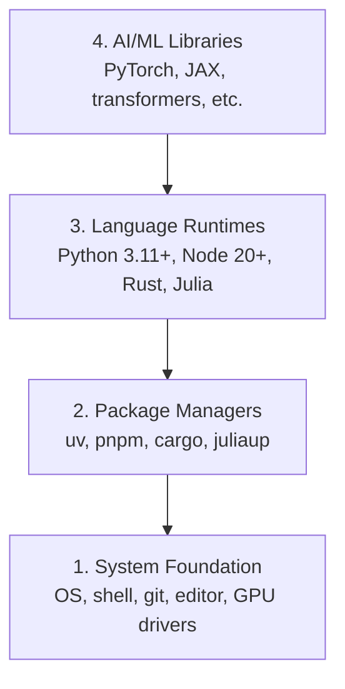

# 개발 환경

> 사용하는 도구가 사고 방식을 형성합니다. 한 번에, 올바르게 설정하세요.

**유형:** Build (실습)
**사용 언어:** Python, Node.js, Rust
**선수 레슨:** 없음
**소요 시간:** ~45분

## 학습 목표

- Python 3.11+, Node.js 20+, Rust 툴체인을 처음부터 설정하기
- 재현 가능한 빌드를 위해 가상 환경 및 패키지 관리자 구성하기
- CUDA/MPS를 통한 GPU 접근을 검증하고 테스트 텐서 연산 실행하기
- 시스템, 패키지, 런타임, AI 라이브러리로 이루어진 4계층 스택 이해하기

## 문제 상황

앞으로 500개 이상의 레슨에 걸쳐 Python, TypeScript, Rust, Julia를 사용해 AI 엔지니어링을 배우게 됩니다. 환경이 제대로 갖춰져 있지 않다면 모든 레슨마다 학습 대신 개발 도구와 씨름하게 됩니다.

대부분의 사람들은 환경 설정을 건너뜁니다. 그러고는 import 오류, 버전 충돌, 누락된 CUDA 드라이버를 디버깅하느라 몇 시간씩 낭비합니다. 이번 기회에 한 번에, 제대로 설정하겠습니다.

## 핵심 개념

AI 엔지니어링 환경은 네 개의 계층으로 구성됩니다:



설치는 아래에서 위로(bottom-up) 진행합니다. 각 계층은 바로 아래 계층에 의존합니다.

```figure
s0-env-stack
```

## 직접 구축하기

### 1단계: 시스템 기반 구축

시스템을 확인하고 기본 도구를 설치합니다.

```bash
# macOS
xcode-select --install
brew install git curl wget

# Ubuntu/Debian
sudo apt update && sudo apt install -y build-essential git curl wget unzip

# Windows (use WSL2)
wsl --install -d Ubuntu-24.04
```

### 2단계: uv를 사용한 Python 설정

여기서는 `uv`를 사용합니다. pip보다 10~100배 빠르며 가상 환경을 자동으로 처리합니다.

```bash
curl -LsSf https://astral.sh/uv/install.sh | sh

uv python install 3.12

uv venv
source .venv/bin/activate  # or .venv\Scripts\activate on Windows

uv pip install numpy matplotlib jupyter
```

설치를 검증합니다:

```python
import sys
print(f"Python {sys.version}")

import numpy as np
print(f"NumPy {np.__version__}")
a = np.array([1, 2, 3])
print(f"Vector: {a}, dot product with itself: {np.dot(a, a)}")
```

### 3단계: pnpm을 사용한 Node.js 설정

TypeScript 레슨(에이전트, MCP 서버, 웹 앱)에 사용됩니다.

```bash
curl -fsSL https://fnm.vercel.app/install | bash
fnm install 22
fnm use 22

npm install -g pnpm

node -e "console.log('Node', process.version)"
```

fnm 설치 프로그램은 먼저 `unzip`를 확인하고, 없으면 `Not installing fnm due to missing dependencies.`를 출력하며 종료합니다. Linux에서는 zip 아카이브의 압축을 풀고 macOS에서는 Homebrew를 통해 설치합니다. macOS에는 `unzip`가 기본 포함되어 있으며, Ubuntu, Debian, WSL2는 1단계의 apt 명령어로 설치합니다(해당 단계를 건너뛰었다면 `sudo apt install -y unzip` 실행).

**macOS / Apple Silicon (M1/M2/M3/M4):** 설치 프로그램이 `Error: Cannot install under Rosetta 2 in ARM default prefix (/opt/homebrew)` 메시지와 함께 중단된다면, Homebrew는 네이티브 arm64 빌드인데 터미널이 Rosetta 2 환경에서 실행 중인 경우입니다(`arch` 실행 시 `i386` 출력). arm64를 강제 지정하여 fnm을 설치하고 셸에 연결한 뒤, 위의 명령어를 `fnm install 22`부터 다시 실행하세요:

```bash
arch -arm64 brew install fnm
echo 'eval "$(fnm env --use-on-cd)"' >> ~/.zshrc
source ~/.zshrc
```

### 4단계: Rust

성능이 중요한 레슨(추론(inference), 시스템)에 사용됩니다.

```bash
curl --proto '=https' --tlsv1.2 -sSf https://sh.rustup.rs | sh

rustc --version
cargo --version
```

### 5단계: Julia (선택 사항)

Julia가 강점을 발휘하는 수학 중심 레슨에 사용됩니다.

```bash
curl -fsSL https://install.julialang.org | sh

julia -e 'println("Julia ", VERSION)'
```

### 6단계: GPU 설정 (보유한 경우)

**NVIDIA (Linux / Windows):**

```bash
nvidia-smi

# Install PyTorch with CUDA
uv pip install torch torchvision torchaudio --index-url https://download.pytorch.org/whl/cu124
```

**macOS / Apple Silicon (M1/M2/M3/M4):** Mac에는 CUDA가 지원되지 않으며, 이는 정상적인 동작입니다. `--index-url .../cuXXX`를 전달하지 **마세요**(해당 휠은 Linux/Windows 전용이므로 설치에 실패합니다). Apple의 MPS(Metal) GPU 백엔드가 포함된 기본 빌드를 설치합니다:

```bash
uv pip install torch torchvision torchaudio
```

설치 검증(모든 플랫폼에서 작동):

```python
import torch
print(f"CUDA available: {torch.cuda.is_available()}")           # False on macOS — expected
print(f"MPS available:  {torch.backends.mps.is_available()}")   # True on Apple Silicon
if torch.cuda.is_available():
    print(f"GPU: {torch.cuda.get_device_name(0)}")
```

GPU가 없어도 문제없습니다. 대부분의 레슨은 CPU에서 동작합니다. 대규모 학습 레슨의 경우 Google Colab이나 클라우드 GPU를 활용하세요.

### 7단계: 시작하려는 경로(route) 검증

이 레슨의 모든 명령어는 `README.md` 및 `phases/`가 위치한 저장소 루트 디렉터리에서 실행하세요. 사전 점검(preflight)은 선택한 경로를 시작하는 데 필요한 항목만 확인합니다. 초급 학습자가 수많은 경고 문구 대신 명확한 결과 하나만 볼 수 있도록 기본적으로 이후 도구들은 건너뜁니다.

전체 초급 과정을 시작합니다:

```bash
python3 phases/00-setup-and-tooling/01-dev-environment/code/verify.py --route beginner
```

또는 원하는 경로만 점검합니다:

```bash
python3 phases/00-setup-and-tooling/01-dev-environment/code/verify.py --route ml-foundations
python3 phases/00-setup-and-tooling/01-dev-environment/code/verify.py --route llm-engineering
python3 phases/00-setup-and-tooling/01-dev-environment/code/verify.py --route agents
python3 phases/00-setup-and-tooling/01-dev-environment/code/verify.py --route mcp
python3 phases/00-setup-and-tooling/01-dev-environment/code/verify.py --route agent-skills
python3 phases/00-setup-and-tooling/01-dev-environment/code/verify.py --route certification
```

이후 레슨에서 사용하는 선택적 도구와 의존성까지 동일한 사전 점검으로 확인하려면 `--show-later` 옵션을 추가하세요. 이후 도구가 누락되어 있더라도 선택한 경로의 진행이 차단되지는 않습니다.

필수 점검 항목이 실패할 때마다 감지된 경로 또는 import 오류와 함께 정확한 해결 명령어가 표시됩니다. Agent Skills 및 인증 경로는 수동 호스트 점검 항목도 함께 보여주는데, 이는 AI 호스트가 스킬을 감지했는지 혹은 선택한 스킬 스코프가 쓰기 가능한 상태인지를 Python 스크립트만으로는 확인할 수 없기 때문입니다.

초급 사전 점검을 통과하면 실행 가능한 첫 번째 레슨이 정확하게 출력됩니다:

```text
Ready to start Beginner course.
Next: python3 phases/01-math-foundations/01-linear-algebra-intuition/code/vectors.py
```

## 사용하기

확인한 경로를 시작할 환경이 준비되었습니다. 전체 스택을 모두 설치하느라 첫 레슨 시작을 지체하지 말고, 레슨에서 요구할 때마다 이후 도구들을 설치하세요. 커리큘럼 전반에서 사용하게 될 도구는 다음과 같습니다:

| 언어 | 사용 단계 | 패키지 관리자 |
|----------|---------|-----------------|
| Python | 단계 1-12 (ML, DL, NLP, Vision, Audio, LLM) | uv |
| TypeScript | 단계 13-17 (도구, 에이전트, 스웜, 인프라) | pnpm |
| Rust | 단계 12, 15-17 (고성능 시스템) | cargo |
| Julia | 단계 1 (수학 기초) | Pkg |

## 적용하기

이 레슨을 통해 누구나 설정을 확인할 수 있는 검증 스크립트가 생성됩니다.

AI 어시스턴트가 환경 문제를 진단하는 데 유용한 프롬프트는 `outputs/prompt-env-check.md`를 참고하세요.

## 연습 문제

1. 검증 스크립트를 실행하고 실패한 항목을 모두 해결하세요.
2. 이 과정을 위한 Python 가상 환경을 생성하고 PyTorch를 설치하세요.
3. 4개 언어 모두로 "hello world"를 작성하고 각각 실행해 보세요.
