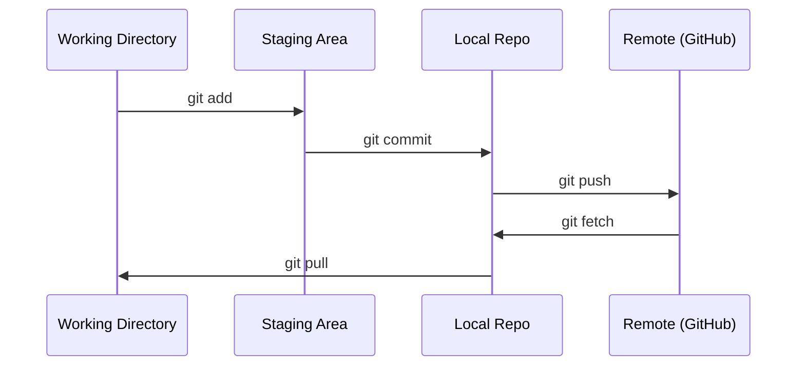

# Git과 협업

> 버전 관리는 선택 사항이 아닙니다. 여기서 진행하는 모든 실험, 모든 모델, 모든 강의 실습은 추적 관리됩니다.

**유형:** Learn (이론)
**사용 언어:** --
**선수 레슨:** Phase 0, Lesson 01
**소요 시간:** ~30분

## 학습 목표

- Git 사용자 정보를 설정하고 add, commit, push로 이어지는 일상적인 워크플로를 사용합니다.
- main 브랜치를 손상시키지 않고 독립적인 실험을 수행하기 위해 브랜치를 생성하고 병합(merge)합니다.
- 모델 체크포인트 및 대용량 바이너리 파일을 제외하는 `.gitignore` 파일을 작성합니다.
- `git log` 명령어로 커밋 히스토리를 탐색하여 프로젝트의 발전 과정을 파악합니다.

## 직면한 과제

앞으로 20개 페이즈(phase)에 걸쳐 수백 개의 코드 파일을 작성하게 됩니다. 버전 관리를 하지 않으면 작업 내용을 잃어버리고, 되돌릴 수 없는 실수를 저지르며, 다른 사람과 협업할 수도 없게 됩니다.

Git은 이를 해결하는 도구이며, GitHub는 코드가 저장되는 공간입니다. 이 강의에서는 본 과정에 꼭 필요한 내용만 다룹니다.

## 핵심 개념



기억해야 할 세 가지:
1. 자주 저장하기 (`git commit`)
2. 원격 저장소로 푸시하기 (`git push`)
3. 실험을 위한 브랜치 만들기 (`git checkout -b experiment`)

```figure
s0-commit-dag
```

## 실습하기

### 1단계: Git 설정하기

```bash
git config --global user.name "Your Name"
git config --global user.email "you@example.com"
```

### 2단계: 일상적인 워크플로

```bash
git status
git add file.py
git commit -m "Add perceptron implementation"
git push origin main
```

### 3단계: 실험을 위한 브랜치 작업

```bash
git checkout -b experiment/new-optimizer

# ... make changes, commit ...

git checkout main
git merge experiment/new-optimizer
```

### 4단계: 강의 저장소 다루기

강의 저장소 자체에는 직접 푸시할 수 없습니다. 메인테이너만 쓰기 권한을 가지고 있기 때문입니다. 따라서 GitHub에서 먼저 포크(Fork, 우측 상단 버튼)하여 `origin`가 본인의 저장소 복사본을 가리키도록 설정해야 합니다:

```bash
git clone https://github.com/YOUR-USERNAME/ai-engineering-from-scratch.git
cd ai-engineering-from-scratch

git checkout -b my-progress
# work through lessons, commit your code
git push origin my-progress
```

## 실전 적용

이 강의에서는 다음 명령어들만 숙지하면 충분합니다:

| 명령어 | 사용 시점 |
|---------|------|
| `git clone` | 강의 저장소 가져오기 |
| `git add` + `git commit` | 작업 내용 저장하기 |
| `git push` | GitHub에 백업하기 |
| `git checkout -b` | main을 건드리지 않고 새로운 시도하기 |
| `git log --oneline` | 지금까지 작업한 내용 확인하기 |

이것으로 충분합니다. 이 강의에서는 rebase, cherry-pick, submodule 같은 고급 기능은 필요하지 않습니다.

## 연습 문제

1. 이 저장소를 포크하고, 포크한 저장소를 클론한 뒤, `my-progress`라는 브랜치를 만들어 파일을 생성하고 커밋한 후 푸시해 보세요.
2. 모델 체크포인트 파일(`.pt`, `.pth`, `.safetensors`)을 제외하는 `.gitignore` 파일을 작성해 보세요.
3. `git log --oneline` 명령어로 이 저장소의 커밋 히스토리를 살펴보고, 강의가 어떻게 추가되어 왔는지 확인해 보세요.

## 핵심 용어

| 용어 | 일상적인 표현 | 실제 의미 |
|------|----------------|----------------------|
| 커밋(Commit) | "저장하기" | 특정 시점의 전체 프로젝트 스냅샷 |
| 브랜치(Branch) | "복사본" | 작업을 진행함에 따라 앞으로 나아가는 커밋에 대한 포인터 |
| 병합(Merge) | "코드 합치기" | 한 브랜치의 변경 사항을 가져와 다른 브랜치에 적용하는 작업 |
| 원격 저장소(Remote) | "클라우드" | 다른 곳(GitHub, GitLab 등)에 호스팅된 저장소의 복사본 |
