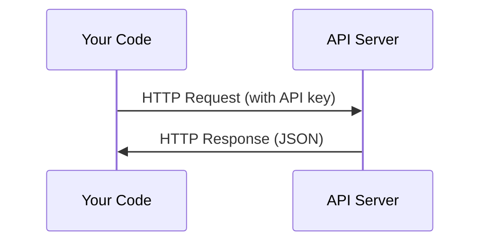

# API 및 키

> 모든 AI API는 동일한 방식으로 작동합니다. 즉, 요청을 보내고 응답을 받습니다. 세부 사항은 달라지더라도 패턴은 변하지 않습니다.

**유형:** Build (실습)
**사용 언어:** Python, TypeScript
**선수 레슨:** Phase 0, Lesson 01
**소요 시간:** ~30분

## 학습 목표

- 환경 변수와 `.env` 파일을 사용하여 API 키를 안전하게 저장합니다.
- Anthropic Python SDK와 순수(raw) HTTP를 모두 사용하여 LLM API 호출을 수행합니다.
- 디버깅을 위해 SDK 기반 및 순수 HTTP 요청/응답 형식을 비교합니다.
- 인증 및 속도 제한(rate limit)을 포함한 일반적인 API 오류를 식별하고 처리합니다.

## 문제 상황

Phase 11부터는 LLM API(Anthropic, OpenAI, Google)를 호출하게 됩니다. Phase 13~16에서는 이러한 API를 루프 내에서 활용하는 에이전트(agent)를 구축합니다. 따라서 API 키가 어떻게 작동하는지, 안전하게 저장하는 방법은 무엇인지, 첫 번째 API 호출을 어떻게 수행하는지 알아야 합니다.

## 핵심 개념



모든 API 호출에는 다음 요소가 포함됩니다.
1. 엔드포인트(URL)
2. API 키(인증)
3. 요청 본문(request body, 원하는 내용)
4. 응답 본문(response body, 반환받는 내용)

```figure
s0-secret-inject
```

## 직접 만들기

### 1단계: API 키 안전하게 저장하기

코드에 API 키를 직접 넣지 마십시오. 환경 변수를 사용해야 합니다.

```bash
export ANTHROPIC_API_KEY="sk-ant-..."
export OPENAI_API_KEY="sk-..."
```

또는 `.env` 파일을 사용합니다(`.gitignore`에 추가해야 합니다).

```
ANTHROPIC_API_KEY=sk-ant-...
OPENAI_API_KEY=sk-...
```

### 2단계: 첫 번째 API 호출 (Python)

```python
import os

import anthropic

client = anthropic.Anthropic()

MODEL = os.environ.get("LLM_MODEL", "claude-sonnet-5")

response = client.messages.create(
    model=MODEL,
    max_tokens=256,
    messages=[{"role": "user", "content": "What is a neural network in one sentence?"}]
)

print(response.content[0].text)
```

`LLM_MODEL`은 Anthropic 모델 ID를 선택하며, 기본값은 날짜가 붙지 않은 Sonnet 별칭(alias)입니다. 다른 제공업체(OpenAI, Google 등)도 키와 모델 ID를 조합하는 동일한 패턴을 따르지만, 각각 고유한 SDK, 엔드포인트 및 요청/응답 스키마를 가집니다.

### 3단계: 첫 번째 API 호출 (TypeScript)

```typescript
import Anthropic from "@anthropic-ai/sdk";

const client = new Anthropic();

const MODEL = process.env.LLM_MODEL ?? "claude-sonnet-5";

const response = await client.messages.create({
  model: MODEL,
  max_tokens: 256,
  messages: [{ role: "user", content: "What is a neural network in one sentence?" }],
});

console.log(response.content[0].text);
```

### 4단계: 순수 HTTP 호출 (SDK 미사용)

```python
import os
import urllib.request
import json

url = "https://api.anthropic.com/v1/messages"
headers = {
    "Content-Type": "application/json",
    "x-api-key": os.environ["ANTHROPIC_API_KEY"],
    "anthropic-version": "2023-06-01",
}
body = json.dumps({
    "model": os.environ.get("LLM_MODEL", "claude-sonnet-5"),
    "max_tokens": 256,
    "messages": [{"role": "user", "content": "What is a neural network in one sentence?"}],
}).encode()

req = urllib.request.Request(url, data=body, headers=headers, method="POST")
with urllib.request.urlopen(req) as resp:
    result = json.loads(resp.read())
    print(result["content"][0]["text"])
```

이것이 바로 SDK가 내부적으로 수행하는 작업입니다. 순수 HTTP 호출 방식을 이해하면 디버깅할 때 도움이 됩니다.

## 적용하기

이 과정에서 사용하는 API는 다음과 같습니다.

| API | 필요한 시점 | 무료 티어 |
|-----|-----------------|-----------|
| Anthropic (Claude) | Phase 11~16 (에이전트, 도구) | 가입 시 $5 크레딧 |
| OpenAI | Phase 11 (비교) | 가입 시 $5 크레딧 |
| Hugging Face | Phase 4~10 (모델, 데이터셋) | 무료 |

지금 당장 모든 API를 준비할 필요는 없습니다. 각 레슨에서 요구할 때 설정하면 됩니다.

## 최종 산출물

이 레슨을 통해 다음 산출물을 만듭니다.
- `outputs/prompt-api-troubleshooter.md` - 일반적인 API 오류 진단

## 연습 문제

1. Anthropic API 키를 발급받고 첫 번째 API 호출을 수행합니다.
2. 순수 HTTP 버전을 실행해 보고 SDK 버전과 응답 형식을 비교합니다.
3. 의도적으로 잘못된 API 키를 사용하여 오류 메시지를 확인합니다.

## 핵심 용어

| 용어 | 흔히 하는 표현 | 실제 의미 |
|------|----------------|----------------------|
| API 키(API key) | "API용 비밀번호" | 계정을 식별하고 요청 권한을 부여하는 고유한 문자열 |
| 속도 제한(Rate limit) | "요청을 제한당하고 있어요" | 남용을 방지하고 공정한 사용을 보장하기 위한 분/시간당 최대 요청 수 |
| 토큰(Token) | "단어 하나" (API 맥락에서) | 과금 단위: 입력 토큰과 출력 토큰을 별도로 계산하여 요금을 청구함 |
| 스트리밍(Streaming) | "실시간 응답" | 전체 응답을 기다리지 않고 단어 단위로 응답을 점진적으로 수신하는 방식 |
