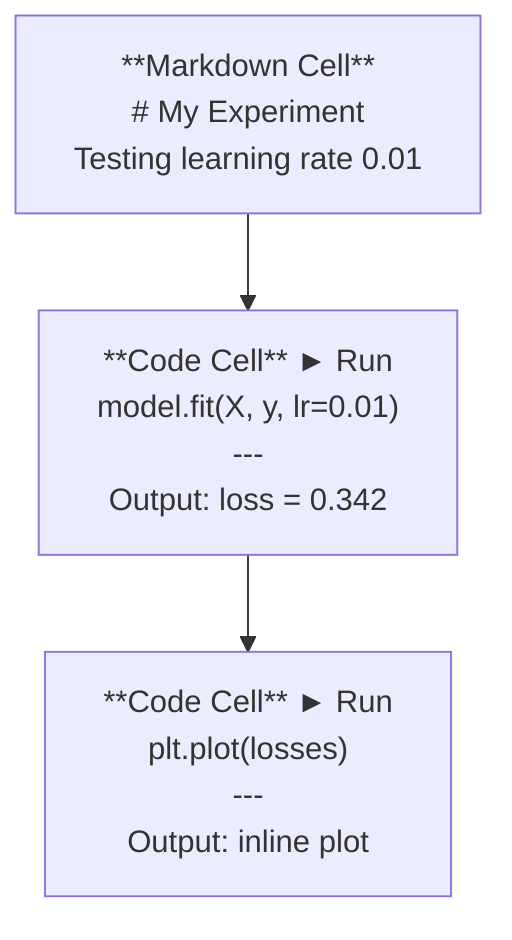
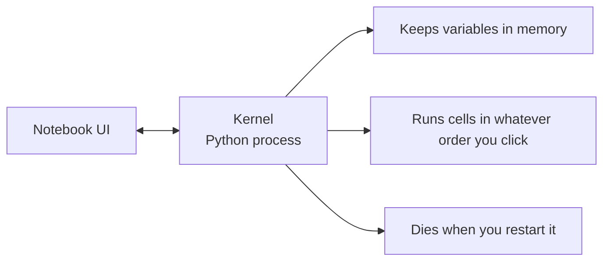

# Jupyter Notebooks

> 노트북은 AI 엔지니어링의 실험대입니다. 여기서 프로토타입을 만들고, 검증된 코드를 프로덕션으로 이전합니다.

**유형:** Build (실습)
**사용 언어:** Python
**선수 레슨:** Phase 0, Lesson 01
**소요 시간:** ~30분

## 학습 목표

- JupyterLab, Jupyter Notebook 또는 Jupyter 확장이 설치된 VS Code를 설치하고 실행합니다
- 매직 명령어(`%timeit`, `%%time`, `%matplotlib inline`)를 사용하여 벤치마크를 수행하고 인라인으로 시각화합니다
- 노트북과 스크립트의 사용 시점을 구분하고 "노트북에서 탐색하고, 스크립트로 배포한다"는 워크플로를 적용합니다
- 실행 순서 뒤섞임, 숨겨진 상태(hidden state), 메모리 누수와 같은 노트북의 일반적인 함정을 식별하고 방지합니다

## 문제 정의

모든 AI 논문, 튜토리얼, Kaggle 대회에서 Jupyter 노트북을 사용합니다. 노트북을 사용하면 코드를 조각 단위로 실행하고, 결과를 인라인으로 확인하며, 코드와 설명을 함께 작성하고, 빠르게 반복 실험할 수 있습니다. 노트북 없이 AI를 배우려는 것은 연습장 없이 수학 숙제를 푸는 것과 같습니다.

하지만 노트북에는 치명적인 함정이 있습니다. 사람들은 노트북이 적합하지 않은 작업까지 포함해 모든 일에 노트북을 쓰곤 합니다. 노트북을 써야 할 때와 스크립트를 써야 할 때를 구분하면 나중에 겪을 디버깅의 악몽을 피할 수 있습니다.

## 개념

노트북은 셀(cell)의 목록입니다. 각 셀은 코드 또는 텍스트로 구성됩니다.



커널(kernel)은 백그라운드에서 실행되는 Python 프로세스입니다. 셀을 실행하면 코드가 커널로 전송되고, 커널이 코드를 실행한 뒤 결과를 반환합니다. 모든 셀은 동일한 커널을 공유하므로 셀 간에 변수가 유지됩니다.



"클릭하는 순서대로 실행된다"는 점은 강력한 장점인 동시에 제 발등을 찍는 함정이기도 합니다.

```figure
s0-cell-order
```

## 직접 구현하기

### 1단계: 인터페이스 선택하기

세 가지 옵션, 하나의 포맷:

| 인터페이스 | 설치 방법 | 추천 용도 |
|-----------|---------|----------|
| JupyterLab | `pip install jupyterlab` 실행 후 `jupyter lab` | 완전한 IDE 환경, 다중 탭, 파일 브라우저, 터미널 |
| Jupyter Notebook | `pip install notebook` 실행 후 `jupyter notebook` | 단순하고 가벼움, 한 번에 하나의 노트북 작업 |
| VS Code | "Jupyter" 확장 설치 | 기존 에디터 환경 유지, Git 연동, 디버깅 |

세 가지 모두 동일한 `.ipynb` 파일을 읽고 씁니다. 원하는 것을 선택하면 됩니다. AI 작업에서는 JupyterLab이 가장 널리 사용됩니다.

```bash
pip install jupyterlab
jupyter lab
```

### 2단계: 필수 단축키

노트북은 두 가지 모드로 동작합니다. `Escape`을 누르면 명령 모드(왼쪽에 파란색 바), `Enter`를 누르면 편집 모드(초록색 바)로 전환됩니다.

**명령 모드 (가장 자주 사용):**

| 키 | 동작 |
|-----|--------|
| `Shift+Enter` | 셀 실행 후 다음 셀로 이동 |
| `A` | 위에 셀 삽입 |
| `B` | 아래에 셀 삽입 |
| `DD` | 셀 삭제 |
| `M` | 마크다운 셀로 변환 |
| `Y` | 코드 셀로 변환 |
| `Z` | 셀 작업 실행 취소 |
| `Ctrl+Shift+H` | 모든 단축키 보기 |

**편집 모드:**

| 키 | 동작 |
|-----|--------|
| `Tab` | 자동 완성 |
| `Shift+Tab` | 함수 시그니처 표시 |
| `Ctrl+/` | 주석 토글 |

`Shift+Enter`는 하루에도 수천 번씩 사용하게 될 단축키입니다. 가장 먼저 익혀두세요.

### 3단계: 셀 종류

**코드 셀**은 Python 코드를 실행하고 결과를 표시합니다.

```python
import numpy as np
data = np.random.randn(1000)
data.mean(), data.std()
```

출력: `(0.0032, 0.9987)`

**마크다운 셀**은 서식 있는 텍스트를 렌더링합니다. 무엇을 왜 하고 있는지 기록할 때 사용합니다. 제목, 굵은 글씨, 기울임꼴, LaTeX 수식(`$E = mc^2$`), 표, 이미지를 지원합니다.

### 4단계: 매직 명령어

이 명령어들은 Python 코드가 아닙니다. `%`(라인 매직) 또는 `%%`(셀 매직)으로 시작하는 Jupyter 전용 명령어입니다.

**코드 실행 시간 측정:**

```python
%timeit np.random.randn(10000)
```

출력: `45.2 us +/- 1.3 us per loop`

```python
%%time
model.fit(X_train, y_train, epochs=10)
```

출력: `Wall time: 2.34 s`

`%timeit`는 코드를 여러 번 실행하여 평균을 냅니다. `%%time`는 코드를 한 번만 실행합니다. 마이크로벤치마크에는 `%timeit`를, 학습 실행에는 `%%time`를 사용합니다.

**인라인 플롯 활성화:**

```python
%matplotlib inline
```

이제 모든 `plt.plot()` 또는 `plt.show()` 출력이 노트북에 직접 렌더링됩니다.

**노트북을 벗어나지 않고 패키지 설치하기:**

```python
!pip install scikit-learn
```

`!` 접두사를 붙이면 모든 셸 명령어를 실행할 수 있습니다.

**환경 변수 확인:**

```python
%env CUDA_VISIBLE_DEVICES
```

### 5단계: 리치 아웃풋(Rich output) 인라인 표시

노트북은 셀의 마지막 표현식을 자동으로 표시합니다. 하지만 이를 직접 제어할 수도 있습니다.

```python
import pandas as pd

df = pd.DataFrame({
    "model": ["Linear", "Random Forest", "Neural Net"],
    "accuracy": [0.72, 0.89, 0.94],
    "training_time": [0.1, 2.3, 45.6]
})
df
```

단순한 텍스트 덤프가 아니라 서식이 지정된 HTML 표로 렌더링됩니다. 플롯도 마찬가지입니다.

```python
import matplotlib.pyplot as plt

plt.figure(figsize=(8, 4))
plt.plot([1, 2, 3, 4], [1, 4, 2, 3])
plt.title("Inline Plot")
plt.show()
```

셀 바로 아래에 플롯이 나타납니다. 이것이 AI 작업에서 노트북이 널리 쓰이는 이유입니다. 데이터, 플롯, 코드를 한눈에 함께 볼 수 있습니다.

이미지의 경우:

```python
from IPython.display import Image, display
display(Image(filename="architecture.png"))
```

### 6단계: Google Colab

Colab은 클라우드에서 제공되는 무료 Jupyter 노트북입니다. GPU, 사전 설치된 라이브러리, Google Drive 연동을 지원하며 별도의 설정이 필요 없습니다.

1. [colab.research.google.com](https://colab.research.google.com)으로 이동합니다
2. 이 과정의 `.ipynb` 파일을 업로드합니다
3. 런타임 > 런타임 유형 변경 > T4 GPU (무료)를 선택합니다

로컬 Jupyter와의 차이점:
- 세션 간에 파일이 유지되지 않습니다 (Drive에 저장하거나 다운로드해야 함)
- 사전 설치됨: numpy, pandas, matplotlib, torch, tensorflow, sklearn
- 파일 업로드/다운로드용 `from google.colab import files` 제공
- 영구 스토리지를 위한 `from google.colab import drive; drive.mount('/content/drive')` 제공
- 90분 동안 비활성 상태이면 세션 시간 초과 (무료 티어)

## 활용하기

### 노트북 vs 스크립트: 각각 언제 사용해야 할까

| 노트북 사용 용도 | 스크립트 사용 용도 |
|-------------------|-----------------|
| 데이터셋 탐색 | 학습 파이프라인 |
| 모델 프로토타이핑 | 재사용 가능한 유틸리티 |
| 결과 시각화 | `if __name__`가 포함된 모든 작업 |
| 작업 내용 설명 및 문서화 | 스케줄에 따라 실행되는 코드 |
| 빠른 실험 | 프로덕션 코드 |
| 강의 실습 과제 | 패키지 및 라이브러리 |

원칙: **노트북에서 탐색하고, 스크립트로 배포한다**.

AI 개발에서 흔히 쓰이는 워크플로:
1. 노트북에서 데이터를 탐색합니다
2. 노트북에서 모델 프로토타입을 만듭니다
3. 정상 작동하면 코드를 `.py` 파일로 이전합니다
4. 추가 실험을 위해 해당 `.py` 파일을 다시 노트북으로 임포트합니다

### 자주 발생하는 함정

**실행 순서 뒤섞임(Out-of-order execution).** 5번 셀을 실행하고, 2번 셀을 실행한 뒤, 7번 셀을 실행하는 경우입니다. 내 컴퓨터에서는 잘 동작하지만 다른 사람이 위에서부터 순서대로 실행하면 오류가 발생합니다. 해결책: 공유하기 전에 Kernel > Restart & Run All을 실행합니다.

**숨겨진 상태(Hidden state).** 셀을 삭제했지만 해당 셀이 생성한 변수가 여전히 메모리에 남아 있는 경우입니다. 노트북 코드는 깨끗해 보이지만 이미 사라진 유령 셀에 의존하고 있습니다. 해결책: 커널을 주기적으로 재시작합니다.

**메모리 누수.** 4GB 크기의 데이터셋을 로드하고, 모델을 학습시킨 뒤, 또 다른 데이터셋을 로드합니다. 메모리가 전혀 해제되지 않습니다. 해결책: `del variable_name` 및 `gc.collect()`를 사용하거나 커널을 재시작합니다.

## 배포하기

이번 레슨에서 작성하는 결과물:
- 노트북 문제 디버깅을 위한 `outputs/prompt-notebook-helper.md`

## 연습 문제

1. JupyterLab을 열고, 노트북을 생성한 뒤, `%timeit`를 사용하여 100,000개의 난수 배열을 생성할 때 리스트 컴프리헨션과 numpy의 성능을 비교해 보세요
2. CSV를 로드하고 데이터프레임을 표시하며 차트를 그리는 마크다운 셀과 코드 셀로 구성된 노트북을 만드세요. 그런 다음 Kernel > Restart & Run All을 실행하여 위에서 아래로 정상 작동하는지 확인하세요
3. `code/notebook_tips.py`의 코드를 복사하여 Colab 노트북에 붙여넣고, 무료 GPU 환경에서 실행해 보세요

## 주요 용어

| 용어 | 흔히 하는 표현 | 실제 의미 |
|------|----------------|----------------------|
| Kernel | "내 코드를 실행해 주는 것" | 셀을 실행하고 변수를 메모리에 유지하는 독립된 Python 프로세스 |
| Cell | "코드 블록" | 노트북에서 독립적으로 실행 가능한 단위 (코드 또는 마크다운) |
| Magic command | "Jupyter 팁/트릭" | 노트북 환경을 제어하기 위해 `%` 또는 `%%` 접두사가 붙은 특수 명령어 |
| `.ipynb` | "노트북 파일" | 셀, 출력 결과, 메타데이터가 포함된 JSON 파일. IPython Notebook의 약어 |
## 참고 자료

- [JupyterLab Docs](https://jupyterlab.readthedocs.io/): 전체 기능 안내
- [Google Colab FAQ](https://research.google.com/colaboratory/faq.html): Colab 관련 제한 사항 및 기능
- [28 Jupyter Notebook Tips](https://www.dataquest.io/blog/jupyter-notebook-tips-tricks-shortcuts/): 파워 유저를 위한 단축키
