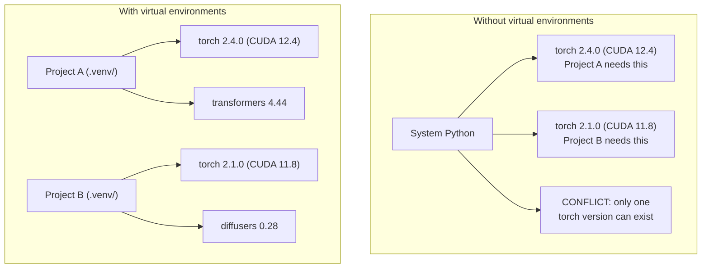

# Python Environments

> 의존성 지옥(Dependency hell)은 실재합니다. 가상 환경이 그 해결책입니다.

**유형:** Build (실습)
**사용 언어:** Shell
**선수 레슨:** Phase 0, Lesson 01
**소요 시간:** ~30분

## Learning Objectives

- `uv`, `venv`, 또는 `conda`을 사용하여 격리된 가상 환경 생성하기
- 선택적 의존성 그룹(optional dependency groups)을 포함한 `pyproject.toml`을 작성하고 재현성을 위한 lockfile 생성하기
- 전역 설치, pip/conda 혼용, CUDA 버전 불일치 등 자주 발생하는 문제 진단 및 해결하기
- 상충하는 의존성을 가진 프로젝트를 위한 단계(phase)별 환경 전략 구현하기

## The Problem

미세 조정(fine-tuning) 프로젝트를 위해 PyTorch 2.4를 설치합니다. 다음 주에 진행하는 다른 프로젝트는 CUDA 빌드가 고정되어 있어 PyTorch 2.1이 필요합니다. 전역 환경을 업그레이드하면 첫 번째 프로젝트가 깨집니다. 다운그레이드하면 두 번째 프로젝트가 깨집니다.

이것이 바로 의존성 지옥입니다. AI/ML 작업에서는 다음과 같은 이유로 이런 상황이 끊임없이 발생합니다.

- PyTorch, JAX, TensorFlow가 각자의 CUDA 바인딩을 제공함
- 모델 라이브러리들이 특정 프레임워크 버전을 고정함
- 전역 `pip install` 실행 시 이전에 설치되어 있던 패키지를 덮어씀
- CUDA 11.8 빌드가 CUDA 12.x 드라이버와 호환되지 않음(그 반대도 마찬가지)

해결책은 간단합니다. 모든 프로젝트가 자체 패키지를 갖춘 고유한 격리 환경을 사용하도록 하는 것입니다.

## The Concept



```figure
s0-env-isolation
```

## Build It

### Option 1: uv venv (Recommended)

`uv`는 가장 빠른 Python 패키지 관리자입니다(pip 대비 10~100배 빠름). 가상 환경, Python 버전, 의존성 해결(dependency resolution)을 하나의 도구에서 처리합니다.

```bash
curl -LsSf https://astral.sh/uv/install.sh | sh

uv python install 3.12

cd your-project
uv venv
source .venv/bin/activate
```

패키지 설치:

```bash
uv pip install torch numpy
```

한 단계로 `pyproject.toml`를 포함한 프로젝트 생성:

```bash
uv init my-ai-project
cd my-ai-project
uv add torch numpy matplotlib
```

### Option 2: venv (Built-in)

`uv`를 설치할 수 없는 경우, Python에 기본 내장된 `venv`를 사용할 수 있습니다.

```bash
python3 -m venv .venv
source .venv/bin/activate  # Linux/macOS
.venv\Scripts\activate     # Windows

pip install torch numpy
```

`uv`보다 느리지만, Python이 설치된 모든 환경에서 동작합니다.

### Option 3: conda (When You Need It)

Conda는 CUDA 툴킷, cuDNN, C 라이브러리와 같은 비-Python 의존성을 관리합니다. 다음과 같은 상황에서 사용합니다.

- 시스템 전체에 설치하지 않고 특정 CUDA 툴킷 버전이 필요한 경우
- 시스템 패키지를 설치할 수 없는 공유 클러스터 환경인 경우
- 라이브러리의 설치 가이드에 "use conda"라고 명시되어 있는 경우

```bash
# Install miniconda (not the full Anaconda)
curl -LsSf https://repo.anaconda.com/miniconda/Miniconda3-latest-Linux-x86_64.sh -o miniconda.sh
bash miniconda.sh -b

conda create -n myproject python=3.12
conda activate myproject

conda install pytorch torchvision torchaudio pytorch-cuda=12.4 -c pytorch -c nvidia
```

한 가지 원칙: 특정 환경에 conda를 사용하기로 했다면, 해당 환경의 모든 패키지 설치에도 conda를 사용해야 합니다. conda 환경에 `pip install`을 섞어 쓰면 디버깅하기 까다로운 의존성 충돌이 발생합니다.

### For This Course: Per-Phase Strategy

코스 전체를 위해 하나의 환경만 만들 수도 있습니다. 하지만 그렇게 하지 마십시오. 단계마다 서로 다른(때로는 상충하는) 의존성이 필요합니다.

전략:

```
ai-engineering-from-scratch/
├── .venv/                    <-- shared lightweight env for phases 0-3
├── phases/
│   ├── 04-neural-networks/
│   │   └── .venv/            <-- PyTorch env
│   ├── 05-cnns/
│   │   └── .venv/            <-- same PyTorch env (symlink or shared)
│   ├── 08-transformers/
│   │   └── .venv/            <-- might need different transformer versions
│   └── 11-llm-apis/
│       └── .venv/            <-- API SDKs, no torch needed
```

`code/env_setup.sh`의 스크립트가 본 코스를 위한 기본 환경을 생성합니다.

## pyproject.toml Basics

모든 Python 프로젝트는 `pyproject.toml`을 갖추어야 합니다. 이 파일 하나로 `setup.py`, `setup.cfg`, `requirements.txt`을 대체할 수 있습니다.

```toml
[project]
name = "ai-engineering-from-scratch"
version = "0.1.0"
requires-python = ">=3.11"
dependencies = [
    "numpy>=1.26",
    "matplotlib>=3.8",
    "jupyter>=1.0",
    "scikit-learn>=1.4",
]

[project.optional-dependencies]
torch = ["torch>=2.3", "torchvision>=0.18"]
llm = ["anthropic>=0.39", "openai>=1.50"]
```

설치 실행:

```bash
uv pip install -e ".[torch]"    # base + PyTorch
uv pip install -e ".[llm]"     # base + LLM SDKs
uv pip install -e ".[torch,llm]" # everything
```

## Lockfiles

lockfile은 전이적 의존성(transitive dependencies)을 포함한 모든 의존성을 정확한 버전으로 고정합니다. 이를 통해 재현성이 보장되며, lockfile을 통해 설치하는 모든 사람이 정확히 동일한 패키지를 얻게 됩니다.

```bash
# uv generates uv.lock automatically when using uv add
uv add numpy

# pip-tools approach
uv pip compile pyproject.toml -o requirements.lock
uv pip install -r requirements.lock
```

lockfile을 git에 커밋하십시오. 다른 사람이 저장소를 클론한 후 lockfile을 통해 설치하면 동일한 버전을 갖게 됩니다.

## Common Mistakes

### 1. 전역 설치

```bash
pip install torch  # BAD: installs to system Python

source .venv/bin/activate
pip install torch  # GOOD: installs to virtual environment
```

패키지가 어디에 설치되는지 확인하십시오.

```bash
which python       # should show .venv/bin/python, not /usr/bin/python
which pip           # should show .venv/bin/pip
```

### 2. pip와 conda 혼용

```bash
conda create -n myenv python=3.12
conda activate myenv
conda install pytorch -c pytorch
pip install some-other-package   # BAD: can break conda's dependency tracking
conda install some-other-package # GOOD: let conda manage everything
```

conda 내부에서 pip를 반드시 사용해야 하는 경우(일부 패키지는 pip 전용임), conda 패키지를 모두 먼저 설치한 후 pip 패키지를 마지막에 설치하십시오.

### 3. 활성화하는 것을 잊음

```bash
python train.py           # uses system Python, missing packages
source .venv/bin/activate
python train.py           # uses project Python, packages found
```

셸 프롬프트에 환경 이름이 표시되어야 합니다.

```
(.venv) $ python train.py
```

### 4. .venv를 git에 커밋

```bash
echo ".venv/" >> .gitignore
```

가상 환경은 200MB~2GB에 달합니다. 로컬 전용이며 머신 간 이동이 불가능합니다. 가상 환경 대신 `pyproject.toml`과 lockfile을 커밋하십시오.

### 5. CUDA 버전 불일치

```bash
nvidia-smi                # shows driver CUDA version (e.g., 12.4)
python -c "import torch; print(torch.version.cuda)"  # shows PyTorch CUDA version

# These must be compatible.
# PyTorch CUDA version must be <= driver CUDA version.
```

## Use It

설정 스크립트를 실행하여 코스 환경을 생성하십시오.

```bash
bash phases/00-setup-and-tooling/06-python-environments/code/env_setup.sh
```

이 스크립트는 핵심 의존성이 설치되고 검증된 `.venv`을 저장소 루트에 생성합니다.

## Exercises

1. `env_setup.sh`를 실행하고 모든 검사가 통과하는지 확인하기
2. 두 번째 가상 환경을 생성하고, 다른 버전의 numpy를 설치한 후, 두 환경이 격리되어 있는지 확인하기
3. PyTorch와 Anthropic SDK가 모두 필요한 프로젝트를 위한 `pyproject.toml` 작성하기
4. 의도적으로 패키지를 전역에 설치(venv를 활성화하지 않고)해 보고, 어디에 설치되는지 확인한 다음 삭제하기

## Key Terms

| Term | What people say | What it actually means |
|------|----------------|----------------------|
| Virtual environment | "A venv" | 시스템 Python과 분리된, Python 인터프리터 및 패키지를 포함하는 격리된 디렉터리 |
| Lockfile | "Pinned dependencies" | 모든 패키지와 정확한 버전을 나열하여 머신 간 동일한 설치를 보장하는 파일 |
| pyproject.toml | "The new setup.py" | setup.py/setup.cfg/requirements.txt를 대체하는 표준 Python 프로젝트 설정 파일 |
| Transitive dependency | "A dependency of a dependency" | 패키지 B가 C에 의존할 때, B에 의존하는 A를 설치하면 C는 A의 전이적 의존성이 됨 |
| CUDA mismatch | "My GPU isn't working" | PyTorch가 사용자의 GPU 드라이버가 지원하는 것과 다른 CUDA 버전으로 컴파일된 상태 |
