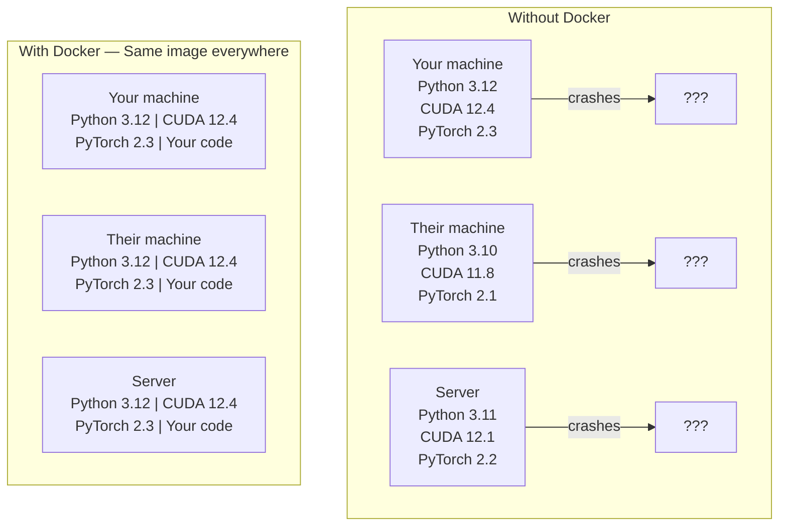

# Docker for AI

> 컨테이너는 "내 컴퓨터에서는 잘 되는데"라는 말을 과거의 유물로 만듭니다.

**유형:** Build (실습)
**사용 언어:** Docker
**선수 레슨:** Phase 0, Lessons 01 and 03
**소요 시간:** ~60분

## Learning Objectives

- Dockerfile로부터 CUDA, PyTorch 및 AI 라이브러리가 포함된 GPU 지원 Docker 이미지를 빌드합니다
- 호스트 디렉터리를 볼륨으로 마운트하여 컨테이너를 다시 빌드하더라도 모델, 데이터셋, 코드가 유지되도록 합니다
- 컨테이너 내부에서 GPU에 접근할 수 있도록 NVIDIA Container Toolkit을 구성합니다
- Docker Compose를 사용하여 다중 서비스 AI 애플리케이션(추론(inference) 서버 + 벡터 데이터베이스)을 오케스트레이션합니다

## The Problem

여러분의 랩톱에는 PyTorch 2.3, CUDA 12.4, Python 3.12가 설치되어 있고 여기서 모델을 학습시켰습니다. 반면 동료의 환경은 PyTorch 2.1, CUDA 11.8, Python 3.10입니다. 여러분의 모델은 동료의 컴퓨터에서 충돌을 일으키지만, 여러분이 작성한 Dockerfile은 두 환경 모두에서 정상 작동합니다.

AI 프로젝트는 의존성 관리의 지옥에 가깝습니다. 일반적인 스택에는 Python, PyTorch, CUDA 드라이버, cuDNN, 시스템 레벨 C 라이브러리, 그리고 정확한 컴파일러 버전이 필요한 flash-attn 같은 특수 패키지가 포함됩니다. Docker는 이 모든 것을 하나의 이미지로 패키징하여 어디서나 동일하게 실행되도록 보장합니다.

## The Concept

Docker는 코드, 런타임, 라이브러리, 시스템 도구를 컨테이너라는 격리된 단위로 감쌉니다. 자체 커널을 실행하는 대신 호스트 OS 커널을 공유하므로, 몇 분이 아니라 몇 초 만에 시작되는 가벼운 가상 머신(VM)이라고 생각하면 됩니다.



### Why AI projects need Docker more than most

1. **GPU 드라이버는 취약합니다.** CUDA 12.4 코드는 CUDA 11.8에서 실행되지 않습니다. Docker는 컨테이너 내부에 CUDA 툴킷을 격리하는 동시에 NVIDIA Container Toolkit을 통해 호스트 GPU 드라이버를 공유합니다.

2. **모델 가중치(weights)는 용량이 큽니다.** 7B 파라미터 모델은 fp16 기준으로 14GB에 달합니다. 이미지를 다시 빌드할 때마다 모델을 다시 다운로드하고 싶지는 않을 것입니다. Docker 볼륨을 사용하면 호스트의 모델 디렉터리를 컨테이너에 마운트할 수 있습니다.

3. **다중 서비스 아키텍처가 일반적입니다.** 실제 AI 애플리케이션은 단순한 Python 스크립트 하나로 끝나지 않습니다. 추론 서버, RAG를 위한 벡터 데이터베이스, 웹 프론트엔드 등이 함께 필요합니다. Docker Compose는 명령어 하나로 이 모든 것을 오케스트레이션합니다.

### Key vocabulary

| Term | What it means |
|------|---------------|
| Image | 읽기 전용 템플릿입니다. 레시피에 해당하며 Dockerfile로부터 빌드됩니다. |
| Container | 이미지의 실행 인스턴스입니다. 실제 요리가 이루어지는 주방에 해당합니다. |
| Dockerfile | 이미지를 빌드하기 위한 단계별 지침입니다. 레이어 단위로 구성됩니다. |
| Volume | 컨테이너가 재시작되어도 유지되는 영구 스토리지입니다. |
| docker-compose | YAML 파일로 다중 컨테이너 애플리케이션을 정의하는 도구입니다. |

### Common container patterns in AI

```
Dev Container
  Full toolkit. Editor support. Jupyter. Debugging tools.
  Used during development and experimentation.

Training Container
  Minimal. Just the training script and dependencies.
  Runs on GPU clusters. No editor, no Jupyter.

Inference Container
  Optimized for serving. Small image. Fast cold start.
  Runs behind a load balancer in production.
```

```figure
s0-image-layers
```

## Build It

### Step 1: Install Docker

```bash
# macOS
brew install --cask docker
open /Applications/Docker.app

# Ubuntu
curl -fsSL https://get.docker.com | sh
sudo usermod -aG docker $USER
# Log out and back in for group change to take effect
```

설치 확인:

```bash
docker --version
docker run hello-world
```

### Step 2: Install NVIDIA Container Toolkit (Linux with NVIDIA GPU)

컨테이너가 GPU에 접근할 수 있도록 설정합니다. macOS 및 Windows(WSL2) 사용자는 이 단계를 건너뛰어도 됩니다. 해당 플랫폼에서는 Docker Desktop이 GPU 패스스루를 다르게 처리합니다.

```bash
distribution=$(. /etc/os-release;echo $ID$VERSION_ID)
curl -fsSL https://nvidia.github.io/libnvidia-container/gpgkey | sudo gpg --dearmor -o /usr/share/keyrings/nvidia-container-toolkit-keyring.gpg
curl -s -L https://nvidia.github.io/libnvidia-container/$distribution/libnvidia-container.list | \
    sed 's#deb https://#deb [signed-by=/usr/share/keyrings/nvidia-container-toolkit-keyring.gpg] https://#g' | \
    sudo tee /etc/apt/sources.list.d/nvidia-container-toolkit.list

sudo apt-get update
sudo apt-get install -y nvidia-container-toolkit
sudo nvidia-ctk runtime configure --runtime=docker
sudo systemctl restart docker
```

컨테이너 내부에서 GPU 접근 테스트:

```bash
docker run --rm --gpus all nvidia/cuda:12.4.1-base-ubuntu22.04 nvidia-smi
```

GPU 정보가 출력된다면 툴킷이 정상 작동하는 것입니다.

### Step 3: Understand base images

올바른 베이스 이미지를 선택하면 수많은 디버깅 시간을 절약할 수 있습니다.

```
nvidia/cuda:12.4.1-devel-ubuntu22.04
  Full CUDA toolkit. Compilers included.
  Use for: building packages that need nvcc (flash-attn, bitsandbytes)
  Size: ~4 GB

nvidia/cuda:12.4.1-runtime-ubuntu22.04
  CUDA runtime only. No compilers.
  Use for: running pre-built code
  Size: ~1.5 GB

pytorch/pytorch:2.6.0-cuda12.4-cudnn9-runtime
  PyTorch pre-installed on top of CUDA.
  Use for: skipping the PyTorch install step
  Size: ~6 GB

python:3.12-slim
  No CUDA. CPU only.
  Use for: inference on CPU, lightweight tools
  Size: ~150 MB
```

### Step 4: Write a Dockerfile for AI development

`code/Dockerfile`에 위치한 Dockerfile의 내용입니다. 각 부분을 살펴보겠습니다.

```dockerfile
FROM --platform=linux/amd64 nvidia/cuda:12.4.1-devel-ubuntu22.04

ENV DEBIAN_FRONTEND=noninteractive
ENV PYTHONUNBUFFERED=1

RUN apt-get update && apt-get install -y --no-install-recommends \
    software-properties-common \
    git \
    curl \
    build-essential \
    && add-apt-repository -y ppa:deadsnakes/ppa \
    && apt-get update && apt-get install -y --no-install-recommends \
    python3.12 \
    python3.12-venv \
    python3.12-dev \
    && rm -rf /var/lib/apt/lists/*

RUN update-alternatives --install /usr/bin/python python /usr/bin/python3.12 1

RUN curl -sSL https://raw.githubusercontent.com/pypa/get-pip/3b73145063be545b649ad9ca83ea8da5fc915a4f/public/get-pip.py -o /tmp/get-pip.py \
    && echo "a341e1a43e38001c551a1508a73ff23636a11970b61d901d9a1cad2a18f57055  /tmp/get-pip.py" | sha256sum -c - \
    && python /tmp/get-pip.py \
    && rm /tmp/get-pip.py \
    && update-alternatives --install /usr/bin/pip pip /usr/local/bin/pip3.12 1

RUN python -m pip install --no-cache-dir --upgrade pip setuptools wheel

RUN python -m pip install --no-cache-dir \
    torch==2.6.0+cu124 \
    torchvision==0.21.0+cu124 \
    torchaudio==2.6.0+cu124 \
    --index-url https://download.pytorch.org/whl/cu124

RUN python -m pip install --no-cache-dir \
    numpy \
    pandas \
    scikit-learn \
    matplotlib \
    jupyter \
    transformers \
    datasets \
    accelerate \
    safetensors

WORKDIR /workspace

VOLUME ["/workspace", "/models"]

EXPOSE 8888

CMD ["python"]
```

빌드 실행:

```bash
docker build -t ai-dev -f phases/00-setup-and-tooling/07-docker-for-ai/code/Dockerfile .
```

처음 실행할 때는 시간이 다소 걸립니다(CUDA 베이스 이미지 + PyTorch 다운로드). 이후의 빌드는 캐시된 레이어를 사용하므로 훨씬 빠릅니다.

**macOS / Apple Silicon (M1/M2/M3/M4):** `FROM` 라인에 지정된 `--platform=linux/amd64` 덕분에 Mac에서도 이 빌드가 성공합니다. CUDA 베이스 이미지는 arm64 변형도 제공하며 Docker Desktop은 Apple Silicon에서 이를 자동으로 선택하지만, PyTorch는 `cu124` 휠(wheel)을 x86_64용으로만 배포하므로 `pip install torch==2.6.0+cu124` 레이어에서 `No matching distribution found for torch==2.6.0+cu124` 오류가 발생하며 실패합니다. 플랫폼을 명시적으로 고정하면 x86_64 이미지를 가져와 에뮬레이션 환경에서 실행합니다. 이 경우 빌드가 더 느리고 컨테이너에 GPU가 인식되지 않습니다(어차피 Mac에는 CUDA가 없습니다). Mac에서는 아래의 `docker run` 명령어에서 `--gpus all` 플래그를 제거하십시오. Apple Silicon에서 GPU를 사용하려면 Lesson 01의 MPS 빌드로 실습을 로컬에서 직접 실행하고, 이 이미지는 NVIDIA GPU가 장착된 x86_64 Linux 호스트용으로 유지하는 것이 좋습니다.

실행:

```bash
docker run --rm -it --gpus all \
    -v $(pwd):/workspace \
    -v ~/models:/models \
    ai-dev python -c "import torch; print(f'PyTorch {torch.__version__}, CUDA: {torch.cuda.is_available()}')"
```

컨테이너 내부에서 Jupyter 실행:

```bash
docker run --rm -it --gpus all \
    -v $(pwd):/workspace \
    -v ~/models:/models \
    -p 8888:8888 \
    ai-dev jupyter notebook --ip=0.0.0.0 --port=8888 --no-browser --allow-root
```

### Step 5: Volume mounts for data and models

볼륨 마운트는 AI 작업에서 매우 중요합니다. 마운트하지 않으면 컨테이너가 중지될 때마다 다운로드한 14GB짜리 모델이 사라집니다.

```bash
# Mount your code
-v $(pwd):/workspace

# Mount a shared models directory
-v ~/models:/models

# Mount datasets
-v ~/datasets:/data
```

학습 스크립트 내부에서는 마운트된 경로로부터 모델을 로드합니다.

```python
from transformers import AutoModel

model = AutoModel.from_pretrained("/models/llama-7b")
```

모델 파일은 호스트의 파일시스템에 저장되어 있으므로, 모델을 다시 다운로드하지 않고도 얼마든지 컨테이너를 다시 빌드할 수 있습니다.

### Step 6: Docker Compose for multi-service AI apps

실제 RAG 애플리케이션에는 추론 서버와 벡터 데이터베이스가 모두 필요합니다. Docker Compose를 사용하면 단 하나의 명령어로 두 서비스를 모두 실행할 수 있습니다.

`code/docker-compose.yml` 파일의 내용입니다.

```yaml
services:
  ai-dev:
    build:
      context: .
      dockerfile: Dockerfile
    deploy:
      resources:
        reservations:
          devices:
            - driver: nvidia
              count: all
              capabilities: [gpu]
    volumes:
      - ../../../:/workspace
      - ~/models:/models
      - ~/datasets:/data
    ports:
      - "8888:8888"
    stdin_open: true
    tty: true
    command: jupyter notebook --ip=0.0.0.0 --port=8888 --no-browser --allow-root

  qdrant:
    image: qdrant/qdrant:v1.12.5
    ports:
      - "6333:6333"
      - "6334:6334"
    volumes:
      - qdrant_data:/qdrant/storage

volumes:
  qdrant_data:
```

모든 서비스 시작:

```bash
cd phases/00-setup-and-tooling/07-docker-for-ai/code
docker compose up -d
```

이제 AI 개발 컨테이너는 서비스 이름을 사용하여 `http://qdrant:6333` 주소로 벡터 데이터베이스에 연결할 수 있습니다. Docker Compose가 자동으로 공유 네트워크를 생성해 줍니다.

AI 컨테이너 내부에서 연결 테스트:

```python
from qdrant_client import QdrantClient

client = QdrantClient(host="qdrant", port=6333)
print(client.get_collections())
```

모든 서비스 중지:

```bash
docker compose down
```

qdrant 볼륨까지 함께 삭제하려면 `-v`를 추가합니다.

```bash
docker compose down -v
```

### Step 7: Useful Docker commands for AI work

```bash
# List running containers
docker ps

# List all images and their sizes
docker images

# Remove unused images (reclaim disk space)
docker system prune -a

# Check GPU usage inside a running container
docker exec -it <container_id> nvidia-smi

# Copy a file from container to host
docker cp <container_id>:/workspace/results.csv ./results.csv

# View container logs
docker logs -f <container_id>
```

## Use It

이제 재현 가능한 AI 개발 환경이 마련되었습니다. 이후 과정에서는 다음 방식을 따릅니다.

- `docker compose up`를 사용하여 개발 환경과 벡터 데이터베이스를 함께 시작합니다
- 코드, 모델, 데이터를 볼륨으로 마운트하여 컨테이너를 다시 빌드해도 유실되지 않도록 합니다
- 강의에서 새로운 Python 패키지가 필요할 때는 Dockerfile에 추가하고 다시 빌드합니다
- 팀원들과 Dockerfile을 공유합니다. 모든 팀원이 완전히 동일한 환경을 갖추게 됩니다.

### No GPU?

`--gpus all` 플래그와 NVIDIA 배포 블록을 제거하십시오. CPU 기반 강의 실습에는 컨테이너가 여전히 정상 작동합니다. PyTorch가 CUDA의 부재를 감지하고 자동으로 CPU로 전환합니다.

## Exercises

1. Dockerfile을 빌드하고 컨테이너 내부에서 `python -c "import torch; print(torch.__version__)"`를 실행해 보세요
2. docker-compose 스택을 실행하고 AI 컨테이너에서 `http://qdrant:6333/collections`로 Qdrant에 접근할 수 있는지 확인해 보세요
3. Dockerfile에 `flask`를 추가하고, 다시 빌드한 뒤 포트 5000에서 간단한 API 서버를 실행해 보세요. 포트는 `-p 5000:5000`로 매핑합니다
4. `docker images`로 이미지 크기를 측정해 보세요. 베이스 이미지를 `devel`에서 `runtime`로 변경해 보고 크기를 비교해 보세요

## Key Terms

| Term | What people say | What it actually means |
|------|----------------|----------------------|
| Container | "가벼운 가상 머신(VM)" | 자체 파일시스템과 네트워크를 갖추고 호스트 커널을 공유하는 격리된 프로세스 |
| Image layer | "캐시된 단계" | 각 Dockerfile 명령어가 생성하는 레이어. 변경되지 않은 레이어는 캐시되므로 재빌드 속도가 빠름 |
| NVIDIA Container Toolkit | "Docker 안의 GPU" | `--gpus` 플래그를 통해 호스트 GPU를 컨테이너에 노출해 주는 런타임 훅 |
| Volume mount | "공유 폴더" | 컨테이너 내부로 매핑된 호스트의 디렉터리. 컨테이너가 중지된 후에도 변경 사항이 유지됨 |
| Base image | "시작점" | Dockerfile이 기반으로 삼는 `FROM` 이미지. 사전에 어떤 항목이 설치되어 있는지를 결정함 |
