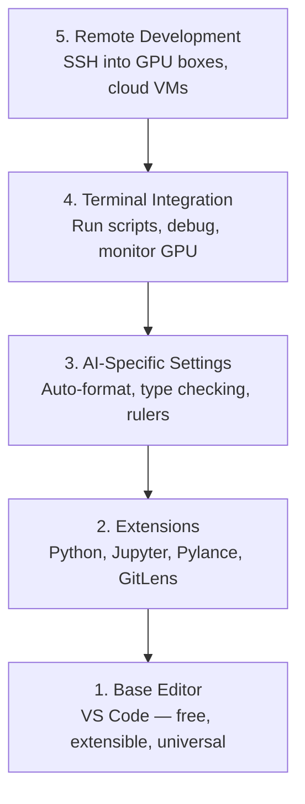

# 에디터 설정

> 에디터는 당신의 부조종사입니다. 한 번 제대로 설정해 두면 방해되지 않고 제 몫을 톡톡히 해냅니다.

**유형:** Build (실습)
**사용 언어:** --
**선수 레슨:** Phase 0, Lesson 01
**소요 시간:** ~20분

## 학습 목표

- Python, Jupyter, 린팅, Remote SSH를 위한 필수 확장 프로그램과 함께 VS Code를 설치합니다.
- AI 워크플로를 위해 저장 시 자동 서식 지정(format-on-save), 타입 검사, 노트북 출력 스크롤을 설정합니다.
- 원격 GPU 머신의 코드를 로컬 환경처럼 편집하고 디버깅할 수 있도록 Remote SSH를 구성합니다.
- 대체 에디터(Cursor, Windsurf, Neovim)와 AI 작업 시의 트레이드오프를 평가합니다.

## 해결하려는 문제

앞으로 에디터 안에서 Python 코드를 작성하고, 노트북을 실행하며, 학습 루프를 디버깅하고, GPU 머신에 SSH로 접속하는 데 수천 시간을 쓰게 됩니다. 에디터 설정이 잘못되어 있으면 자동 완성 미지원, 타입 힌트 부재, 인라인 오류 미표시, 수동 코드 서식 지정, 투박한 터미널 워크플로 등 매 작업 세션마다 마찰이 발생합니다.

제대로 된 설정에는 20분이 걸립니다. 이를 건너뛰면 매일 20분씩 낭비하게 됩니다.

## 핵심 개념

AI 엔지니어링을 위한 에디터 설정에는 다섯 가지가 필요합니다.



```figure
s0-lsp-roundtrip
```

## 직접 구축하기

### 1단계: VS Code 설치

VS Code를 권장 에디터로 사용합니다. 무료이며 모든 OS에서 실행되고, 수준 높은 Jupyter notebook 지원을 제공하며, 확장 프로그램 생태계가 AI 작업에 필요한 모든 것을 포괄합니다.

[code.visualstudio.com](https://code.visualstudio.com/)에서 다운로드합니다.

터미널에서 설치를 확인합니다:

```bash
code --version
```

macOS에서 `code` 명령어를 찾을 수 없다면, VS Code를 열고 `Cmd+Shift+P`를 누른 뒤 "Shell Command"를 입력하고 "'code' 명령을 PATH에 설치"를 선택합니다.

### 2단계: 필수 확장 프로그램 설치

VS Code에서 통합 터미널을 열고(`` Ctrl+` `(모든 플랫폼 공통)), AI 작업에 중요한 확장 프로그램들을 설치합니다:

```bash
code --install-extension ms-python.python
code --install-extension ms-python.vscode-pylance
code --install-extension ms-toolsai.jupyter
code --install-extension eamodio.gitlens
code --install-extension ms-vscode-remote.remote-ssh
code --install-extension ms-python.debugpy
code --install-extension ms-python.black-formatter
code --install-extension charliermarsh.ruff
```

각 확장 프로그램의 역할:

| 확장 프로그램 | 도입 이유 |
|-----------|-----|
| Python | 언어 지원, 가상환경 감지, 실행/디버그 |
| Pylance | 빠른 타입 검사, 자동 완성, import 구문 해석 |
| Jupyter | VS Code 내 노트북 실행, 변수 탐색기 |
| GitLens | 변경자 확인, 인라인 git blame |
| Remote SSH | 원격 GPU 머신의 폴더를 로컬처럼 열기 |
| Debugpy | Python 단계별 실행 디버깅 |
| Black Formatter | 저장 시 자동 서식 지정, 일관된 스타일 유지 |
| Ruff | 빠른 린팅, 흔한 실수 감지 |

이 레슨의 `code/.vscode/extensions.json` 파일에 전체 권장 목록이 포함되어 있습니다. 프로젝트 폴더를 열면 VS Code에서 설치 안내를 표시합니다.

### 3단계: 환경설정 구성

이 레슨의 `code/.vscode/settings.json` 설정을 복사하거나, `Settings > Open Settings (JSON)`을 통해 직접 적용합니다.

AI 작업을 위한 핵심 설정:

```jsonc
{
    "python.analysis.typeCheckingMode": "basic",
    "editor.formatOnSave": true,
    "editor.rulers": [88, 120],
    "notebook.output.scrolling": true,
    "files.autoSave": "afterDelay"
}
```

이 설정들이 중요한 이유:

- **기본(basic) 타입 검사**: 실행 전에 잘못된 인자 타입을 잡아냅니다. 텐서 형태(tensor shape) 불일치나 잘못된 API 매개변수로 인한 디버깅 시간을 줄여줍니다.
- **저장 시 자동 서식 지정**: 코드 포맷팅에 더 이상 신경 쓸 필요가 없습니다. Black이 알아서 처리합니다.
- **88자 및 120자 눈금자**: Black은 88자에서 줄을 바꿉니다. 120자 표시는 독스트링(docstring)과 주석이 지나치게 길어지는 시점을 보여줍니다.
- **노트북 출력 스크롤**: 학습 루프는 수천 줄을 출력합니다. 스크롤이 없으면 출력 창이 지나치게 커집니다.
- **자동 저장**: 저장을 깜빡하는 경우가 반드시 생깁니다. 그러면 학습 스크립트가 이전 코드를 실행하게 됩니다. 자동 저장은 이를 방지합니다.

### 4단계: 터미널 연동

VS Code의 통합 터미널은 학습 스크립트를 실행하고, GPU를 모니터링하며, 환경을 관리하는 공간입니다.

올바르게 설정합니다:

```jsonc
{
    "terminal.integrated.defaultProfile.osx": "zsh",
    "terminal.integrated.defaultProfile.linux": "bash",
    "terminal.integrated.fontSize": 13,
    "terminal.integrated.scrollback": 10000
}
```

유용한 단축키:

| 동작 | macOS | Linux/Windows |
|--------|-------|---------------|
| 터미널 토글 | `` Ctrl+` `` | `` Ctrl+` `` |
| 새 터미널 열기 | `` Ctrl+Shift+` `` | `` Ctrl+Shift+` `` |
| 터미널 분할 | `Cmd+\` | `Ctrl+Shift+5` |

터미널 분할은 매우 유용합니다. 한쪽에서는 스크립트를 실행하고, 다른 쪽에서는 `nvidia-smi -l 1` 또는 `watch -n 1 nvidia-smi`로 GPU를 모니터링할 수 있습니다.

### 5단계: 원격 개발 (GPU 머신으로 SSH 접속)

AI 작업에서 가장 중요한 확장 프로그램입니다. 원격 머신(클라우드 VM, 연구실 서버, Lambda, Vast.ai)에서 학습을 실행하게 됩니다. Remote SSH를 사용하면 원격 파일시스템을 열고, 파일을 편집하고, 터미널을 실행하고, 모든 것이 로컬에 있는 것처럼 디버깅할 수 있습니다.

설정 방법:

1. Remote SSH 확장 프로그램을 설치합니다 (2단계에서 완료).
2. `Ctrl+Shift+P` (또는 `Cmd+Shift+P`)를 누르고 "Remote-SSH: Connect to Host"를 입력합니다.
3. `user@your-gpu-box-ip`를 입력합니다.
4. VS Code가 원격 머신에 서버 컴포넌트를 자동으로 설치합니다.

비밀번호 없이 접속하려면 SSH 키를 설정합니다:

```bash
ssh-keygen -t ed25519 -C "your-email@example.com"
ssh-copy-id user@your-gpu-box-ip
```

편의를 위해 호스트를 `~/.ssh/config`에 추가합니다:

```
Host gpu-box
    HostName 203.0.113.50
    User ubuntu
    IdentityFile ~/.ssh/id_ed25519
    ForwardAgent yes
```

이제 `Remote-SSH: Connect to Host > gpu-box` 명령으로 즉시 접속할 수 있습니다.

## 대체 에디터

### Cursor

[cursor.com](https://cursor.com)은 AI 코드 생성 기능이 내장된 VS Code 포크(fork)입니다. 동일한 확장 프로그램 생태계와 설정 형식을 사용합니다. Cursor를 사용하더라도 이 레슨의 모든 내용이 그대로 적용됩니다. 동일한 `settings.json` 및 `extensions.json`를 가져와 사용하면 됩니다.

### Windsurf

[windsurf.com](https://windsurf.com)은 또 다른 AI 중심 VS Code 포크입니다. 마찬가지로 동일한 확장 프로그램, 동일한 설정 형식, 동일한 Remote SSH 지원을 공유합니다.

### Vim/Neovim

이미 Vim이나 Neovim을 사용하고 있고 생산성이 높다면 그대로 유지해도 좋습니다. AI Python 작업을 위한 최소 설정은 다음과 같습니다:

- 타입 검사를 위한 **pyright** 또는 **pylsp** (Mason 또는 수동 설치)
- 언어 서버 연동을 위한 **nvim-lspconfig**
- 노트북 형태의 실행을 위한 **jupyter-vim** 또는 **molten-nvim**
- 파일/심볼 검색을 위한 **telescope.nvim**
- 서식 지정 및 린팅을 위한 **none-ls.nvim** (black 및 ruff 연동)

아직 Vim을 사용하지 않는다면 지금 시작하지 마세요. 에디터 학습 곡선이 AI 엔지니어링 학습과 충돌하게 됩니다. VS Code를 사용하세요.

## 실전 활용

이 설정을 마치면 일상적인 워크플로는 다음과 같습니다:

1. VS Code에서 프로젝트 폴더를 엽니다(또는 Remote SSH를 통해 GPU 머신에 접속합니다).
2. 자동 완성, 타입 힌트, 인라인 오류 확인 기능과 함께 에디터에서 Python 코드를 작성합니다.
3. Jupyter 확장 프로그램을 사용해 Jupyter notebook을 인라인으로 실행합니다.
4. 학습 스크립트 실행, `uv pip install`, GPU 모니터링에는 통합 터미널을 사용합니다.
5. 커밋하기 전에 GitLens로 변경 사항을 검토합니다.

## 연습 과제

1. VS Code 및 2단계에 나열된 모든 확장 프로그램을 설치합니다.
2. 이 레슨의 `settings.json` 설정을 VS Code 환경설정으로 복사합니다.
3. Python 파일을 열어 Pylance가 타입 힌트를 표시하고 Black이 저장 시 서식을 자동 지정하는지 확인합니다.
4. 원격 머신에 접근할 수 있다면 Remote SSH를 설정하고 원격 머신의 폴더를 열어봅니다.

## 핵심 용어

| 용어 | 흔히 부르는 말 | 실제 의미 |
|------|----------------|----------------------|
| LSP | "자동 완성 엔진" | Language Server Protocol: 에디터가 언어별 서버로부터 타입 정보, 완성 후보, 진단(diagnostic) 결과를 받아오기 위한 표준 규격 |
| Pylance | "파이썬 플러그인" | 타입 검사와 IntelliSense를 위해 Pyright를 사용하는 Microsoft의 Python 언어 서버 |
| Remote SSH | "서버에서 작업하기" | 원격 머신에서 가벼운 서버를 실행하고 로컬 에디터로 UI를 스트리밍하는 VS Code 확장 프로그램 |
| Format on save | "자동 프리티어" | 코드를 저장할 때마다 에디터가 포매터(Black, Ruff)를 실행하여 코드 스타일을 항상 일관되게 유지하는 기능 |
