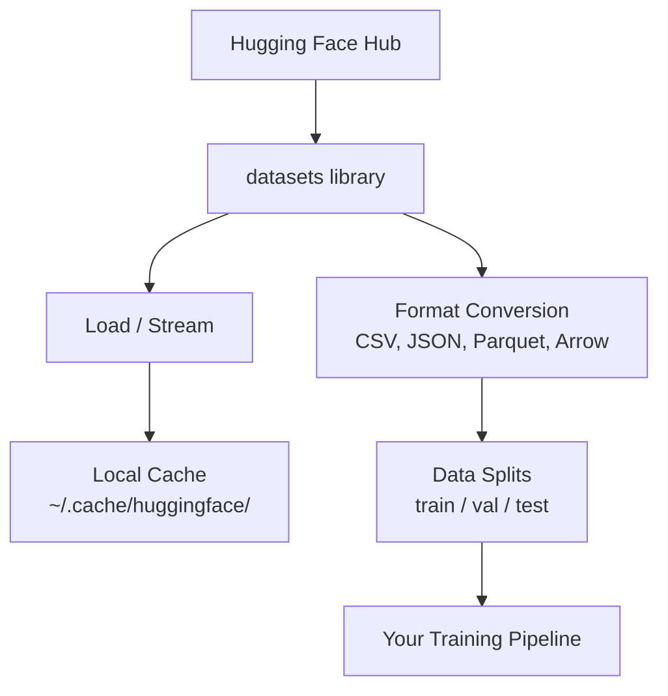

# 데이터 관리

> 데이터는 연료입니다. 데이터를 어떻게 관리하느냐에 따라 나아가는 속도가 결정됩니다.

**유형:** Build (실습)
**Language:** Python
**선수 레슨:** Phase 0, Lesson 01
**소요 시간:** ~45분

## 학습 목표

- Hugging Face `datasets` 라이브러리를 사용하여 데이터셋을 로드, 스트리밍, 캐싱합니다.
- CSV, JSON, Parquet, Arrow 포맷 간에 상호 변환하고 각각의 장단점을 설명합니다.
- 고정된 난수 시드(random seed)를 사용하여 재현 가능한 훈련/검증/테스트 분할을 생성합니다.
- `.gitignore`, Git LFS 또는 DVC를 사용하여 대용량 모델 및 데이터셋 파일을 관리합니다.

## 문제점

모든 AI 프로젝트는 데이터에서 시작됩니다. 데이터셋을 찾고, 다운로드하고, 포맷을 변환하고, 훈련 및 평가용으로 분할하고, 실험을 재현할 수 있도록 버전을 관리해야 합니다. 매번 이 작업을 수동으로 수행하는 것은 느리고 오류가 발생하기 쉽습니다. 반복 가능한 워크플로가 필요합니다.

## 개념



Hugging Face `datasets` 라이브러리는 AI 작업을 위한 데이터를 로드하는 표준 방식입니다. 다운로드, 캐싱, 포맷 변환 및 스트리밍을 기본적으로 처리합니다.

```figure
s0-data-pipeline
```

## 구현하기

### 1단계: datasets 라이브러리 설치

```bash
pip install datasets huggingface_hub
```

### 2단계: 데이터셋 로드

```python
from datasets import load_dataset

dataset = load_dataset("stanfordnlp/imdb")
print(dataset)
print(dataset["train"][0])
```

이 코드는 IMDB 영화 리뷰 데이터셋을 다운로드합니다. 최초 다운로드 이후에는 `~/.cache/huggingface/datasets/`에 저장된 캐시에서 로드됩니다.

### 3단계: 대용량 데이터셋 스트리밍

어떤 데이터셋은 너무 커서 디스크에 모두 담을 수 없습니다. 스트리밍을 사용하면 전체 데이터를 다운로드하지 않고 행 단위로 로드합니다.

```python
dataset = load_dataset("wikimedia/wikipedia", "20231101.en", split="train", streaming=True)

for i, example in enumerate(dataset):
    print(example["title"])
    if i >= 4:
        break
```

스트리밍을 사용하면 `IterableDataset`가 반환됩니다. 데이터가 도착하는 대로 행을 처리하므로 데이터셋 크기에 관계없이 메모리 사용량이 일정하게 유지됩니다.

### 4단계: 데이터셋 포맷

`datasets` 라이브러리는 내부적으로 Apache Arrow를 사용합니다. 파이프라인의 필요에 따라 다른 포맷으로 변환할 수 있습니다.

```python
dataset = load_dataset("stanfordnlp/imdb", split="train")

dataset.to_csv("imdb_train.csv")
dataset.to_json("imdb_train.json")
dataset.to_parquet("imdb_train.parquet")
```

포맷 비교:

| 포맷 | 크기 | 읽기 속도 | 적합한 용도 |
|------|------|-----------|----------|
| CSV | 큼 | 느림 | 사람이 읽어야 하는 경우, 스프레드시트 |
| JSON | 큼 | 느림 | API, 중첩된 데이터 |
| Parquet | 작음 | 빠름 | 분석, 컬럼 기반 쿼리 |
| Arrow | 작음 | 가장 빠름 | 인메모리 처리 (`datasets`가 내부적으로 사용하는 포맷) |

AI 작업에서는 Parquet이 최적의 저장 포맷입니다. Arrow는 메모리에서 작업할 때 사용됩니다. CSV와 JSON은 데이터 교환용입니다.

### 5단계: 데이터 분할

모든 ML 프로젝트에는 세 가지 분할이 필요합니다.

- **훈련(Train)**: 모델이 학습하는 데이터입니다 (일반적으로 80%)
- **검증(Validation)**: 훈련 중 진행 상황을 확인합니다 (일반적으로 10%)
- **테스트(Test)**: 훈련 완료 후 최종 평가에 사용됩니다 (일반적으로 10%)

일부 데이터셋은 미리 분할되어 제공됩니다. 그렇지 않은 경우에는 직접 분할해야 합니다.

```python
dataset = load_dataset("stanfordnlp/imdb", split="train")

split = dataset.train_test_split(test_size=0.2, seed=42)
train_val = split["train"].train_test_split(test_size=0.125, seed=42)

train_ds = train_val["train"]
val_ds = train_val["test"]
test_ds = split["test"]

print(f"Train: {len(train_ds)}, Val: {len(val_ds)}, Test: {len(test_ds)}")
```

재현성을 위해 항상 시드를 설정합니다. 동일한 시드는 매번 동일한 분할을 생성합니다.

### 6단계: 모델 다운로드 및 캐싱

모델은 대용량 파일입니다. `huggingface_hub` 라이브러리가 다운로드와 캐싱을 처리합니다.

```python
from huggingface_hub import hf_hub_download, snapshot_download

model_path = hf_hub_download(
    repo_id="sentence-transformers/all-MiniLM-L6-v2",
    filename="config.json"
)
print(f"Cached at: {model_path}")

model_dir = snapshot_download("sentence-transformers/all-MiniLM-L6-v2")
print(f"Full model at: {model_dir}")
```

모델은 `~/.cache/huggingface/hub/`에 캐시됩니다. 한 번 다운로드되면 이후 실행 시 즉시 로드됩니다.

### 7단계: 대용량 파일 처리

모델 가중치와 대용량 데이터셋은 Git에 커밋하지 않아야 합니다. 세 가지 옵션이 있습니다.

**옵션 A: .gitignore (가장 간단함)**

```
*.bin
*.safetensors
*.pt
*.onnx
data/*.parquet
data/*.csv
models/
```

**옵션 B: Git LFS (Git에서 대용량 파일 추적)**

```bash
git lfs install
git lfs track "*.bin"
git lfs track "*.safetensors"
git add .gitattributes
```

Git LFS는 저장소에 포인터를 저장하고 실제 파일은 별도의 서버에 저장합니다. GitHub에서는 1GB를 무료로 제공합니다.

**옵션 C: DVC (데이터 버전 관리)**

```bash
pip install dvc
dvc init
dvc add data/training_set.parquet
git add data/training_set.parquet.dvc data/.gitignore
git commit -m "Track training data with DVC"
```

DVC는 데이터를 가리키는 작은 `.dvc` 파일을 생성합니다. 실제 데이터는 S3, GCS 또는 다른 원격 스토리지 백엔드에 저장됩니다.

| 접근 방식 | 복잡도 | 적합한 용도 |
|----------|-----------|----------|
| .gitignore | 낮음 | 개인 프로젝트, 다시 다운로드할 수 있는 데이터 |
| Git LFS | 보통 | Git을 통해 모델 가중치를 공유하는 팀 |
| DVC | 높음 | 재현 가능한 실험, 대용량 데이터셋, 팀 협업 |

이 과정에서는 `.gitignore`만으로도 충분합니다. 여러 머신에서 정확한 실험을 재현해야 할 때 DVC를 사용합니다.

### 8단계: 스토리지 패턴

**로컬 스토리지**는 약 10GB 미만의 데이터셋에 적합합니다. HF 캐시가 이를 자동으로 처리합니다.

**클라우드 스토리지**는 더 큰 데이터셋이나 여러 머신 간에 공유해야 하는 데이터에 사용됩니다.

```python
import os

local_path = os.path.expanduser("~/.cache/huggingface/datasets/")

# s3_path = "s3://my-bucket/datasets/"
# gcs_path = "gs://my-bucket/datasets/"
```

DVC는 S3 및 GCS와 직접 연동됩니다.

```bash
dvc remote add -d myremote s3://my-bucket/dvc-store
dvc push
```

이 과정에서는 로컬 스토리지만으로도 충분합니다. 클라우드 스토리지는 원격 GPU 인스턴스에서 미세 조정(fine-tuning)을 수행할 때 유용합니다.

## 이 과정에서 사용되는 데이터셋

| 데이터셋 | 강의 | 크기 | 학습 내용 |
|---------|---------|------|----------------|
| IMDB | 토큰화, 분류 | 84 MB | 텍스트 분류 기초 |
| WikiText | 언어 모델링 | 181 MB | 다음 토큰 예측 |
| SQuAD | QA 시스템 | 35 MB | 질의응답, 스팬 |
| Common Crawl (subset) | 임베딩 | 가변적 | 대규모 텍스트 처리 |
| MNIST | 비전 기초 | 21 MB | 이미지 분류 기초 |
| COCO (subset) | 멀티모달 | 가변적 | 이미지-텍스트 쌍 |

지금 이 데이터셋을 모두 다운로드할 필요는 없습니다. 각 강의에서 필요한 데이터셋을 안내합니다.

## 사용하기

유틸리티 스크립트를 실행하여 모든 것이 정상 작동하는지 확인합니다.

```bash
python code/data_utils.py
```

이 스크립트는 작은 데이터셋을 다운로드하고, 변환하고, 분할한 뒤 요약 정보를 출력합니다.

## 완성된 산출물

이 강의에서 생성되는 산출물은 다음과 같습니다.
- `code/data_utils.py` - 재사용 가능한 데이터 로드 및 캐싱 유틸리티
- `outputs/prompt-data-helper.md` - 특정 작업에 적합한 데이터셋을 찾기 위한 프롬프트

## 실습 과제

1. `mrpc` 설정으로 `glue` 데이터셋을 로드하고 처음 5개 예시를 확인합니다.
2. `c4` 데이터셋을 스트리밍하고 10초 동안 처리할 수 있는 예시 개수를 측정합니다.
3. 데이터셋을 Parquet으로 변환하고 CSV와 파일 크기를 비교합니다.
4. 고정된 시드로 70/15/15 훈련/검증/테스트 분할을 생성하고 각 크기를 확인합니다.

## 핵심 용어

| 용어 | 흔히 하는 말 | 실제 의미 |
|------|----------------|----------------------|
| 데이터셋 분할 (Dataset split) | "훈련 데이터" | ML 수명 주기의 서로 다른 단계에서 사용되는 이름이 지정된 하위 집합(train/val/test) |
| 스트리밍 (Streaming) | "지연 로딩" | 전체 데이터셋을 다운로드하지 않고 원격 소스에서 행 단위로 데이터를 처리하는 방식 |
| Parquet | "압축된 CSV" | 분석 쿼리와 스토리지 효율성에 최적화된 컬럼 기반 파일 포맷 |
| Arrow | "빠른 데이터프레임" | 제로 카피(zero-copy) 읽기를 위해 datasets 라이브러리가 내부적으로 사용하는 인메모리 컬럼 기반 포맷 |
| Git LFS | "대용량 파일용 Git" | 버전 관리에는 포인터만 유지하고 대용량 파일은 Git 저장소 외부에 저장하는 확장 도구 |
| DVC | "데이터용 Git" | 클라우드 스토리지와 연동되는 데이터셋 및 모델용 버전 관리 시스템 |
| 캐시 (Cache) | "이미 다운로드됨" | 이전에 가져온 데이터의 로컬 복사본으로, 기본적으로 ~/.cache/huggingface/에 저장됨 |
