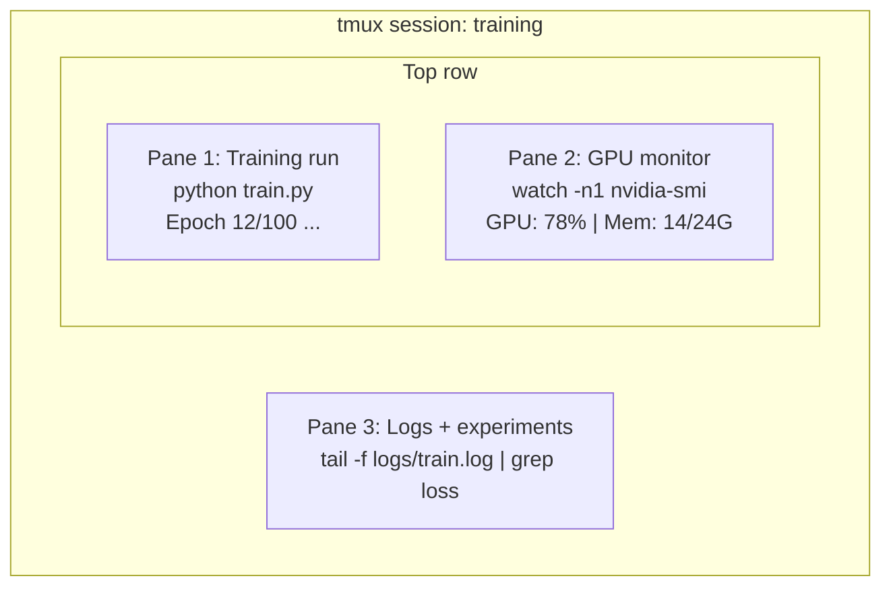

# Terminal & Shell

> 터미널은 AI 엔지니어가 살아가는 공간입니다. 이곳에 익숙해지세요.

**유형:** Learn (이론)
**사용 언어:** --
**선수 레슨:** Phase 0, Lesson 01
**소요 시간:** ~35분

## Learning Objectives

- 파이프, 리다이렉트, `grep`를 사용하여 커맨드라인에서 학습 로그를 필터링하고 처리합니다.
- 학습과 GPU 모니터링을 병행할 수 있도록 여러 패인(pane)을 갖춘 지속형 tmux 세션을 생성합니다.
- `htop`, `nvtop`, `nvidia-smi`를 사용하여 시스템 및 GPU 리소스를 모니터링합니다.
- SSH, `scp`, `rsync`를 사용하여 로컬 머신과 원격 머신 간에 파일을 전송합니다.

## The Problem

여러분은 어떤 에디터보다 터미널에서 더 많은 시간을 보내게 될 것입니다. 학습 실행, GPU 모니터링, 로그 테일링(log tailing), 원격 SSH 세션, 환경 관리 등 모든 AI 워크플로는 셸을 거칩니다. 여기서 작업 속도가 느리다면 모든 작업이 느려집니다.

이 레슨에서는 AI 작업에 꼭 필요한 터미널 기술을 다룹니다. Unix의 역사는 다루지 않습니다. Bash 스크립팅을 깊게 파고들지도 않습니다. 오직 필요한 것만 다룹니다.

## The Concept



세 가지 작업이 동시에 실행됩니다. 터미널은 하나입니다. 세션에서 분리(detach)하고, 퇴근한 뒤, 다시 SSH로 접속하여 재연결(reattach)할 수 있습니다. 학습은 계속 실행됩니다.

```figure
s0-shell-pipeline
```

## Build It

### Step 1: 셸 확인하기

현재 실행 중인 셸을 확인합니다:

```bash
echo $SHELL
```

대부분의 시스템은 `bash` 또는 `zsh`를 사용합니다. 둘 다 문제없이 작동합니다. 이 코스의 명령어들은 두 셸 모두에서 동작합니다.

알아두어야 할 핵심 사항:

```bash
# Move around
cd ~/projects/ai-engineering-from-scratch
pwd
ls -la

# History search (most useful shortcut you'll learn)
# Ctrl+R then type part of a previous command
# Press Ctrl+R again to cycle through matches

# Clear terminal
clear   # or Ctrl+L

# Cancel a running command
# Ctrl+C

# Suspend a running command (resume with fg)
# Ctrl+Z
```

### Step 2: 파이프와 리다이렉트

파이프(piping)는 명령어들을 서로 연결합니다. 이를 통해 로그를 처리하고, 출력을 필터링하며, 도구들을 연쇄적으로 실행합니다. 이 기능은 끊임없이 사용하게 됩니다.

```bash
# Count how many times "loss" appears in a log
cat train.log | grep "loss" | wc -l

# Extract just the loss values from training output
grep "loss:" train.log | awk '{print $NF}' > losses.txt

# Watch a log file update in real time, filtering for errors
tail -f train.log | grep --line-buffered "ERROR"

# Sort experiments by final accuracy
grep "final_accuracy" results/*.log | sort -t= -k2 -n -r

# Redirect stdout and stderr to separate files
python train.py > output.log 2> errors.log

# Redirect both to the same file
python train.py > train_full.log 2>&1
```

알아두어야 할 세 가지 리다이렉트:

| 기호 | 역할 |
|--------|-------------|
| `>` | stdout을 파일에 쓰기 (덮어쓰기) |
| `>>` | stdout을 파일 끝에 추가 |
| `2>` | stderr를 파일에 쓰기 |
| `2>&1` | stderr를 stdout과 같은 위치로 전송 |
| `\|` | 한 명령어의 stdout을 다음 명령어의 stdin으로 전송 |

### Step 3: 백그라운드 프로세스

학습 실행에는 수시간이 걸립니다. 그동안 내내 터미널을 열어두고 싶지는 않을 것입니다.

```bash
# Run in background (output still goes to terminal)
python train.py &

# Run in background, immune to hangup (closing terminal won't kill it)
nohup python train.py > train.log 2>&1 &

# Check what's running in background
jobs
ps aux | grep train.py

# Bring a background job to foreground
fg %1

# Kill a background process
kill %1
# or find its PID and kill that
kill $(pgrep -f "train.py")
```

`&`, `nohup`, `screen`/`tmux`의 차이점:

| 방식 | 터미널을 닫아도 유지되는가? | 다시 연결(reattach)할 수 있는가? |
|--------|-------------------------|---------------|
| `command &` | 아니요 | 아니요 |
| `nohup command &` | 예 | 아니요 (로그 파일 확인 필요) |
| `screen` / `tmux` | 예 | 예 |

몇 분 이상 걸리는 작업에는 항상 tmux를 사용하세요.

### Step 4: tmux

tmux를 사용하면 여러 패인을 포함하는 지속형 터미널 세션을 만들 수 있습니다. 학습 실행을 관리하는 데 가장 유용한 단 하나의 도구입니다.

```bash
# Install
# macOS
brew install tmux
# Ubuntu
sudo apt install tmux

# Start a named session
tmux new -s training

# Split horizontally
# Ctrl+B then "

# Split vertically
# Ctrl+B then %

# Navigate between panes
# Ctrl+B then arrow keys

# Detach (session keeps running)
# Ctrl+B then d

# Reattach
tmux attach -t training

# List sessions
tmux ls

# Kill a session
tmux kill-session -t training
```

전형적인 AI 워크플로 세션:

```bash
tmux new -s train

# Pane 1: start training
python train.py --epochs 100 --lr 1e-4

# Ctrl+B, " to split, then run GPU monitor
watch -n1 nvidia-smi

# Ctrl+B, % to split vertically, tail the logs
tail -f logs/experiment.log

# Now detach with Ctrl+B, d
# SSH out, go get coffee, come back
# tmux attach -t train
```

### Step 5: htop과 nvtop을 사용한 모니터링

```bash
# System processes (better than top)
htop

# GPU processes (if you have NVIDIA GPU)
# Install: sudo apt install nvtop (Ubuntu) or brew install nvtop (macOS)
nvtop

# Quick GPU check without nvtop
nvidia-smi

# Watch GPU usage update every second
watch -n1 nvidia-smi

# See which processes are using the GPU
nvidia-smi --query-compute-apps=pid,name,used_memory --format=csv
```

자주 사용하는 `htop` 단축키:
- `F6` 또는 `>`: 열 기준으로 정렬 (메모리 정렬을 통해 메모리 누수 탐색)
- `F5`: 트리 뷰 전환 (자식 프로세스 확인)
- `F9`: 프로세스 종료(kill)
- `/`: 프로세스 이름 검색

### Step 6: 원격 GPU 머신을 위한 SSH

클라우드 GPU(Lambda, RunPod, Vast.ai)를 대여하면 SSH를 통해 접속합니다.

```bash
# Basic connection
ssh user@gpu-box-ip

# With a specific key
ssh -i ~/.ssh/my_gpu_key user@gpu-box-ip

# Copy files to remote
scp model.pt user@gpu-box-ip:~/models/

# Copy files from remote
scp user@gpu-box-ip:~/results/metrics.json ./

# Sync a whole directory (faster for many files)
rsync -avz ./data/ user@gpu-box-ip:~/data/

# Port forward (access remote Jupyter/TensorBoard locally)
ssh -L 8888:localhost:8888 user@gpu-box-ip
# Now open localhost:8888 in your browser

# SSH config for convenience
# Add to ~/.ssh/config:
# Host gpu
#     HostName 192.168.1.100
#     User ubuntu
#     IdentityFile ~/.ssh/gpu_key
#
# Then just:
# ssh gpu
```

### Step 7: AI 작업에 유용한 alias

다음 내용을 `~/.bashrc` 또는 `~/.zshrc`에 추가하세요:

```bash
source phases/00-setup-and-tooling/10-terminal-and-shell/code/shell_aliases.sh
```

또는 원하는 것만 복사하여 사용하세요. 주요 alias:

```bash
# GPU status at a glance
alias gpu='nvidia-smi --query-gpu=index,name,utilization.gpu,memory.used,memory.total,temperature.gpu --format=csv,noheader'

# Kill all Python training processes
alias killtraining='pkill -f "python.*train"'

# Quick virtual environment activate
alias ae='source .venv/bin/activate'

# Watch training loss
alias watchloss='tail -f logs/*.log | grep --line-buffered "loss"'
```

전체 목록은 `code/shell_aliases.sh`를 참조하세요.

### Step 8: 자주 쓰이는 AI 터미널 패턴

실무에서 반복적으로 나타나는 패턴들입니다:

```bash
# Run training, log everything, notify when done
python train.py 2>&1 | tee train.log; echo "DONE" | mail -s "Training complete" you@email.com

# Compare two experiment logs side by side
diff <(grep "accuracy" exp1.log) <(grep "accuracy" exp2.log)

# Find the largest model files (clean up disk space)
find . -name "*.pt" -o -name "*.safetensors" | xargs du -h | sort -rh | head -20

# Download a model from Hugging Face
wget https://huggingface.co/model/resolve/main/model.safetensors

# Untar a dataset
tar xzf dataset.tar.gz -C ./data/

# Count lines in all Python files (see how big your project is)
find . -name "*.py" | xargs wc -l | tail -1

# Check disk space (training data fills disks fast)
df -h
du -sh ./data/*

# Environment variable check before training
env | grep -i cuda
env | grep -i torch
```

## Use It

이 코스에서 각 도구가 사용되는 시점은 다음과 같습니다:

| 도구 | 사용 시점 |
|------|----------------|
| tmux | 모든 학습 실행 (Phase 3 이상) |
| `tail -f` + `grep` | 학습 로그 모니터링 |
| `nohup` / `&` | 빠른 백그라운드 작업 |
| `htop` / `nvtop` | 느린 학습 디버깅, OOM 오류 디버깅 |
| SSH + `rsync` | 클라우드 GPU 작업 |
| 파이프 + 리다이렉트 | 실험 결과 처리 |
| Aliases | 반복적인 명령어 입력 시간 단축 |

## Exercises

1. tmux를 설치하고, 패인 3개로 구성된 세션을 생성한 뒤, 하나의 패인에는 `htop`, 다른 하나에는 `watch -n1 date`, 세 번째에는 Python 스크립트를 실행해 보세요. 세션을 분리(detach)했다가 다시 연결(reattach)해 봅니다.
2. `code/shell_aliases.sh`의 alias들을 셸 설정 파일에 추가하고 `source ~/.zshrc`(또는 `~/.bashrc`) 명령어로 다시 로드합니다.
3. `for i in $(seq 1 100); do echo "epoch $i loss: $(echo "scale=4; 1/$i" | bc)"; sleep 0.1; done > fake_train.log`로 가짜 학습 로그를 생성한 후 `grep`, `tail`, `awk`를 사용하여 손실(loss) 값만 추출해 보세요.
4. 접근 가능한 서버에 대한 SSH config 항목을 설정해 보세요(접근 가능한 서버가 없다면 `localhost`를 사용하여 문법을 연습해 봅니다).

## Key Terms

| 용어 | 흔히 부르는 말 | 실제 의미 |
|------|----------------|----------------------|
| Shell | "터미널" | 명령어를 해석하는 프로그램 (bash, zsh, fish) |
| tmux | "터미널 멀티플렉서" | 하나의 창 안에서 여러 터미널 세션을 실행하고 분리/재연결할 수 있게 해주는 프로그램 |
| Pipe | "그 막대기 기호" | 한 명령어의 출력을 다른 명령어의 입력으로 보내는 `\|` 연산자 |
| PID | "프로세스 ID" | 실행 중인 모든 프로세스에 할당되는 고유 번호로, 모니터링하거나 종료할 때 사용 |
| nohup | "노헙" | 끊기 신호(hangup signal)를 무시하고 명령어를 실행하여 터미널을 닫아도 프로세스가 종료되지 않게 함 |
| SSH | "서버 접속" | Secure Shell의 약자로, 원격 머신에서 명령어를 실행하기 위한 암호화 프로토콜 |
