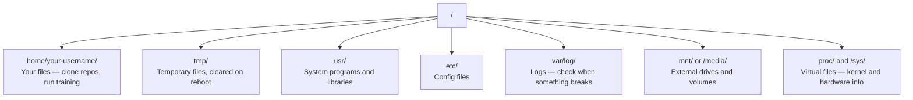

# AI를 위한 Linux

> 대부분의 AI는 Linux에서 실행됩니다. 작업이 막히지 않을 만큼은 알아두어야 합니다.

**유형:** Learn (이론)
**사용 언어:** --
**선수 레슨:** Phase 0, Lesson 01
**소요 시간:** ~30분

## 학습 목표

- Linux 파일 시스템을 탐색하고 명령줄에서 필수적인 파일 작업을 수행합니다
- `chmod` 및 `chown`을 사용하여 파일 권한을 관리하고 "Permission denied" 오류를 해결합니다
- `apt`을 사용하여 시스템 패키지를 설치하고 AI 작업을 위한 새 GPU 머신을 설정합니다
- 원격 머신에서 작업할 때 개발자가 흔히 겪는 macOS와 Linux 간의 차이점을 파악합니다

## 문제점

개발은 macOS나 Windows에서 진행할 수 있습니다. 하지만 클라우드 GPU 머신에 SSH로 접속하거나, Lambda 인스턴스를 대여하거나, EC2 머신을 띄우는 순간 Ubuntu 환경을 마주하게 됩니다. 터미널이 유일한 인터페이스입니다. Finder도, Explorer도, GUI도 없습니다. 파일 시스템을 탐색하고, 패키지를 설치하고, 명령줄에서 프로세스를 관리하지 못한다면 "Linux에서 파일 압축 푸는 법"을 구글링하는 동안 유휴 GPU 비용만 낭비하게 됩니다.

이 문서는 서바이벌 가이드입니다. AI 작업을 위해 원격 Linux 머신을 다루는 데 꼭 필요한 내용만 다룹니다. 그 이상은 다루지 않습니다.

## 파일 시스템 구조

Linux는 모든 것을 단일 루트 `/` 아래에 체계화합니다. `C:\`나 `/Volumes` 같은 드라이브는 없습니다. 실제로 다루게 될 디렉터리는 다음과 같습니다.



홈 디렉터리는 `~` 또는 `/home/your-username`입니다. 거의 모든 작업이 이곳에서 이루어집니다.

## 필수 명령어

원격 GPU 머신에서 수행하는 작업의 95%를 아우르는 15가지 명령어입니다.

### 이동

```bash
pwd                         # Where am I?
ls                          # What's here?
ls -la                      # What's here, including hidden files with details?
cd /path/to/dir             # Go there
cd ~                        # Go home
cd ..                       # Go up one level
```

### 파일 및 디렉터리

```bash
mkdir my-project            # Create a directory
mkdir -p a/b/c              # Create nested directories in one shot

cp file.txt backup.txt      # Copy a file
cp -r src/ src-backup/      # Copy a directory (recursive)

mv old.txt new.txt          # Rename a file
mv file.txt /tmp/           # Move a file

rm file.txt                 # Delete a file (no trash, it's gone)
rm -rf my-dir/              # Delete a directory and everything inside
```

`rm -rf` 작업은 영구적입니다. 실행 취소는 불가능합니다. Enter 키를 누르기 전에 경로를 다시 한번 확인하세요.

### 파일 읽기

```bash
cat file.txt                # Print entire file
head -20 file.txt           # First 20 lines
tail -20 file.txt           # Last 20 lines
tail -f log.txt             # Follow a log file in real time (Ctrl+C to stop)
less file.txt               # Scroll through a file (q to quit)
```

### 검색

```bash
grep "error" training.log           # Find lines containing "error"
grep -r "learning_rate" .           # Search all files in current directory
grep -i "cuda" config.yaml          # Case-insensitive search

find . -name "*.py"                 # Find all Python files under current dir
find . -name "*.ckpt" -size +1G     # Find checkpoint files larger than 1GB
```

## 권한

Linux의 모든 파일에는 소유자와 권한 비트가 있습니다. 스크립트가 실행되지 않거나 디렉터리에 쓸 수 없을 때 이 문제를 겪게 됩니다.

```bash
ls -l train.py
# -rwxr-xr-- 1 user group 2048 Mar 19 10:00 train.py
#  ^^^             owner permissions: read, write, execute
#     ^^^          group permissions: read, execute
#        ^^        everyone else: read only
```

자주 사용하는 해결 방법:

```bash
chmod +x train.sh           # Make a script executable
chmod 755 deploy.sh         # Owner: full, others: read+execute
chmod 644 config.yaml       # Owner: read+write, others: read only

chown user:group file.txt   # Change who owns a file (needs sudo)
```

"Permission denied"가 표시된다면 거의 항상 권한 문제입니다. 대부분의 경우 `chmod +x` 또는 `sudo`로 해결할 수 있습니다.

## 패키지 관리 (apt)

Ubuntu는 `apt`을 사용합니다. 이를 통해 시스템 수준의 소프트웨어를 설치합니다.

```bash
sudo apt update             # Refresh the package list (always do this first)
sudo apt install -y htop    # Install a package (-y skips confirmation)
sudo apt install -y build-essential  # C compiler, make, etc. Needed by many Python packages
sudo apt install -y tmux    # Terminal multiplexer (keep sessions alive after disconnect)

apt list --installed        # What's installed?
sudo apt remove htop        # Uninstall
```

새 GPU 머신에 흔히 설치하는 패키지:

```bash
sudo apt update && sudo apt install -y \
    build-essential \
    git \
    curl \
    wget \
    tmux \
    htop \
    unzip \
    python3-venv
```

## 사용자와 sudo

보통 일반 사용자로 로그인하게 됩니다. 일부 작업에는 root(관리자) 권한이 필요합니다.

```bash
whoami                      # What user am I?
sudo command                # Run a single command as root
sudo su                     # Become root (exit to go back, use sparingly)
```

클라우드 GPU 인스턴스에서는 대개 유일한 사용자이며 이미 sudo 권한을 가지고 있습니다. 모든 명령을 root로 실행하지는 마세요. 필요한 경우에만 sudo를 사용해야 합니다.

## 프로세스와 systemd

학습이 멈추거나 어떤 프로세스가 실행 중인지 확인해야 할 때:

```bash
htop                        # Interactive process viewer (q to quit)
ps aux | grep python        # Find running Python processes
kill 12345                  # Gracefully stop process with PID 12345
kill -9 12345               # Force kill (use when graceful doesn't work)
nvidia-smi                  # GPU processes and memory usage
```

systemd는 서비스(백그라운드 데몬)를 관리합니다. 추론(inference) 서버를 실행할 때 사용하게 됩니다.

```bash
sudo systemctl start nginx          # Start a service
sudo systemctl stop nginx           # Stop it
sudo systemctl restart nginx        # Restart it
sudo systemctl status nginx         # Check if it's running
sudo systemctl enable nginx         # Start automatically on boot
```

## 디스크 공간

GPU 머신은 종종 디스크 공간이 제한적입니다. 모델과 데이터셋은 용량을 빠르게 채웁니다.

```bash
df -h                       # Disk usage for all mounted drives
df -h /home                 # Disk usage for /home specifically

du -sh *                    # Size of each item in current directory
du -sh ~/.cache             # Size of your cache (pip, huggingface models land here)
du -sh /data/checkpoints/   # Check how big your checkpoints are

# Find the biggest space hogs
du -h --max-depth=1 / 2>/dev/null | sort -hr | head -20
```

일반적인 용량 확보 방법:

```bash
# Clear pip cache
pip cache purge

# Clear apt cache
sudo apt clean

# Remove old checkpoints you don't need
rm -rf checkpoints/epoch_01/ checkpoints/epoch_02/
```

## 네트워킹

명령줄에서 모델을 다운로드하고, 파일을 전송하고, API를 호출하게 됩니다.

```bash
# Download files
wget https://example.com/model.bin                   # Download a file
curl -O https://example.com/data.tar.gz              # Same thing with curl
curl -s https://api.example.com/health | python3 -m json.tool  # Hit an API, pretty-print JSON

# Transfer files between machines
scp model.bin user@remote:/data/                     # Copy file to remote machine
scp user@remote:/data/results.csv .                  # Copy file from remote to local
scp -r user@remote:/data/checkpoints/ ./local-dir/   # Copy directory

# Sync directories (faster than scp for large transfers, resumes on failure)
rsync -avz --progress ./data/ user@remote:/data/
rsync -avz --progress user@remote:/results/ ./results/
```

용량이 큰 파일에는 `scp`보다 `rsync`을 사용하세요. 변경된 바이트만 전송하며 연결이 끊겼을 때도 잘 대처합니다.

## tmux: 세션 유지하기

원격 머신에 SSH로 접속한 경우, 노트북을 닫으면 학습 실행이 종료됩니다. tmux를 사용하면 이를 방지할 수 있습니다.

```bash
tmux new -s train           # Start a new session named "train"
# ... start your training, then:
# Ctrl+B, then D            # Detach (training keeps running)

tmux ls                     # List sessions
tmux attach -t train        # Reattach to session

# Inside tmux:
# Ctrl+B, then %            # Split pane vertically
# Ctrl+B, then "            # Split pane horizontally
# Ctrl+B, then arrow keys   # Switch between panes
```

시간이 오래 걸리는 학습 작업은 항상 tmux 내에서 실행하세요. 예외는 없습니다.

## Windows 사용자를 위한 WSL2

Windows를 사용 중이라면, WSL2를 통해 듀얼 부팅 없이도 실제 Linux 환경을 구축할 수 있습니다.

```bash
# In PowerShell (admin)
wsl --install -d Ubuntu-24.04

# After restart, open Ubuntu from Start menu
sudo apt update && sudo apt upgrade -y
```

WSL2는 실제 Linux 커널을 실행합니다. 이 강의의 모든 내용은 WSL2 내부에서 작동합니다. Windows 파일은 WSL 내부에서 `/mnt/c/Users/YourName/`에 위치합니다.

GPU 패스스루는 Windows 측에 NVIDIA 드라이버가 설치되어 있으면 작동합니다. Linux 드라이버가 아닌 Windows NVIDIA 드라이버를 설치하면 WSL2 내부에서 CUDA를 사용할 수 있습니다.

## 주의할 점: macOS에서 Linux로 전환 시

macOS 환경에 익숙한 경우 혼란을 줄 수 있는 부분들입니다.

| macOS | Linux | 참고 |
|-------|-------|-------|
| `brew install` | `sudo apt install` | 패키지 이름이 다른 경우가 있습니다. `brew install htop` 대 `sudo apt install htop`은 동일하게 작동하지만, `brew install readline` 대 `sudo apt install libreadline-dev`는 그렇지 않습니다. |
| `open file.txt` | `xdg-open file.txt` | 하지만 원격 머신에는 GUI가 없습니다. `cat`나 `less`을 사용하세요. |
| `pbcopy` / `pbpaste` | 지원 안 됨 | SSH 환경에서는 클립보드 입출력 파이프를 사용할 수 없습니다. |
| `~/.zshrc` | `~/.bashrc` | macOS 기본 셸은 zsh입니다. 대부분의 Linux 서버는 bash를 사용합니다. |
| `/opt/homebrew/` | `/usr/bin/`, `/usr/local/bin/` | 바이너리가 위치하는 경로가 다릅니다. |
| `sed -i '' 's/a/b/' file` | `sed -i 's/a/b/' file` | macOS sed는 `-i` 뒤에 빈 문자열이 필요합니다. Linux는 필요하지 않습니다. |
| 대소문자를 구분하지 않는 파일 시스템 | 대소문자를 구분하는 파일 시스템 | Linux에서 `Model.py`와 `model.py`는 서로 다른 두 개의 파일입니다. |
| 줄 바꿈 `\n` | 줄 바꿈 `\n` | 동일합니다. 하지만 Windows는 `\r\n`를 사용하므로 bash 스크립트가 깨질 수 있습니다. 해결하려면 `dos2unix`를 실행하세요. |

## 빠른 참조 가이드

```
Navigation:     pwd, ls, cd, find
Files:          cp, mv, rm, mkdir, cat, head, tail, less
Search:         grep, find
Permissions:    chmod, chown, sudo
Packages:       apt update, apt install
Processes:      htop, ps, kill, nvidia-smi
Services:       systemctl start/stop/restart/status
Disk:           df -h, du -sh
Network:        curl, wget, scp, rsync
Sessions:       tmux new/attach/detach
```

```figure
s0-process-fork
```

## 실습 과제

1. 임의의 Linux 머신에 SSH로 접속하거나(또는 WSL2를 열고) 홈 디렉터리로 이동합니다. 프로젝트 폴더를 만들고, `touch`를 사용하여 그 안에 빈 파일 3개를 생성한 다음, `ls -la`으로 확인해 보세요.
2. apt로 `htop`을 설치하고 실행하여 어떤 프로세스가 메모리를 가장 많이 사용하고 있는지 확인합니다.
3. tmux 세션을 시작하고, 그 안에서 `sleep 300`을 실행한 뒤 세션을 분리(detach)하고, 세션 목록을 확인한 후 다시 연결(reattach)해 보세요.
4. `df -h`를 사용하여 사용 가능한 디스크 공간을 확인한 다음, `du -sh ~/.cache/*`을 사용하여 캐시에서 공간을 차지하고 있는 항목을 찾아보세요.
5. 로컬 머신에서 원격 머신으로 `scp`를 사용하여 파일을 전송한 다음, `rsync`를 사용해 동일한 전송을 수행하고 두 경험을 비교해 보세요.
