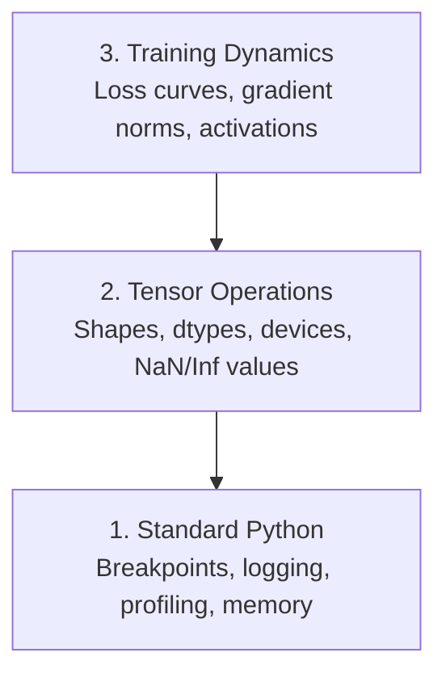

# Debugging and Profiling

> 최악의 AI 버그는 프로그램을 중단시키지 않습니다. 쓰레기 데이터로 조용히 학습을 진행하며 그럴싸한 손실 곡선을 보여줄 뿐입니다.

**유형:** Build (실습)
**Language:** Python
**선수 레슨:** Lesson 1 (Dev Environment), basic PyTorch familiarity
**소요 시간:** ~60분

## Learning Objectives

- 조건부 `breakpoint()` 및 `debug_print`을 사용하여 학습 도중 텐서의 shape, dtype, NaN 값을 검사합니다.
- `cProfile`, `line_profiler`, `tracemalloc`으로 학습 루프를 프로파일링하여 병목 현상을 찾아냅니다.
- 자주 발생하는 AI 버그(shape 불일치, NaN 손실, 데이터 누수, 잘못된 디바이스의 텐서)를 감지합니다.
- TensorBoard를 설정하여 손실 곡선, 가중치 히스토그램, 그래디언트(gradient) 분포를 시각화합니다.

## The Problem

AI 코드는 일반적인 코드와 다르게 실패합니다. 웹 애플리케이션은 스택 트레이스를 남기며 충돌합니다. 하지만 설정이 잘못된 학습 루프는 8시간 동안 실행되어 200달러 상당의 GPU 비용을 소모하고도 모든 입력에 대해 평균값만을 예측하는 모델을 만들어냅니다. 코드는 에러를 전혀 발생시키지 않았습니다. 버그는 단지 잘못된 디바이스에 놓인 텐서, 누락된 `.detach()`, 또는 특성(feature)으로 유출된 레이블 때문이었습니다.

시간과 컴퓨팅 자원을 낭비하기 전에 이러한 침묵하는 실패(silent failure)를 잡아낼 수 있는 디버깅 도구가 필요합니다.

## The Concept

AI 디버깅은 세 가지 레벨에서 작동합니다:



대부분의 사람들은 곧바로 레벨 3(TensorBoard 응시하기)으로 넘어갑니다. 하지만 AI 버그의 80%는 레벨 1과 2에 존재합니다.

```figure
s0-flame-hot
```

## Build It

### Part 1: Print Debugging (Yes, It Works)

프린트 디버깅은 종종 과소평가되지만, 그래서는 안 됩니다. 텐서 코드의 경우, shape, dtype, 값의 범위를 한 번에 모두 확인해야 하므로 목적에 맞게 작성된 print 문이 디버거를 단계별로 실행하는 것보다 훨씬 효과적입니다.

```python
def debug_print(name, tensor):
    print(f"{name}: shape={tensor.shape}, dtype={tensor.dtype}, "
          f"device={tensor.device}, "
          f"min={tensor.min().item():.4f}, max={tensor.max().item():.4f}, "
          f"mean={tensor.mean().item():.4f}, "
          f"has_nan={tensor.isnan().any().item()}")
```

의심스러운 연산이 끝날 때마다 이 함수를 호출하십시오. 버그를 찾으면 print 문을 제거하면 됩니다. 간단합니다.

### Part 2: Python Debugger (pdb and breakpoint)

내장 디버거는 AI 작업에서 과소평가되어 있습니다. 학습 루프에 `breakpoint()`을 삽입하고 텐서를 대화형으로 검사해 보십시오.

```python
def training_step(model, batch, criterion, optimizer):
    inputs, labels = batch
    outputs = model(inputs)
    loss = criterion(outputs, labels)

    if loss.item() > 100 or torch.isnan(loss):
        breakpoint()

    loss.backward()
    optimizer.step()
```

디버거로 진입했을 때 유용한 명령어들입니다:

- shape를 확인하기 위한 `p outputs.shape`
- 손실 값을 확인하기 위한 `p loss.item()`
- NaN 개수를 세기 위한 `p torch.isnan(outputs).sum()`
- 그래디언트를 확인하기 위한 `p model.fc1.weight.grad`
- 계속 실행하기 위한 `c`, 종료하기 위한 `q`

이것은 조건부 디버깅입니다. 무언가 잘못된 것으로 보일 때만 멈춥니다. 10,000단계의 학습 실행에서는 이러한 방식이 매우 중요합니다.

### Part 3: Python Logging

디버깅이 단순한 확인 수준을 넘어설 때는 print 문을 로깅으로 대체하십시오.

```python
import logging

logging.basicConfig(
    level=logging.INFO,
    format="%(asctime)s [%(levelname)s] %(message)s",
    handlers=[
        logging.FileHandler("training.log"),
        logging.StreamHandler()
    ]
)
logger = logging.getLogger(__name__)

logger.info("Starting training: lr=%.4f, batch_size=%d", lr, batch_size)
logger.warning("Loss spike detected: %.4f at step %d", loss.item(), step)
logger.error("NaN loss at step %d, stopping", step)
```

로깅은 타임스탬프, 심각도 수준, 파일 출력을 제공합니다. 새벽 3시에 학습 실행이 실패했을 때 필요한 것은 화면 밖으로 스크롤되어 사라진 터미널 출력이 아니라 로그 파일입니다.

### Part 4: Timing Code Sections

시간이 어디에 소모되는지 파악하는 것이 최적화의 첫 단계입니다.

```python
import time

class Timer:
    def __init__(self, name=""):
        self.name = name

    def __enter__(self):
        self.start = time.perf_counter()
        return self

    def __exit__(self, *args):
        elapsed = time.perf_counter() - self.start
        print(f"[{self.name}] {elapsed:.4f}s")

with Timer("data loading"):
    batch = next(dataloader_iter)

with Timer("forward pass"):
    outputs = model(batch)

with Timer("backward pass"):
    loss.backward()
```

흔히 발견되는 결과는 데이터 로딩이 전체 학습 시간의 60%를 차지한다는 점입니다. 이 경우 해결책은 더 빠른 GPU가 아니라 DataLoader의 `num_workers > 0` 설정입니다.

### Part 5: cProfile and line_profiler

수동 타이머 이상의 분석이 필요한 경우:

```bash
python -m cProfile -s cumtime train.py
```

누적 시간순으로 정렬된 모든 함수 호출이 표시됩니다. 줄 단위 프로파일링을 수행하려면 다음과 같이 합니다:

```bash
pip install line_profiler
```

```python
@profile
def train_step(model, data, target):
    output = model(data)
    loss = F.cross_entropy(output, target)
    loss.backward()
    return loss

# Run with: kernprof -l -v train.py
```

### Part 6: Memory Profiling

#### CPU Memory with tracemalloc

```python
import tracemalloc

tracemalloc.start()

# your code here
model = build_model()
data = load_dataset()

snapshot = tracemalloc.take_snapshot()
top_stats = snapshot.statistics("lineno")
for stat in top_stats[:10]:
    print(stat)
```

#### CPU Memory with memory_profiler

```bash
pip install memory_profiler
```

```python
from memory_profiler import profile

@profile
def load_data():
    raw = read_csv("data.csv")       # watch memory jump here
    processed = preprocess(raw)       # and here
    return processed
```

줄 단위 메모리 사용량을 확인하려면 `python -m memory_profiler your_script.py`으로 실행하십시오.

#### GPU Memory with PyTorch

```python
import torch

if torch.cuda.is_available():
    print(torch.cuda.memory_summary())

    print(f"Allocated: {torch.cuda.memory_allocated() / 1e9:.2f} GB")
    print(f"Cached: {torch.cuda.memory_reserved() / 1e9:.2f} GB")
```

OOM(Out of Memory)이 발생했을 때:

1. 배치 크기 줄이기 (언제나 가장 먼저 시도해야 할 방법)
2. 캐시된 메모리를 해제하기 위해 `torch.cuda.empty_cache()` 사용
3. 크기가 큰 중간 텐서에 대해 `del tensor` 실행 후 `torch.cuda.empty_cache()` 사용
4. 메모리 사용량을 절반으로 줄이기 위해 혼합 정밀도(`torch.cuda.amp`) 사용
5. 매우 깊은 모델의 경우 그래디언트 체크포인팅(gradient checkpointing) 사용

### Part 7: Common AI Bugs and How to Catch Them

#### Shape Mismatch

가장 빈번하게 발생하는 버그입니다. 모델이 `[batch, channels, height, width]`을 기대할 때 텐서가 `[batch, features]`의 shape를 가지는 경우입니다.

```python
def check_shapes(model, sample_input):
    print(f"Input: {sample_input.shape}")
    hooks = []

    def make_hook(name):
        def hook(module, inp, out):
            in_shape = inp[0].shape if isinstance(inp, tuple) else inp.shape
            out_shape = out.shape if hasattr(out, "shape") else type(out)
            print(f"  {name}: {in_shape} -> {out_shape}")
        return hook

    for name, module in model.named_modules():
        hooks.append(module.register_forward_hook(make_hook(name)))

    with torch.no_grad():
        model(sample_input)

    for h in hooks:
        h.remove()
```

샘플 배치로 이 코드를 한 번 실행해 보십시오. 모델 내의 모든 shape 변환을 매핑해 줍니다.

#### NaN Loss

NaN 손실은 무언가가 폭발했음을 의미합니다. 흔한 원인은 다음과 같습니다:

- 지나치게 높은 학습률(learning rate)
- 커스텀 손실 함수에서의 0으로 나누기
- 0 또는 음수에 대한 로그 연산
- RNN에서의 그래디언트 폭주(exploding gradients)

```python
def detect_nan(model, loss, step):
    if torch.isnan(loss):
        print(f"NaN loss at step {step}")
        for name, param in model.named_parameters():
            if param.grad is not None:
                if torch.isnan(param.grad).any():
                    print(f"  NaN gradient in {name}")
                if torch.isinf(param.grad).any():
                    print(f"  Inf gradient in {name}")
        return True
    return False
```

#### Data Leakage

모델이 테스트 세트에서 99%의 정확도를 기록합니다. 좋아 보이지만 버그입니다.

```python
def check_data_leakage(train_set, test_set, id_column="id"):
    train_ids = set(train_set[id_column].tolist())
    test_ids = set(test_set[id_column].tolist())
    overlap = train_ids & test_ids
    if overlap:
        print(f"DATA LEAKAGE: {len(overlap)} samples in both train and test")
        return True
    return False
```

시간적 누수(temporal leakage)도 확인해야 합니다. 즉, 과거를 예측하기 위해 미래 데이터를 사용하는 경우입니다. 분할하기 전에 타임스탬프를 기준으로 정렬하십시오.

#### Wrong Device

서로 다른 디바이스(CPU와 GPU)에 있는 텐서는 런타임 오류를 발생시킵니다. 하지만 다른 모든 것은 GPU에 있는데 특정 텐서만 조용히 CPU에 남아 있어 학습 속도만 느려지는 경우도 있습니다.

```python
def check_devices(model, *tensors):
    model_device = next(model.parameters()).device
    print(f"Model device: {model_device}")
    for i, t in enumerate(tensors):
        if t.device != model_device:
            print(f"  WARNING: tensor {i} on {t.device}, model on {model_device}")
```

### Part 8: TensorBoard Basics

TensorBoard는 시간에 따른 학습 진행 상황을 보여줍니다.

```bash
pip install tensorboard
```

```python
from torch.utils.tensorboard import SummaryWriter

writer = SummaryWriter("runs/experiment_1")

for step in range(num_steps):
    loss = train_step(model, batch)

    writer.add_scalar("loss/train", loss.item(), step)
    writer.add_scalar("lr", optimizer.param_groups[0]["lr"], step)

    if step % 100 == 0:
        for name, param in model.named_parameters():
            writer.add_histogram(f"weights/{name}", param, step)
            if param.grad is not None:
                writer.add_histogram(f"grads/{name}", param.grad, step)

writer.close()
```

실행 방법:

```bash
tensorboard --logdir=runs
```

확인해야 할 사항:

- **손실이 감소하지 않음**: 학습률이 너무 낮거나 모델 아키텍처에 문제가 있음
- **손실이 심하게 요동침**: 학습률이 너무 높음
- **손실이 NaN이 됨**: 수치적 불안정성 (위의 NaN 섹션 참조)
- **학습 손실은 감소하는데 검증 손실은 증가함**: 과적합(overfitting)
- **가중치 히스토그램이 0으로 수렴함**: 그래디언트 소실(vanishing gradients)
- **그래디언트 히스토그램이 폭발함**: 그래디언트 클리핑(gradient clipping) 필요

### Part 9: VS Code Debugger

대화형 디버깅을 위해 VS Code를 `launch.json` 파일로 구성합니다:

```json
{
    "version": "0.2.0",
    "configurations": [
        {
            "name": "Debug Training",
            "type": "debugpy",
            "request": "launch",
            "program": "${file}",
            "console": "integratedTerminal",
            "justMyCode": false
        }
    ]
}
```

거터(gutter)를 클릭하여 중단점(breakpoint)을 설정하십시오. Variables 창을 사용하여 텐서 속성을 검사할 수 있습니다. Debug Console을 이용하면 실행 도중 임의의 Python 표현식을 실행할 수 있습니다.

각 변환 단계를 직접 확인하고 싶은 데이터 전처리 파이프라인을 단계별로 실행할 때 유용합니다.

## Use It

대부분의 AI 버그를 잡아내는 디버깅 워크플로는 다음과 같습니다:

1. **학습 전**: 샘플 배치로 `check_shapes`을 실행합니다. 입력 및 출력 차원이 예상과 일치하는지 확인합니다.
2. **초기 10단계**: 손실, 출력값, 그래디언트에 대해 `debug_print`을 사용합니다. NaN이 없고 값들이 합리적인 범위 내에 있는지 확인합니다.
3. **학습 중**: 손실, 학습률, 그래디언트 노름(gradient norm)을 기록합니다. 시각화를 위해 TensorBoard를 사용합니다.
4. **오류 발생 시**: 실패 지점에 `breakpoint()`을 배치합니다. 텐서를 대화형으로 검사합니다.
5. **성능 점검**: 데이터 로딩, 순전파(forward pass), 역전파(backward pass)의 소요 시간을 측정합니다. OOM에 가깝다면 메모리를 프로파일링합니다.

## Ship It

디버깅 툴킷 스크립트를 실행하십시오:

```bash
python phases/00-setup-and-tooling/12-debugging-and-profiling/code/debug_tools.py
```

AI 관련 버그 진단에 도움이 되는 프롬프트는 `outputs/prompt-debug-ai-code.md`을 참조하십시오.

## Exercises

1. `debug_tools.py`을 실행하고 각 섹션의 출력을 살펴보십시오. 더미 모델을 수정하여 NaN을 발생시키고(힌트: 순전파에서 0으로 나누기 수행), 감지기가 이를 잡아내는지 확인하십시오.
2. `cProfile`을 사용하여 학습 루프를 프로파일링하고 가장 느린 함수를 찾아내십시오.
3. `tracemalloc`을 사용하여 데이터 로딩 파이프라인에서 가장 많은 메모리를 할당하는 줄을 찾으십시오.
4. 간단한 학습 실행에 대해 TensorBoard를 설정하고 모델이 과적합되고 있는지 확인하십시오.
5. 학습 루프 내부에서 `breakpoint()`을 사용해 보십시오. 디버거 프롬프트에서 텐서 shape, 디바이스, 그래디언트 값을 검사하는 연습을 하십시오.
