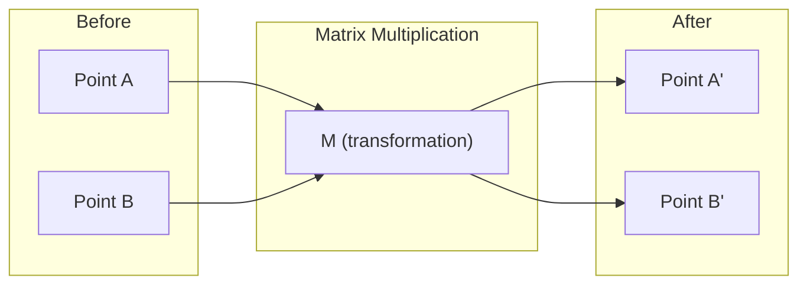
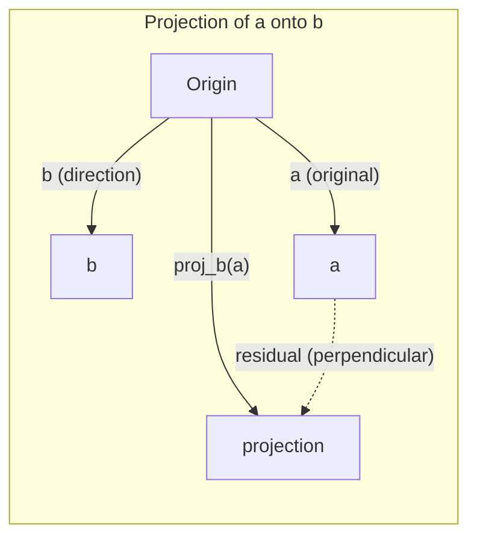

# 선형대수학의 직관

> 모든 AI 모델은 그저 화려한 모자를 쓴 행렬 연산에 불과합니다.

**유형:** Learn (이론)
**사용 언어:** Python, Julia
**선수 레슨:** Phase 0
**소요 시간:** ~60분

## 학습 목표

- Python으로 벡터 및 행렬 연산(덧셈, 내적, 행렬 곱셈)을 밑바닥부터 직접 구현합니다.
- 내적(dot product), 투영(projection), 그람-슈미트 과정(Gram-Schmidt process)의 기하학적 의미를 설명합니다.
- 기본 행 연산(row reduction)을 사용하여 벡터 집합의 선형 독립(linear independence), 랭크(rank), 기저(basis)를 판별합니다.
- 선형대수학 개념을 임베딩(embedding), 어텐션 점수(attention score), LoRA 등의 AI 응용 분야와 연결합니다.

## 문제

어떤 ML 논문이든 펼쳐 보면 첫 페이지부터 벡터, 행렬, 내적, 변환이 등장합니다. 선형대수학적 직관이 없다면 이들은 그저 기호에 불과합니다. 하지만 직관이 있다면 신경망이 실제로 무엇을 하고 있는지, 즉 공간에서 점들을 어떻게 이동시키고 있는지를 볼 수 있습니다.

수학자가 될 필요는 없습니다. 이러한 연산들이 기하학적으로 무엇을 의미하는지 파악하고, 이를 직접 코드로 구현할 수 있으면 됩니다.

## 개념

### 벡터는 점(이자 방향)입니다

벡터는 단순한 숫자들의 목록입니다. 하지만 이 숫자들은 의미를 지니고 있습니다. 바로 공간에서의 좌표입니다.

**2D 벡터 [3, 2]:**

| x | y | 점 |
|---|---|-------|
| 3 | 2 | 평면 위의 원점 (0,0)에서 (3, 2)를 가리키는 벡터 |

이 벡터의 크기는 sqrt(3^2 + 2^2) = sqrt(13)이며 오른쪽 위를 향합니다.

AI에서 벡터는 모든 것을 표현합니다:
- 단어 → 768개의 숫자로 이루어진 벡터 (임베딩 공간에서의 "의미")
- 이미지 → 수백만 개의 픽셀 값으로 이루어진 벡터
- 사용자 → 선호도를 나타내는 벡터

### 행렬은 변환입니다

행렬은 한 벡터를 다른 벡터로 변환합니다. 회전, 크기 조절(scale), 신장(stretch), 투영(project)을 수행할 수 있습니다.



AI에서 행렬은 곧 모델 자체입니다:
- 신경망 가중치 → 입력을 출력으로 변환하는 행렬
- 어텐션 점수 → 어디에 주목할지 결정하는 행렬
- 임베딩 → 단어를 벡터로 매핑하는 행렬

### 내적은 유사도를 측정합니다

두 벡터의 내적은 두 벡터가 얼마나 유사한지를 알려줍니다.

```
a · b = a₁×b₁ + a₂×b₂ + ... + aₙ×bₙ

Same direction:      a · b > 0  (similar)
Perpendicular:       a · b = 0  (unrelated)
Opposite direction:  a · b < 0  (dissimilar)
```

검색 엔진, 추천 시스템, RAG가 작동하는 방식이 바로 이와 같습니다. 내적 값이 높은 벡터를 찾는 것입니다.

### 선형 독립

집합 내의 어떤 벡터도 다른 벡터들의 조합으로 표현될 수 없을 때, 이 벡터들을 선형 독립(linearly independent)이라고 합니다. v1, v2, v3가 독립적이라면 이들은 3차원 공간을 생성(span)합니다. 만약 하나가 다른 벡터들의 조합이라면, 평면만을 생성하게 됩니다.

AI에서 이것이 중요한 이유: 특성 행렬(feature matrix)의 열들은 선형 독립이어야 합니다. 두 특성이 완벽하게 상관되어 있다면(선형 종속), 모델은 이들의 효과를 구분할 수 없습니다. 이는 회귀 분석에서 다중공선성(multicollinearity)을 유발하여 가중치 행렬을 불안정하게 만들고, 입력의 작은 변화에도 출력이 크게 요동치게 만듭니다.

**구체적인 예시:**

```
v1 = [1, 0, 0]
v2 = [0, 1, 0]
v3 = [2, 1, 0]   # v3 = 2*v1 + v2
```

v1과 v2는 독립입니다. 어느 쪽도 상대방의 스칼라 배수이거나 조합이 아닙니다. 하지만 v3 = 2*v1 + v2이므로 {v1, v2, v3}은 종속 집합입니다. 이 세 벡터는 모두 xy 평면 위에 있습니다. 이들을 어떻게 조합하더라도 [0, 0, 1]에는 도달할 수 없습니다. 벡터는 세 개이지만 자유도는 2차원에 불과합니다.

데이터셋의 관점에서 보면: feature_3 = 2*feature_1 + feature_2라면, feature_3을 추가해도 모델에는 새로운 정보가 전혀 제공되지 않습니다. 더 나쁜 점은 정규 방정식(normal equations)을 특이 행렬(singular)로 만들어 가중치에 대한 유일해(unique solution)가 존재하지 않게 된다는 것입니다.

### 기저와 랭크

기저(basis)는 전체 공간을 생성하는 선형 독립 벡터들의 최소 집합입니다. 기저 벡터의 개수가 곧 그 공간의 차원입니다.

3차원 공간의 표준 기저는 {[1,0,0], [0,1,0], [0,0,1]}입니다. 하지만 3차원에서 서로 독립인 세 벡터라면 무엇이든 유효한 기저가 됩니다. 기저를 선택한다는 것은 좌표계를 선택한다는 것을 의미합니다.

행렬의 랭크(rank) = 선형 독립인 열의 수 = 선형 독립인 행의 수. 만약 rank < min(rows, cols)라면, 해당 행렬은 랭크 부족(rank-deficient) 상태입니다. 이는 다음을 의미합니다:
- 연립방정식의 해가 무수히 많거나(또는 전혀 없거나)
- 변환 과정에서 정보가 손실됨
- 행렬의 역행렬을 구할 수 없음

| 상황 | 랭크 | ML에서의 의미 |
|-----------|------|---------------------|
| 풀 랭크(Full rank, rank = min(m, n)) | 최댓값 | 유일한 최소제곱해(least-squares solution)가 존재합니다. 모델의 조건수가 양호합니다(well-conditioned). |
| 랭크 부족(Rank deficient, rank < min(m, n)) | 최댓값 미만 | 특성이 중복됩니다. 가중치 해가 무수히 많습니다. 정규화(regularization)가 필요합니다. |
| 랭크 1(Rank 1) | 1 | 모든 열이 하나의 벡터를 스케일링한 복사본입니다. 모든 데이터가 한 직선 위에 위치합니다. |
| 거의 랭크 부족(작은 특이값) | 수치적으로 낮음 | 행렬의 조건수가 나쁩니다(ill-conditioned). 미세한 입력 노이즈가 큰 출력 변화를 일으킵니다. SVD 절단(truncation)이나 릿지 회귀(ridge regression)를 사용해야 합니다. |

### 투영

벡터 **a**를 벡터 **b**에 투영(projection)하면 **b** 방향을 따르는 **a**의 성분을 얻게 됩니다:

```
proj_b(a) = (a dot b / b dot b) * b
```

잔차(residual, a - proj_b(a))는 b와 수직을 이룹니다. 이러한 직교 분해(orthogonal decomposition)는 최소제곱 적합(least-squares fitting)의 기초가 됩니다.

투영은 ML 전반에서 활용됩니다:
- 선형 회귀는 관측값에서 열 공간(column space)까지의 거리를 최소화합니다. 즉, 해 자체가 바로 투영입니다.
- PCA는 최대 분산 방향으로 데이터를 투영합니다.
- 트랜스포머(Transformer)의 어텐션은 쿼리(query)를 키(key)에 투영한 값을 계산합니다.



**예시:** a = [3, 4], b = [1, 0]

proj_b(a) = (3*1 + 4*0) / (1*1 + 0*0) * [1, 0] = 3 * [1, 0] = [3, 0]

투영은 y 성분을 제거합니다. 이는 가장 단순한 형태의 차원 축소(dimensionality reduction)이며, 관심 없는 방향을 버리는 과정입니다.

### 그람-슈미트 과정

임의의 독립 벡터 집합을 정규 직교 기저(orthonormal basis)로 변환하는 방법입니다. 정규 직교란 모든 벡터의 길이가 1이고 모든 벡터 쌍이 서로 수직임을 의미합니다.

알고리즘:
1. 첫 번째 벡터를 가져와 정규화(normalize)합니다.
2. 두 번째 벡터에서 첫 번째 벡터로의 투영 성분을 뺀 후 정규화합니다.
3. 세 번째 벡터에서 이전의 모든 벡터들로의 투영 성분을 뺀 후 정규화합니다.
4. 나머지 벡터들에 대해서도 동일한 과정을 반복합니다.

```
Input:  v1, v2, v3, ... (linearly independent)

u1 = v1 / |v1|

w2 = v2 - (v2 dot u1) * u1
u2 = w2 / |w2|

w3 = v3 - (v3 dot u1) * u1 - (v3 dot u2) * u2
u3 = w3 / |w3|

Output: u1, u2, u3, ... (orthonormal basis)
```

이것이 QR 분해(QR decomposition)의 내부 동작 방식입니다. Q는 정규 직교 기저이고, R은 투영 계수들을 담고 있습니다. QR 분해는 다음에 사용됩니다:
- 선형 연립방정식 풀이 (가우스 소거법보다 수치적으로 안정적)
- 고윳값 계산 (QR 알고리즘)
- 최소제곱 회귀 (표준적인 수치적 해법)

```figure
eigen-directions
```

## 직접 구현하기

### 1단계: 밑바닥부터 벡터 구현하기 (Python)

```python
class Vector:
    def __init__(self, components):
        self.components = list(components)
        self.dim = len(self.components)

    def __add__(self, other):
        return Vector([a + b for a, b in zip(self.components, other.components)])

    def __sub__(self, other):
        return Vector([a - b for a, b in zip(self.components, other.components)])

    def dot(self, other):
        return sum(a * b for a, b in zip(self.components, other.components))

    def magnitude(self):
        return sum(x**2 for x in self.components) ** 0.5

    def normalize(self):
        mag = self.magnitude()
        return Vector([x / mag for x in self.components])

    def cosine_similarity(self, other):
        return self.dot(other) / (self.magnitude() * other.magnitude())

    def __repr__(self):
        return f"Vector({self.components})"


a = Vector([1, 2, 3])
b = Vector([4, 5, 6])

print(f"a + b = {a + b}")
print(f"a · b = {a.dot(b)}")
print(f"|a| = {a.magnitude():.4f}")
print(f"cosine similarity = {a.cosine_similarity(b):.4f}")
```

### 2단계: 밑바닥부터 행렬 구현하기 (Python)

```python
class Matrix:
    def __init__(self, rows):
        self.rows = [list(row) for row in rows]
        self.shape = (len(self.rows), len(self.rows[0]))

    def __matmul__(self, other):
        if isinstance(other, Vector):
            return Vector([
                sum(self.rows[i][j] * other.components[j] for j in range(self.shape[1]))
                for i in range(self.shape[0])
            ])
        rows = []
        for i in range(self.shape[0]):
            row = []
            for j in range(other.shape[1]):
                row.append(sum(
                    self.rows[i][k] * other.rows[k][j]
                    for k in range(self.shape[1])
                ))
            rows.append(row)
        return Matrix(rows)

    def transpose(self):
        return Matrix([
            [self.rows[j][i] for j in range(self.shape[0])]
            for i in range(self.shape[1])
        ])

    def __repr__(self):
        return f"Matrix({self.rows})"


rotation_90 = Matrix([[0, -1], [1, 0]])
point = Vector([3, 1])

rotated = rotation_90 @ point
print(f"Original: {point}")
print(f"Rotated 90°: {rotated}")
```

### 3단계: 이것이 AI에서 중요한 이유

```python
import random

random.seed(42)
weights = Matrix([[random.gauss(0, 0.1) for _ in range(3)] for _ in range(2)])
input_vector = Vector([1.0, 0.5, -0.3])

output = weights @ input_vector
print(f"Input (3D): {input_vector}")
print(f"Output (2D): {output}")
print("This is what a neural network layer does -- matrix multiplication.")
```

### 4단계: Julia 버전

```julia
a = [1.0, 2.0, 3.0]
b = [4.0, 5.0, 6.0]

println("a + b = ", a + b)
println("a · b = ", a ⋅ b)       # Julia supports unicode operators
println("|a| = ", √(a ⋅ a))
println("cosine = ", (a ⋅ b) / (√(a ⋅ a) * √(b ⋅ b)))

# Matrix-vector multiplication
W = [0.1 -0.2 0.3; 0.4 0.5 -0.1]
x = [1.0, 0.5, -0.3]
println("Wx = ", W * x)
println("This is a neural network layer.")
```

### 5단계: 밑바닥부터 선형 독립과 투영 구현하기 (Python)

```python
def is_linearly_independent(vectors):
    n = len(vectors)
    dim = len(vectors[0].components)
    mat = Matrix([v.components[:] for v in vectors])
    rows = [row[:] for row in mat.rows]
    rank = 0
    for col in range(dim):
        pivot = None
        for row in range(rank, len(rows)):
            if abs(rows[row][col]) > 1e-10:
                pivot = row
                break
        if pivot is None:
            continue
        rows[rank], rows[pivot] = rows[pivot], rows[rank]
        scale = rows[rank][col]
        rows[rank] = [x / scale for x in rows[rank]]
        for row in range(len(rows)):
            if row != rank and abs(rows[row][col]) > 1e-10:
                factor = rows[row][col]
                rows[row] = [rows[row][j] - factor * rows[rank][j] for j in range(dim)]
        rank += 1
    return rank == n


def project(a, b):
    scalar = a.dot(b) / b.dot(b)
    return Vector([scalar * x for x in b.components])


def gram_schmidt(vectors):
    orthonormal = []
    for v in vectors:
        w = v
        for u in orthonormal:
            proj = project(w, u)
            w = w - proj
        if w.magnitude() < 1e-10:
            continue
        orthonormal.append(w.normalize())
    return orthonormal


v1 = Vector([1, 0, 0])
v2 = Vector([1, 1, 0])
v3 = Vector([1, 1, 1])
basis = gram_schmidt([v1, v2, v3])
for i, u in enumerate(basis):
    print(f"u{i+1} = {u}")
    print(f"  |u{i+1}| = {u.magnitude():.6f}")

print(f"u1 · u2 = {basis[0].dot(basis[1]):.6f}")
print(f"u1 · u3 = {basis[0].dot(basis[2]):.6f}")
print(f"u2 · u3 = {basis[1].dot(basis[2]):.6f}")
```

## 라이브러리 활용하기

이제 실무에서 실제로 사용하게 될 NumPy로 동일한 작업을 수행해 봅니다:

```python
import numpy as np

a = np.array([1, 2, 3], dtype=float)
b = np.array([4, 5, 6], dtype=float)

print(f"a + b = {a + b}")
print(f"a · b = {np.dot(a, b)}")
print(f"|a| = {np.linalg.norm(a):.4f}")
print(f"cosine = {np.dot(a, b) / (np.linalg.norm(a) * np.linalg.norm(b)):.4f}")

W = np.random.randn(2, 3) * 0.1
x = np.array([1.0, 0.5, -0.3])
print(f"Wx = {W @ x}")
```

### NumPy를 활용한 랭크, 투영 및 QR 분해

```python
import numpy as np

A = np.array([[1, 2], [2, 4]])
print(f"Rank: {np.linalg.matrix_rank(A)}")

a = np.array([3, 4])
b = np.array([1, 0])
proj = (np.dot(a, b) / np.dot(b, b)) * b
print(f"Projection of {a} onto {b}: {proj}")

Q, R = np.linalg.qr(np.random.randn(3, 3))
print(f"Q is orthogonal: {np.allclose(Q @ Q.T, np.eye(3))}")
print(f"R is upper triangular: {np.allclose(R, np.triu(R))}")
```

### PyTorch -- 텐서는 자동 미분이 가능한 벡터입니다

```python
import torch

x = torch.randn(3, requires_grad=True)
y = torch.tensor([1.0, 0.0, 0.0])

similarity = torch.dot(x, y)
similarity.backward()

print(f"x = {x.data}")
print(f"y = {y.data}")
print(f"dot product = {similarity.item():.4f}")
print(f"d(dot)/dx = {x.grad}")
```

x에 대한 내적의 기울기(gradient)는 바로 y입니다. PyTorch는 이를 자동으로 계산했습니다. 신경망의 모든 연산은 행렬 곱셈, 내적, 투영과 같은 이러한 연산들로 구성되며, 자동 미분(autodiff)이 이 모든 과정을 거쳐 기울기를 추적합니다.

방금 여러분은 NumPy가 한 줄로 처리하는 연산들을 밑바닥부터 직접 구현했습니다. 이제 내부에서 어떤 일이 일어나는지 이해하셨을 것입니다.
## 배포하기

이 강의를 마치면 다음 결과물이 생성됩니다:
- `outputs/prompt-linear-algebra-tutor.md` -- 기하학적 직관을 통해 선형대수를 가르치기 위한 AI 어시스턴트용 프롬프트

## 연관성

이 강의의 모든 내용은 현대 AI의 특정 영역들과 직접 연결됩니다:

| 개념 | 활용되는 곳 |
|---------|------------------|
| 내적(Dot product) | 트랜스포머(Transformer)의 어텐션(attention) 스코어, RAG의 코사인 유사도 |
| 행렬 곱(Matrix multiply) | 모든 신경망 레이어, 모든 선형 변환 |
| 선형 독립(Linear independence) | 특성 선택(feature selection), 다중공선성(multicollinearity) 방지 |
| 랭크(Rank) | 연립방정식의 해 존재 여부 판별, LoRA(low-rank adaptation) |
| 투영(Projection) | 선형 회귀(열공간으로의 투영), PCA |
| 그람-슈미트(Gram-Schmidt) / QR | 수치 해석 솔버, 고유값 계산 |
| 정규직교기저(Orthonormal basis) | 안정적인 수치 계산, 백색화 변환(whitening transforms) |

LoRA는 특히 주목할 만합니다. LoRA는 가중치 업데이트를 저랭크(low-rank) 행렬로 분해하여 거대 언어 모델(LLM)을 미세 조정(fine-tuning)합니다. 4096x4096 크기의 가중치 행렬(1,600만 개 파라미터)을 직접 업데이트하는 대신, LoRA는 4096x16 및 16x4096 크기의 두 행렬(13만 1천 개 파라미터)을 업데이트합니다. 랭크 16 제약은 가중치 업데이트가 전체 4096차원 공간 중 16차원 부분공간에 존재한다고 가정함을 의미합니다. 이것이 바로 선형대수가 실제로 작동하는 방식입니다.

## 연습 문제

1. 두 벡터 사이의 각도를 도(degree) 단위로 반환하는 `Vector.angle_between(other)`를 구현하세요.
2. x좌표를 2배, y좌표를 3배로 늘리는 2D 스케일링 행렬을 생성한 다음, 벡터 [1, 1]에 적용하세요.
3. 5개의 무작위 단어 임베딩 유사 벡터(50차원)가 주어졌을 때, 코사인 유사도를 사용하여 가장 유사한 두 벡터를 찾으세요.
4. 그람-슈미트 출력 결과가 실제로 정규직교하는지 검증하세요. 모든 벡터 쌍의 내적이 0이고 각 벡터의 크기가 1인지 확인합니다.
5. 랭크가 2인 3x3 행렬을 생성하세요. `rank()` 메서드를 사용하여 검증한 다음, 열들이 생성(span)하는 기하학적 대상이 무엇인지 설명하세요.
6. 벡터 [1, 2, 3]을 [1, 1, 1]에 투영하세요. 그 결과가 기하학적으로 무엇을 나타내는지 설명하세요.

## 핵심 용어

| 용어 | 통칭 | 실제 의미 |
|------|----------------|----------------------|
| 벡터(Vector) | "화살표" | n차원 공간의 점이나 방향을 나타내는 숫자의 목록 |
| 행렬(Matrix) | "숫자 표" | 한 공간에서 다른 공간으로 벡터를 매핑하는 변환 |
| 내적(Dot product) | "곱해서 더하기" | 두 벡터가 얼마나 같은 방향을 향하는지 나타내는 척도 -- 유사도 검색의 핵심 |
| 임베딩(Embedding) | "어떤 AI 마법" | 무언가(단어, 이미지, 사용자)의 의미를 표현하는 벡터 |
| 선형 독립(Linear independence) | "겹치지 않음" | 집합 내의 어떤 벡터도 다른 벡터들의 선형 결합으로 표현할 수 없음 |
| 랭크(Rank) | "차원 수" | 행렬에서 선형 독립인 열(또는 행)의 개수 |
| 투영(Projection) | "그림자" | 한 벡터가 다른 벡터의 방향으로 가지는 성분 |
| 기저(Basis) | "좌표축" | 공간을 생성(span)하는 최소한의 독립 벡터 집합 |
| 정규직교(Orthonormal) | "수직인 단위 벡터들" | 서로 수직이며 각각 길이가 1인 벡터들 |
