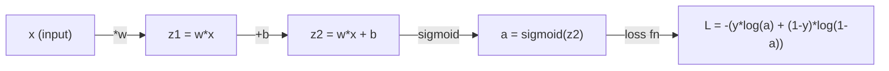
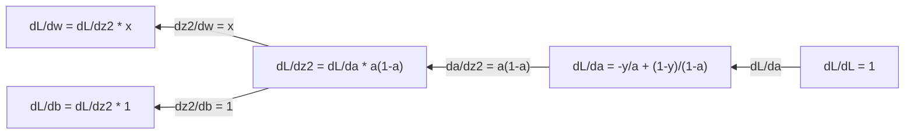
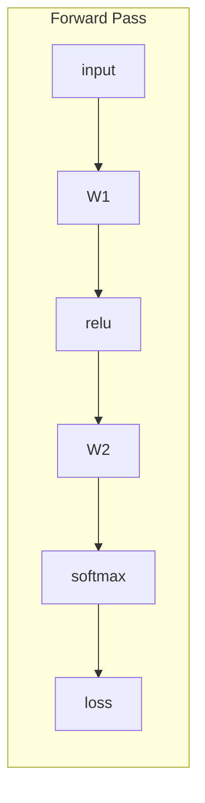
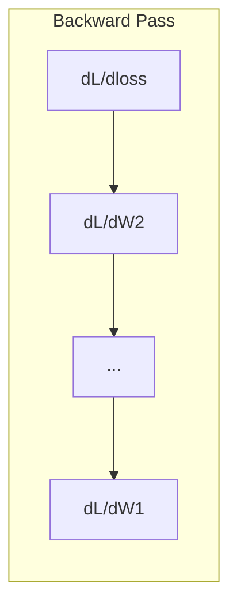

# 머신러닝을 위한 미적분학

> 미분은 어느 쪽이 내리막길인지 알려줍니다. 신경망이 학습하는 데 필요한 것은 그것이 전부입니다.

**유형:** Learn (이론)
**Language:** Python
**선수 레슨:** Phase 1, Lessons 01-03
**소요 시간:** ~60분

## 학습 목표

- 일반적인 ML 함수(x^2, 시그모이드, 교차 엔트로피)에 대한 수치 미분과 해석적 미분 계산하기
- 손실 함수를 최소화하기 위한 경사 하강법(gradient descent)을 1차원 및 2차원에서 밑바닥부터 구현하기
- 선형 회귀 모델의 기울기(gradient)를 유도하고 수동 가중치 업데이트를 통해 학습시키기
- 헤세 행렬(Hessian matrix), 테일러 급수 근사 및 최적화 기법과의 연관성 설명하기

## 문제 정의

수백만 개의 가중치를 가진 신경망이 있습니다. 각 가중치는 조절 손잡이(knob)와 같습니다. 모델의 오차를 조금이라도 줄이려면 모든 손잡이를 어느 방향으로 돌려야 하는지 알아내야 합니다. 미적분학이 바로 그 방향을 알려줍니다.

미적분학이 없다면 신경망 학습은 무작위로 값을 바꿔보며 좋은 결과가 나오기를 바라는 것에 불과할 것입니다. 미분을 활용하면 각 가중치가 오차에 어떤 영향을 미치는지 정확히 파악할 수 있습니다. 매번 모든 손잡이를 올바른 방향으로 돌릴 수 있게 됩니다.

## 핵심 개념

### 미분이란 무엇인가?

미분은 변화율을 측정합니다. 함수 y = f(x)에 대해, 미분 f'(x)는 x를 아주 미세한 양만큼 움직였을 때 y가 얼마나 변하는지를 나타냅니다.

기하학적으로 미분은 한 점에서의 접선의 기울기입니다.

**f(x) = x^2:**

| x | f(x) | f'(x) (기울기) |
|---|------|---------------|
| 0 | 0    | 0 (평평함, 맨 바닥) |
| 1 | 1    | 2 |
| 2 | 4    | 4 (이 지점에서의 접선 기울기) |
| 3 | 9    | 6 |

x=2에서 기울기는 4입니다. x를 오른쪽으로 아주 미세하게 이동하면 y는 그 양의 약 4배만큼 증가합니다. x=0에서 기울기는 0입니다. 그릇 모양의 맨 바닥에 있는 것입니다.

형식적 정의는 다음과 같습니다.

```
f'(x) = lim   f(x + h) - f(x)
        h->0  -----------------
                     h
```

코드에서는 극한을 생략하고 매우 작은 h를 사용합니다. 이것이 수치 미분(numerical derivative)입니다.

### 편미분: 한 번에 한 변수씩

실제 함수는 입력 변수가 많습니다. 신경망의 손실은 수천 개의 가중치에 의해 결정됩니다. 편미분(partial derivative)은 한 변수를 제외한 모든 변수를 상수로 취급하고, 해당 변수에 대해서만 미분합니다.

```
f(x, y) = x^2 + 3xy + y^2

df/dx = 2x + 3y     (treat y as a constant)
df/dy = 3x + 2y     (treat x as a constant)
```

각 편미분은 다음 질문에 답합니다. 이 가중치 하나만 미세하게 조정하면 손실이 어떻게 변하는가?

### 기울기(Gradient): 모든 편미분의 벡터

기울기(gradient)는 모든 편미분을 하나의 벡터로 모은 것입니다. 함수 f(x, y, z)에 대한 기울기는 다음과 같습니다.

```
grad f = [ df/dx, df/dy, df/dz ]
```

기울기는 가장 가파르게 증가하는 방향(steepest ascent)을 가리킵니다. 함수를 최소화하려면 그 반대 방향으로 이동해야 합니다.

**f(x,y) = x^2 + y^2의 등고선 플롯:**

이 함수는 동심원을 등고선으로 갖는 그릇 모양을 형성합니다. 최솟값은 (0, 0)에 있습니다.

| 점 | grad f | -grad f (하강 방향) |
|-------|--------|----------------------------|
| (1, 1) | [2, 2] (오르막을 가리킴, 최솟값에서 멀어짐) | [-2, -2] (내리막을 가리킴, 최솟값을 향함) |
| (0, 0) | [0, 0] (평평함, 최솟값에 위치) | [0, 0] |

이것이 경사 하강법을 그림으로 나타낸 것입니다. 기울기를 계산하고, 부호를 뒤집은 뒤, 한 걸음 나아갑니다.

### 최적화와의 연관성

신경망 학습은 최적화(optimization)입니다. 모델이 얼마나 잘못되었는지를 측정하는 손실 함수 L(w1, w2, ..., wn)이 주어집니다. 여러분은 이를 최소화하고자 합니다.

```
Gradient descent update rule:

  w_new = w_old - learning_rate * dL/dw

For every weight:
  1. Compute the partial derivative of loss with respect to that weight
  2. Subtract a small multiple of it from the weight
  3. Repeat
```

학습률(learning rate)은 보폭(step size)을 제어합니다. 너무 크면 최적점을 지나치고, 너무 작으면 진행이 지나치게 느려집니다.

**손실 지형 (1차원 단면):**

손실 함수 L(w)는 가중치 w가 변함에 따라 봉우리와 골짜기가 있는 곡선을 형성합니다.

| 특성 | 설명 |
|---------|-------------|
| 전역 최솟값(Global minimum) | 전체 곡선에서 가장 낮은 지점 -- 최적의 해 |
| 국소 최솟값(Local minimum) | 주변보다는 낮지만 전체에서 가장 낮지는 않은 골짜기 |
| 기울기 | 경사 하강법은 임의의 시작점에서 기울기를 따라 내리막으로 이동함 |

경사 하강법은 기울기를 따라 내리막길로 이동합니다. 국소 최솟값에 갇힐 수도 있지만, 고차원 공간(수백만 개의 가중치)에서는 이것이 실질적인 문제가 되는 경우가 드뭅니다.

### 수치 미분 vs 해석적 미분

미분을 계산하는 방법에는 두 가지가 있습니다.

해석적 미분(analytical derivative): 미분 규칙을 직접 손으로 적용합니다. f(x) = x^2의 경우 미분은 f'(x) = 2x입니다. 정확하고 빠릅니다.

수치 미분(numerical derivative): 정의를 이용해 근사합니다. 아주 작은 h에 대해 f(x+h)와 f(x-h)를 계산한 후 그 차이를 이용합니다.

```
Numerical (central difference):

f'(x) ~= f(x + h) - f(x - h)
          -----------------------
                  2h

h = 0.0001 works well in practice
```

수치 미분은 느리지만 모든 함수에 적용할 수 있습니다. 해석적 미분은 빠르지만 공식을 직접 유도해야 합니다. 신경망 프레임워크는 세 번째 방식인 자동 미분(automatic differentiation)을 사용하며, 이는 정확한 미분을 기계적으로 계산합니다. 이는 Phase 3에서 다루게 됩니다.

### 간단한 함수의 손 미분

ML에서 반복해서 보게 될 미분들입니다.

```
Function        Derivative       Used in
--------        ----------       -------
f(x) = x^2     f'(x) = 2x      Loss functions (MSE)
f(x) = wx + b  f'(w) = x        Linear layer (gradient w.r.t. weight)
                f'(b) = 1        Linear layer (gradient w.r.t. bias)
                f'(x) = w        Linear layer (gradient w.r.t. input)
f(x) = e^x     f'(x) = e^x     Softmax, attention
f(x) = ln(x)   f'(x) = 1/x     Cross-entropy loss
f(x) = 1/(1+e^-x)  f'(x) = f(x)(1-f(x))   Sigmoid activation
```

f(x) = x^2의 경우:

```
f(x) = x^2    f'(x) = 2x

  x    f(x)   f'(x)   meaning
  -2    4      -4      slope tilts left (decreasing)
  -1    1      -2      slope tilts left (decreasing)
   0    0       0      flat (minimum!)
   1    1       2      slope tilts right (increasing)
   2    4       4      slope tilts right (increasing)
```

x=3, b=1일 때 f(w) = wx + b의 경우:

```
f(w) = 3w + 1    f'(w) = 3

The derivative with respect to w is just x.
If x is big, a small change in w causes a big change in output.
```

### 연쇄 법칙(Chain rule)

함수들이 합성되어 있을 때, 연쇄 법칙(chain rule)은 이를 미분하는 방법을 알려줍니다.

```
If y = f(g(x)), then dy/dx = f'(g(x)) * g'(x)

Example: y = (3x + 1)^2
  outer: f(u) = u^2       f'(u) = 2u
  inner: g(x) = 3x + 1    g'(x) = 3
  dy/dx = 2(3x + 1) * 3 = 6(3x + 1)
```

신경망은 함수의 사슬입니다: 입력 -> 선형 -> 활성화 -> 선형 -> 활성화 -> 손실. 역전파(backpropagation)는 출력에서 입력 방향으로 연쇄 법칙을 반복 적용하는 것입니다. 이것이 알고리즘의 전부입니다.

### 헤세 행렬(Hessian Matrix)

기울기가 경사를 알려준다면, 헤세 행렬은 곡률(curvature)을 알려줍니다.

헤세 행렬은 2계 편미분으로 이루어진 행렬입니다. 함수 f(x1, x2, ..., xn)에 대해 헤세 행렬의 (i, j) 원소는 다음과 같습니다.

```
H[i][j] = d^2f / (dx_i * dx_j)
```

2변수 함수 f(x, y)의 경우:

```
H = | d^2f/dx^2    d^2f/dxdy |
    | d^2f/dydx    d^2f/dy^2 |
```

**임계점(기울기 = 0인 지점)에서 헤세 행렬이 알려주는 것:**

| 헤세 행렬의 특성 | 의미 | 곡면 예시 |
|-----------------|---------|-----------------|
| 양의 정부호(Positive definite, 모든 고유값 > 0) | 국소 최솟값 | 위로 열린 그릇 |
| 음의 정부호(Negative definite, 모든 고유값 < 0) | 국소 최댓값 | 아래로 열린 그릇 |
| 부정호(Indefinite, 혼합된 부호의 고유값) | 안장점(Saddle point) | 말 안장 모양 |

**예시:** f(x, y) = x^2 - y^2 (안장 함수)

```
df/dx = 2x       df/dy = -2y
d^2f/dx^2 = 2    d^2f/dy^2 = -2    d^2f/dxdy = 0

H = | 2   0 |
    | 0  -2 |

Eigenvalues: 2 and -2 (one positive, one negative)
--> Saddle point at (0, 0)
```

f(x, y) = x^2 + y^2 (그릇 모양)과 비교:

```
H = | 2  0 |
    | 0  2 |

Eigenvalues: 2 and 2 (both positive)
--> Local minimum at (0, 0)
```

**ML에서 헤세 행렬이 중요한 이유:**

뉴턴 방법(Newton's method)은 헤세 행렬을 사용하여 경사 하강법보다 더 나은 최적화 스텝을 밟습니다. 단순히 기울기를 따르는 대신 곡률을 고려합니다.

```
Newton's update:    w_new = w_old - H^(-1) * gradient
Gradient descent:   w_new = w_old - lr * gradient
```

뉴턴 방법은 헤세 행렬이 기울기의 스케일을 재조정하기 때문에 더 빠르게 수렴합니다. 가파른 방향에서는 더 작은 스텝을, 완만한 방향에서는 더 큰 스텝을 취합니다.

문제점은 N개의 파라미터를 가진 신경망의 경우 헤세 행렬이 N x N 크기라는 점입니다. 파라미터가 100만 개인 모델이라면 1조 개의 원소를 가진 행렬이 필요합니다. 이것이 바로 우리가 근사 기법을 사용하는 이유입니다.

| 기법 | 사용하는 정보 | 비용 | 수렴 속도 |
|--------|-------------|------|-------------|
| 경사 하강법 | 1차 도함수만 사용 | 스텝당 O(N) | 느림 (선형 수렴) |
| 뉴턴 방법 | 전체 헤세 행렬 | 스텝당 O(N^3) | 빠름 (2차 수렴) |
| L-BFGS | 기울기 이력으로부터 근사된 헤세 행렬 | 스텝당 O(N) | 중간 (초선형 수렴) |
| Adam | 파라미터별 적응형 학습률 (대각 헤세 행렬 근사) | 스텝당 O(N) | 중간 |
| 자연 기울기(Natural gradient) | 피셔 정보 행렬(Fisher information matrix, 통계적 헤세 행렬) | 스텝당 O(N^2) | 빠름 |

실무에서는 딥러닝의 기본 옵티마이저로 Adam이 사용됩니다. Adam은 파라미터별 기울기의 이동 평균과 분산을 추적하여 2차 정보를 저렴한 비용으로 근사합니다.
### 테일러 급수 근사 (Taylor Series Approximation)

모든 매끄러운 함수는 다항식을 통해 국소적으로 근사할 수 있습니다:

```
f(x + h) = f(x) + f'(x)*h + (1/2)*f''(x)*h^2 + (1/6)*f'''(x)*h^3 + ...
```

포함하는 항이 많을수록 근사가 더 정확해지지만, 이는 점 x 근처에서만 해당됩니다.

**테일러 급수가 ML에서 중요한 이유:**

- **1차 테일러 = 경사 하강법(gradient descent).** f(x + h) ~ f(x) + f'(x)*h를 사용할 때, 이는 선형 근사를 수행하는 것입니다. 경사 하강법은 이 선형 모델을 최소화하여 h = -lr * f'(x)를 선택합니다.

- **2차 테일러 = 뉴턴 방법(Newton's method).** f(x + h) ~ f(x) + f'(x)*h + (1/2)*f''(x)*h^2를 사용하면 2차 모델을 얻게 됩니다. 이를 최소화하면 h = -f'(x)/f''(x)가 나오며, 이것이 뉴턴 스텝(Newton's step)입니다.

- **손실 함수 설계.** MSE와 교차 엔트로피(cross-entropy)는 매끄러운 함수이므로, 이들의 테일러 전개는 잘 작동(well-behaved)합니다. 이는 우연이 아닙니다. 매끄러운 손실 함수는 최적화를 예측 가능하게 만듭니다.

```
Approximation order    What it captures    Optimization method
-------------------    -----------------   -------------------
0th order (constant)   Just the value      Random search
1st order (linear)     Slope               Gradient descent
2nd order (quadratic)  Curvature           Newton's method
Higher orders          Finer structure     Rarely used in ML
```

핵심 통찰: 모든 경사 기반 최적화는 본질적으로 손실 함수를 국소적으로 근사하고, 그 근사의 최솟값 방향으로 한 걸음 나아가는 것입니다.

### ML에서의 적분 (Integrals in ML)

미분이 변화율을 나타낸다면, 적분은 누적된 양, 즉 곡선 아래의 면적을 계산합니다.

ML에서는 손으로 직접 적분을 계산하는 일이 드물지만, 그 개념은 곳곳에 존재합니다:

**확률.** 확률 밀도 p(x)를 갖는 연속 확률 변수에 대해:
```
P(a < X < b) = integral from a to b of p(x) dx
```
a와 b 사이의 확률 밀도 곡선 아래 면적은 해당 범위에 속할 확률입니다.

**기댓값.** 확률로 가중된 평균 결과값:
```
E[f(X)] = integral of f(x) * p(x) dx
```
데이터 분포에 대한 기대 손실은 적분입니다. 훈련은 이에 대한 경험적 근사치를 최소화합니다.

**KL 발산(KL divergence).** 두 분포가 얼마나 다른지 측정합니다:
```
KL(p || q) = integral of p(x) * log(p(x) / q(x)) dx
```
VAE, 지식 증류(knowledge distillation), 베이지안 추론(Bayesian inference)에서 사용됩니다.

**정규화 상수.** 베이지안 추론에서:
```
p(w | data) = p(data | w) * p(w) / integral of p(data | w) * p(w) dw
```
분모는 가능한 모든 파라미터 값에 대한 적분입니다. 이는 다루기 힘든(intractable) 경우가 많기 때문에 MCMC나 변분 추론(variational inference)과 같은 근사법을 사용합니다.

| 적분 개념 | ML에서 나타나는 곳 |
|-----------------|----------------------|
| 곡선 아래 면적 | 밀도 함수로부터의 확률 |
| 기댓값 | 손실 함수, 위험 최소화(risk minimization) |
| KL 발산 | VAE, 정책 최적화, 지식 증류 |
| 정규화 | 베이지안 사후 분포, softmax 분모 |
| 주변 가능도(Marginal likelihood) | 모델 비교, 증거 하한(ELBO) |

### 계산 그래프에서의 다변수 연쇄 법칙 (Multivariable Chain Rule in a Computation Graph)

연쇄 법칙(chain rule)은 일직선상의 스칼라 함수에만 적용되는 것이 아닙니다. 신경망에서 변수들은 여러 갈래로 뻗어나가고 다시 합쳐집니다. 단순한 순전파(forward pass)를 통해 미분이 흐르는 방식은 다음과 같습니다:



역전파(backward pass)는 오른쪽에서 왼쪽으로 그래디언트를 계산합니다:



각 화살표는 국소 미분값을 곱합니다. 특정 파라미터에 대한 그래디언트는 손실에서 해당 파라미터까지의 경로상에 있는 모든 국소 미분값의 곱입니다. 경로가 분기했다가 다시 합쳐지는 경우, 각 기여분을 합산합니다(다변수 연쇄 법칙).

역전파(backpropagation)란 바로 이것입니다. 출력에서 입력 방향으로 계산 그래프를 따라 체계적으로 적용되는 연쇄 법칙에 불과합니다.

### 야코비안 행렬 (The Jacobian matrix)

함수가 벡터를 벡터로 매핑할 때(신경망 레이어처럼), 그 미분은 행렬이 됩니다. 야코비안(Jacobian)은 모든 입력에 대한 모든 출력의 편미분을 포함합니다.

f: R^n -> R^m에 대해, 야코비안 J는 m x n 행렬입니다:

| | x1 | x2 | ... | xn |
|---|---|---|---|---|
| f1 | df1/dx1 | df1/dx2 | ... | df1/dxn |
| f2 | df2/dx1 | df2/dx2 | ... | df2/dxn |
| ... | ... | ... | ... | ... |
| fm | dfm/dx1 | dfm/dx2 | ... | dfm/dxn |

신경망을 다룰 때 야코비안을 직접 손으로 계산할 일은 없습니다. PyTorch가 이를 처리합니다. 하지만 야코비안의 존재를 알고 있으면 역전파 시 형태(shape)를 이해하는 데 도움이 됩니다. 레이어가 R^n을 R^m으로 매핑한다면, 그 야코비안은 m x n입니다. 그래디언트는 이 행렬의 전치(transpose)를 통해 역방향으로 흐릅니다.

### 신경망에서 이것이 중요한 이유

신경망의 모든 가중치는 그래디언트를 갖습니다. 그래디언트는 손실을 줄이기 위해 해당 가중치를 어떻게 조정해야 하는지 알려줍니다.





각 가중치 업데이트:
- `W1 = W1 - lr * dL/dW1`
- `W2 = W2 - lr * dL/dW2`

순전파는 예측값과 손실을 계산합니다. 역전파는 모든 가중치에 대한 손실의 그래디언트를 계산합니다. 그런 다음 모든 가중치가 내리막 방향으로 작은 걸음을 내딛습니다. 이를 수백만 번 반복합니다. 그것이 바로 딥러닝입니다.

```figure
derivative-tangent
```

## 직접 구현하기 (Build It)

### 1단계: 밑바닥부터 수치 미분 구현하기

```python
def numerical_derivative(f, x, h=1e-7):
    return (f(x + h) - f(x - h)) / (2 * h)

def f(x):
    return x ** 2

for x in [-2, -1, 0, 1, 2]:
    numerical = numerical_derivative(f, x)
    analytical = 2 * x
    print(f"x={x:2d}  f'(x) numerical={numerical:.6f}  analytical={analytical:.1f}")
```

수치 미분값은 해석적 미분값과 소수점 여러 자리까지 일치합니다.

### 2단계: 편미분과 그래디언트

```python
def numerical_gradient(f, point, h=1e-7):
    gradient = []
    for i in range(len(point)):
        point_plus = list(point)
        point_minus = list(point)
        point_plus[i] += h
        point_minus[i] -= h
        partial = (f(point_plus) - f(point_minus)) / (2 * h)
        gradient.append(partial)
    return gradient

def f_multi(point):
    x, y = point
    return x**2 + 3*x*y + y**2

grad = numerical_gradient(f_multi, [1.0, 2.0])
print(f"Numerical gradient at (1,2): {[f'{g:.4f}' for g in grad]}")
print(f"Analytical gradient at (1,2): [2*1+3*2, 3*1+2*2] = [{2*1+3*2}, {3*1+2*2}]")
```

### 3단계: f(x) = x^2의 최솟값을 찾기 위한 경사 하강법

```python
x = 5.0
lr = 0.1
for step in range(20):
    grad = 2 * x
    x = x - lr * grad
    print(f"step {step:2d}  x={x:8.4f}  f(x)={x**2:10.6f}")
```

x=5에서 시작하여, 각 스텝마다 x=0(최솟값)에 가까워집니다.

### 4단계: 2D 함수에서의 경사 하강법

```python
def f_2d(point):
    x, y = point
    return x**2 + y**2

point = [4.0, 3.0]
lr = 0.1
for step in range(30):
    grad = numerical_gradient(f_2d, point)
    point = [p - lr * g for p, g in zip(point, grad)]
    loss = f_2d(point)
    if step % 5 == 0 or step == 29:
        print(f"step {step:2d}  point=({point[0]:7.4f}, {point[1]:7.4f})  f={loss:.6f}")
```

### 5단계: 수치 미분과 해석적 미분 비교

```python
import math

test_functions = [
    ("x^2",      lambda x: x**2,          lambda x: 2*x),
    ("x^3",      lambda x: x**3,          lambda x: 3*x**2),
    ("sin(x)",   lambda x: math.sin(x),   lambda x: math.cos(x)),
    ("e^x",      lambda x: math.exp(x),   lambda x: math.exp(x)),
    ("1/x",      lambda x: 1/x,           lambda x: -1/x**2),
]

x = 2.0
print(f"{'Function':<12} {'Numerical':>12} {'Analytical':>12} {'Error':>12}")
print("-" * 50)
for name, f, df in test_functions:
    num = numerical_derivative(f, x)
    ana = df(x)
    err = abs(num - ana)
    print(f"{name:<12} {num:12.6f} {ana:12.6f} {err:12.2e}")
```

### 6단계: 수치적으로 헤시안 계산하기

```python
def hessian_2d(f, x, y, h=1e-5):
    fxx = (f(x + h, y) - 2 * f(x, y) + f(x - h, y)) / (h ** 2)
    fyy = (f(x, y + h) - 2 * f(x, y) + f(x, y - h)) / (h ** 2)
    fxy = (f(x + h, y + h) - f(x + h, y - h) - f(x - h, y + h) + f(x - h, y - h)) / (4 * h ** 2)
    return [[fxx, fxy], [fxy, fyy]]

def saddle(x, y):
    return x ** 2 - y ** 2

def bowl(x, y):
    return x ** 2 + y ** 2

H_saddle = hessian_2d(saddle, 0.0, 0.0)
H_bowl = hessian_2d(bowl, 0.0, 0.0)
print(f"Saddle Hessian: {H_saddle}")  # [[2, 0], [0, -2]] -- mixed signs
print(f"Bowl Hessian:   {H_bowl}")    # [[2, 0], [0, 2]]  -- both positive
```

안장점 함수의 헤시안은 고윳값 2와 -2를 갖습니다(부호가 혼합되어 있어 안장점임을 확인). 그릇 모양 함수의 헤시안은 고윳값 2와 2를 갖습니다(둘 다 양수이므로 최솟값임을 확인).

### 7단계: 테일러 근사 작동 확인

```python
import math

def taylor_approx(f, f_prime, f_double_prime, x0, h, order=2):
    result = f(x0)
    if order >= 1:
        result += f_prime(x0) * h
    if order >= 2:
        result += 0.5 * f_double_prime(x0) * h ** 2
    return result

x0 = 0.0
for h in [0.1, 0.5, 1.0, 2.0]:
    true_val = math.sin(h)
    t1 = taylor_approx(math.sin, math.cos, lambda x: -math.sin(x), x0, h, order=1)
    t2 = taylor_approx(math.sin, math.cos, lambda x: -math.sin(x), x0, h, order=2)
    print(f"h={h:.1f}  sin(h)={true_val:.4f}  order1={t1:.4f}  order2={t2:.4f}")
```

x0=0 근처에서 sin(x) ~ x입니다(1차 테일러). 이 근사는 h가 작을 때는 매우 정확하지만, h가 커지면 무너집니다. 이것이 바로 경사 하강법이 작은 학습률(learning rate)에서 가장 잘 작동하는 이유입니다. 각 스텝은 선형 근사가 정확하다는 가정을 바탕으로 합니다.

### 8단계: 이것이 신경망에서 중요한 이유

```python
import random

random.seed(42)

w = random.gauss(0, 1)
b = random.gauss(0, 1)
lr = 0.01

xs = [1.0, 2.0, 3.0, 4.0, 5.0]
ys = [3.0, 5.0, 7.0, 9.0, 11.0]

for epoch in range(200):
    total_loss = 0
    dw = 0
    db = 0
    for x, y in zip(xs, ys):
        pred = w * x + b
        error = pred - y
        total_loss += error ** 2
        dw += 2 * error * x
        db += 2 * error
    dw /= len(xs)
    db /= len(xs)
    total_loss /= len(xs)
    w -= lr * dw
    b -= lr * db
    if epoch % 40 == 0 or epoch == 199:
        print(f"epoch {epoch:3d}  w={w:.4f}  b={b:.4f}  loss={total_loss:.6f}")

print(f"\nLearned: y = {w:.2f}x + {b:.2f}")
print(f"Actual:  y = 2x + 1")
```

모든 경사 기반 훈련 루프는 이 패턴을 따릅니다: 예측, 손실 계산, 그래디언트 계산, 가중치 업데이트.

## 활용하기 (Use It)

NumPy를 사용하면 동일한 연산을 더 빠르고 간결하게 수행할 수 있습니다:

```python
import numpy as np

x = np.array([1, 2, 3, 4, 5], dtype=float)
y = np.array([3, 5, 7, 9, 11], dtype=float)

w, b = np.random.randn(), np.random.randn()
lr = 0.01

for epoch in range(200):
    pred = w * x + b
    error = pred - y
    loss = np.mean(error ** 2)
    dw = np.mean(2 * error * x)
    db = np.mean(2 * error)
    w -= lr * dw
    b -= lr * db

print(f"Learned: y = {w:.2f}x + {b:.2f}")
```

방금 경사 하강법을 밑바닥부터 직접 구현했습니다. PyTorch는 그래디언트 계산을 자동화하지만, 업데이트 루프 자체는 동일합니다.

## 연습 문제

1. `numerical_derivative`를 두 번 호출하여 `numerical_second_derivative(f, x)`를 구현하세요. x=2에서 x^3의 2계 도함수가 12임을 검증하세요.
2. 경사 하강법을 사용하여 f(x, y) = (x - 3)^2 + (y + 1)^2의 최솟값을 찾으세요. (0, 0)에서 시작하세요. 결괏값은 (3, -1)로 수렴해야 합니다.
3. 경사 하강법 루프에 모멘텀(momentum)을 추가하세요: 과거 그래디언트를 누적하는 속도 벡터를 유지합니다. f(x) = x^4 - 3x^2에서 모멘텀이 있을 때와 없을 때의 수렴 속도를 비교하세요.
## 주요 용어

| 용어 | 흔히 쓰이는 표현 | 실제 의미 |
|------|----------------|----------------------|
| 미분(Derivative) | "기울기" | 한 점에서의 함수 변화율입니다. 입력의 단위 변화당 출력이 얼마나 변하는지 알려줍니다. |
| 편미분(Partial derivative) | "한 변수의 미분" | 다른 모든 변수를 상수로 고정하고 하나의 변수에 대해서만 구한 미분입니다. |
| 그래디언트(Gradient) | "가장 가파른 상승 방향" | 모든 편도함수로 구성된 벡터입니다. 함수를 가장 빠르게 증가시키는 방향을 가리킵니다. |
| 경사 하강법(Gradient descent) | "내리막길 내려가기" | 손실을 줄이기 위해 매개변수에서 그래디언트(에 학습률을 곱한 값)를 빼는 방식입니다. 신경망 훈련의 핵심입니다. |
| 학습률(Learning rate) | "스텝 크기" | 각 경사 하강 스텝의 크기를 제어하는 스칼라입니다. 너무 크면 발산하고, 너무 작으면 느리게 수렴합니다. |
| 연쇄 법칙(Chain rule) | "도함수 곱하기" | 합성함수를 미분하기 위한 규칙입니다: df/dx = df/dg * dg/dx. 역전파(backpropagation)의 수학적 기초입니다. |
| 야코비안(Jacobian) | "도함수 행렬" | 함수가 벡터를 벡터로 매핑할 때, 입력에 대한 출력의 모든 편도함수로 이루어진 행렬입니다. |
| 수치 미분(Numerical derivative) | "유한 차분" | 인접한 두 지점에서 함수를 평가하고 그 사이의 기울기를 계산하여 도함수를 근사하는 방식입니다. |
| 역전파(Backpropagation) | "역방향 자동 미분" | 연쇄 법칙을 사용하여 출력부터 입력 방향으로 층별 그래디언트를 계산하는 방식입니다. 신경망이 학습하는 원리입니다. |
| 헤시안(Hessian) | "2계 도함수 행렬" | 모든 2계 편도함수로 구성된 행렬입니다. 함수의 곡률을 나타냅니다. 임계점에서 헤시안이 양의 한정(positive definite)이면 국소 최솟값을 의미합니다. |
| 테일러 급수(Taylor series) | "다항식 근사" | 도함수를 사용하여 특정 지점 주변에서 함수를 근사하는 방법입니다: f(x+h) ~ f(x) + f'(x)h + (1/2)f''(x)h^2 + ... 경사 하강법과 뉴턴 방법(Newton's method)이 작동하는 원리를 이해하는 기초가 됩니다. |
| 적분(Integral) | "곡선 아래의 면적" | 일정 구간에 걸쳐 양을 누적하는 것입니다. 머신러닝에서 적분은 확률, 기댓값, KL 발산(KL divergence)을 정의합니다. |

## 참고 자료

- [3Blue1Brown: Essence of Calculus](https://www.3blue1brown.com/topics/calculus) - 미분, 적분, 연쇄 법칙에 대한 시각적 직관
- [Stanford CS231n: Backpropagation](https://cs231n.github.io/optimization-2/) - 신경망 층을 통해 그래디언트가 흐르는 방식
