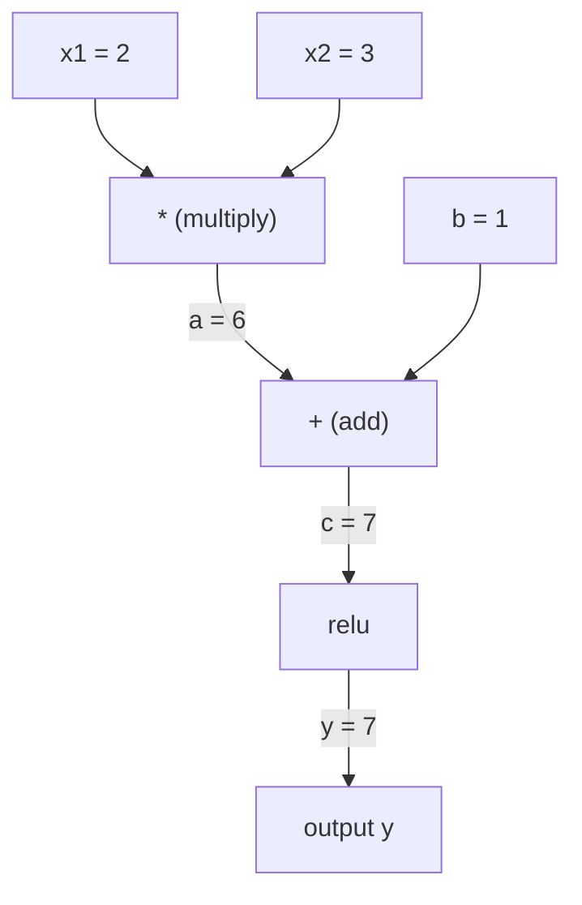
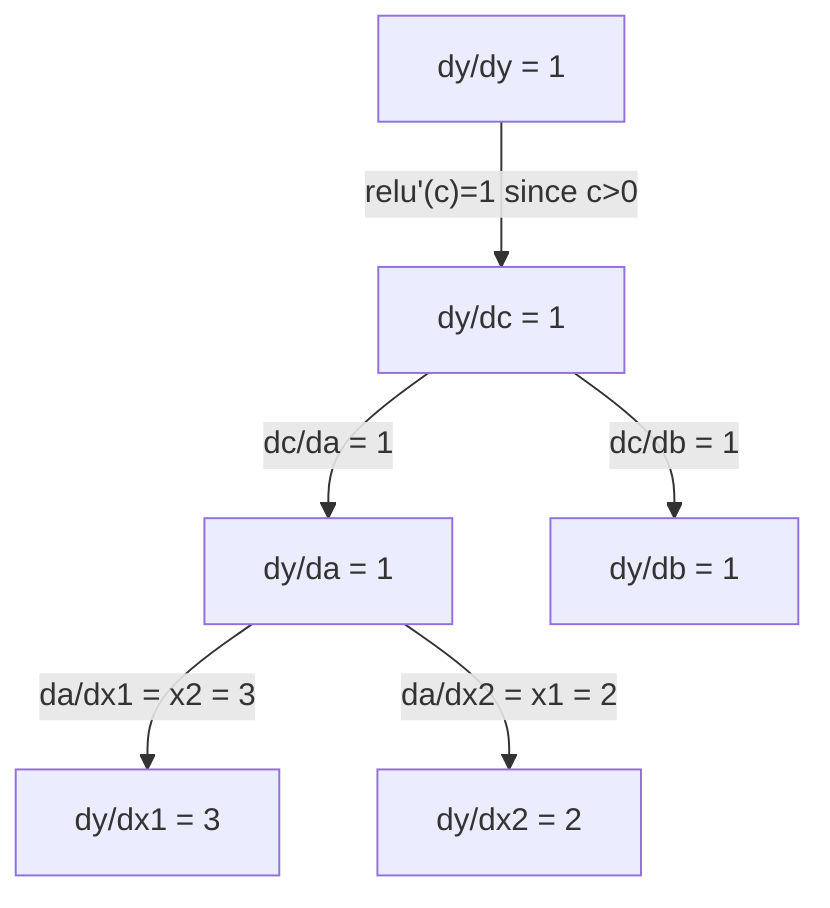

# Chain Rule & Automatic Differentiation

> 연쇄 법칙(chain rule)은 학습하는 모든 신경망의 이면에 있는 핵심 엔진입니다.

**유형:** Build (실습)
**Language:** Python
**선수 레슨:** Phase 1, Lesson 04 (Derivatives & Gradients)
**소요 시간:** ~90분

## Learning Objectives

- 연산을 기록하고 역방향 모드 자동 미분(reverse-mode autodiff)을 통해 기울기(gradient)를 계산하는 최소한의 autograd 엔진(Value 클래스)을 직접 구현합니다.
- 위상 정렬(topological sort)을 사용하여 계산 그래프(computation graph)를 통한 순전파(forward pass) 및 역전파(backward pass)를 구현합니다.
- 순수하게 직접 구현한 autograd 엔진만을 사용하여 XOR 문제에 대한 다층 퍼셉트론(multi-layer perceptron)을 구성하고 학습시킵니다.
- 수치적 유한 차분(numerical finite differences)을 활용한 기울기 검증(gradient checking)으로 자동 미분의 정확성을 검증합니다.

## The Problem

단순한 함수의 도함수는 쉽게 계산할 수 있습니다. 하지만 신경망은 단순한 함수가 아닙니다. 신경망은 수백 개의 함수가 합성된 형태입니다: 행렬 곱셈, 편향(bias) 추가, 활성화 함수 적용, 다시 행렬 곱셈, softmax, 교차 엔트로피 손실(cross-entropy loss)까지 이어집니다. 출력은 함수 안의 함수, 또 그 안의 함수로 이루어진 결과물입니다.

신경망을 학습시키려면 모든 개별 가중치에 대한 손실의 기울기가 필요합니다. 수백만 개의 파라미터에 대해 이를 손으로 직접 계산하는 것은 불가능합니다. 수치적으로(유한 차분을 통해) 계산하는 것은 너무 느립니다.

연쇄 법칙은 수학적 원리를 제공합니다. 자동 미분(automatic differentiation)은 알고리즘을 제공합니다. 두 가지가 결합하면 단 한 번의 순전파에 비례하는 시간 안에 임의의 합성 함수에 대한 정확한 기울기를 계산할 수 있습니다.

이것이 바로 PyTorch, TensorFlow, JAX가 동작하는 방식입니다. 여러분은 이 엔진의 소형 버전을 밑바닥부터 직접 구축해 볼 것입니다.

## The Concept

### The Chain Rule

`y = f(g(x))`일 때, `x`에 대한 `y`의 도함수는 다음과 같습니다:

```
dy/dx = dy/dg * dg/dx = f'(g(x)) * g'(x)
```

사슬(chain)을 따라 도함수들을 곱합니다. 각 링크는 자신의 국소 도함수(local derivative)를 기여합니다.

예제: `y = sin(x^2)`

```
g(x) = x^2       g'(x) = 2x
f(g) = sin(g)     f'(g) = cos(g)

dy/dx = cos(x^2) * 2x
```

더 깊은 합성 함수의 경우, 사슬은 다음과 같이 확장됩니다:

```
y = f(g(h(x)))

dy/dx = f'(g(h(x))) * g'(h(x)) * h'(x)
```

신경망의 모든 층(layer)은 이 사슬의 한 링크에 해당합니다.

### Computational Graphs

계산 그래프는 연쇄 법칙을 시각적으로 보여줍니다. 모든 연산은 노드가 됩니다. 데이터는 그래프를 따라 앞으로 흐릅니다. 기울기는 뒤로 흐릅니다.

**순전파 (값 계산):**



**역전파 (기울기 계산):**



역전파는 모든 노드에서 연쇄 법칙을 적용하여 출력에서 입력 방향으로 기울기를 전파합니다.

### Forward Mode vs Reverse Mode

그래프를 통해 연쇄 법칙을 적용하는 데에는 두 가지 방식이 있습니다.

**순방향 모드(Forward mode)**는 입력에서 시작하여 도함수를 앞으로 밀어냅니다. `dx/dx = 1`를 계산하고 각 연산을 통해 전파합니다. 입력이 적고 출력이 많을 때 유리합니다.

```
Forward mode: seed dx/dx = 1, propagate forward

  x = 2       (dx/dx = 1)
  a = x^2     (da/dx = 2x = 4)
  y = sin(a)  (dy/dx = cos(a) * da/dx = cos(4) * 4 = -2.615)
```

**역방향 모드(Reverse mode)**는 출력에서 시작하여 기울기를 뒤로 당겨옵니다. `dy/dy = 1`를 계산하고 각 연산을 거꾸로 거치며 전파합니다. 입력이 많고 출력이 적을 때 유리합니다.

```
Reverse mode: seed dy/dy = 1, propagate backward

  y = sin(a)  (dy/dy = 1)
  a = x^2     (dy/da = cos(a) = cos(4) = -0.654)
  x = 2       (dy/dx = dy/da * da/dx = -0.654 * 4 = -2.615)
```

신경망은 수백만 개의 입력(가중치)과 단 하나의 출력(손실)을 가집니다. 역방향 모드는 단 한 번의 역전파로 모든 기울기를 계산합니다. 역전파(backpropagation)가 역방향 모드를 사용하는 이유가 바로 여기에 있습니다.

| Mode | Seed | Direction | Best when |
|------|------|-----------|-----------|
| Forward | `dx_i/dx_i = 1` | Input to output | Few inputs, many outputs |
| Reverse | `dy/dy = 1` | Output to input | Many inputs, few outputs (neural nets) |

### Dual Numbers for Forward Mode

순방향 모드는 이중수(dual numbers)를 사용해 우아하게 구현할 수 있습니다. 이중수는 `epsilon^2 = 0`인 `a + b*epsilon` 형태를 가집니다.

```
Dual number: (value, derivative)

(2, 1) means: value is 2, derivative w.r.t. x is 1

Arithmetic rules:
  (a, a') + (b, b') = (a+b, a'+b')
  (a, a') * (b, b') = (a*b, a'*b + a*b')
  sin(a, a')         = (sin(a), cos(a)*a')
```

입력 변수의 도함수 시드(seed)를 1로 설정합니다. 그러면 도함수가 모든 연산을 통해 자동으로 전파됩니다.

### Building an Autograd Engine

autograd 엔진에는 세 가지가 필요합니다:

1. **Value 래핑.** 모든 숫자를 해당 값과 기울기를 저장하는 객체로 감쌉니다.
2. **그래프 기록.** 모든 연산은 자신의 입력과 국소 기울기 함수를 기록합니다.
3. **역전파.** 그래프를 위상 정렬한 다음, 역방향으로 순회하며 각 노드에서 연쇄 법칙을 적용합니다.

이것이 바로 PyTorch의 `autograd`가 수행하는 작업입니다. `torch.Tensor` 클래스는 값을 감싸고, `requires_grad=True`일 때 연산을 기록하며, `.backward()`를 호출할 때 기울기를 계산합니다.

### How PyTorch Autograd Works Under the Hood

PyTorch 코드를 작성할 때:

```python
x = torch.tensor(2.0, requires_grad=True)
y = x ** 2 + 3 * x + 1
y.backward()
print(x.grad)  # 7.0 = 2*x + 3 = 2*2 + 3
```

PyTorch 내부에서는 다음 작업이 수행됩니다:

1. `requires_grad=True`가 설정된 `x`에 대해 `Tensor` 노드를 생성합니다.
2. 모든 연산(`**`, `*`, `+`)은 새 노드를 생성하고 backward 함수를 기록합니다.
3. `y.backward()`는 기록된 그래프를 통해 역방향 모드 자동 미분을 트리거합니다.
4. 각 노드의 `grad_fn`는 국소 기울기를 계산하여 부모 노드로 전달합니다.
5. 기울기는 (대체가 아닌) 덧셈을 통해 `.grad` 속성에 누적됩니다.

이 그래프는 동적(define-by-run)입니다. 순전파가 일어날 때마다 새로운 그래프가 생성됩니다. 이것이 PyTorch가 모델 내부에서 제어 흐름(if/else, 반복문)을 지원할 수 있는 이유입니다.

```figure
chain-rule
```

## Build It

### Step 1: The Value class

```python
class Value:
    def __init__(self, data, children=(), op=''):
        self.data = data
        self.grad = 0.0
        self._backward = lambda: None
        self._prev = set(children)
        self._op = op

    def __repr__(self):
        return f"Value(data={self.data:.4f}, grad={self.grad:.4f})"
```

모든 `Value`는 자신의 수치 데이터, 기울기(초기값은 0), backward 함수, 그리고 자신을 생성한 자식 노드에 대한 포인터를 저장합니다.

### Step 2: Arithmetic operations with gradient tracking

```python
    def __add__(self, other):
        other = other if isinstance(other, Value) else Value(other)
        out = Value(self.data + other.data, (self, other), '+')
        def _backward():
            self.grad += out.grad
            other.grad += out.grad
        out._backward = _backward
        return out

    def __mul__(self, other):
        other = other if isinstance(other, Value) else Value(other)
        out = Value(self.data * other.data, (self, other), '*')
        def _backward():
            self.grad += other.data * out.grad
            other.grad += self.data * out.grad
        out._backward = _backward
        return out

    def relu(self):
        out = Value(max(0, self.data), (self,), 'relu')
        def _backward():
            self.grad += (1.0 if out.data > 0 else 0.0) * out.grad
        out._backward = _backward
        return out
```

각 연산은 국소 기울기를 계산하고 상류 기울기(`out.grad`)와 곱하는 방법을 아는 클로저(closure)를 생성합니다. `+=`는 한 값이 여러 연산에 사용되는 경우를 처리합니다.

### Step 3: The backward pass

```python
    def backward(self):
        topo = []
        visited = set()
        def build_topo(v):
            if v not in visited:
                visited.add(v)
                for child in v._prev:
                    build_topo(child)
                topo.append(v)
        build_topo(self)

        self.grad = 1.0
        for v in reversed(topo):
            v._backward()
```

위상 정렬은 모든 노드의 기울기가 자식 노드로 전파되기 전에 완전히 계산되도록 보장합니다. 시드 기울기는 1.0(dy/dy = 1)입니다.

### Step 4: More operations for a complete engine

기본 Value 클래스는 덧셈, 곱셈, relu를 처리합니다. 실제 autograd 엔진에는 더 많은 연산이 필요합니다. 신경망을 구축하는 데 필요한 연산은 다음과 같습니다:

```python
    def __neg__(self):
        return self * -1

    def __sub__(self, other):
        return self + (-other)

    def __radd__(self, other):
        return self + other

    def __rmul__(self, other):
        return self * other

    def __rsub__(self, other):
        return other + (-self)

    def __pow__(self, n):
        out = Value(self.data ** n, (self,), f'**{n}')
        def _backward():
            self.grad += n * (self.data ** (n - 1)) * out.grad
        out._backward = _backward
        return out

    def __truediv__(self, other):
        return self * (other ** -1) if isinstance(other, Value) else self * (Value(other) ** -1)

    def exp(self):
        import math
        e = math.exp(self.data)
        out = Value(e, (self,), 'exp')
        def _backward():
            self.grad += e * out.grad
        out._backward = _backward
        return out

    def log(self):
        import math
        out = Value(math.log(self.data), (self,), 'log')
        def _backward():
            self.grad += (1.0 / self.data) * out.grad
        out._backward = _backward
        return out

    def tanh(self):
        import math
        t = math.tanh(self.data)
        out = Value(t, (self,), 'tanh')
        def _backward():
            self.grad += (1 - t ** 2) * out.grad
        out._backward = _backward
        return out
```

**각 연산이 중요한 이유:**

| Operation | Backward rule | Used in |
|-----------|--------------|---------|
| `__sub__` | Reuses add + neg | Loss computation (pred - target) |
| `__pow__` | n * x^(n-1) | Polynomial activations, MSE (error^2) |
| `__truediv__` | Reuses mul + pow(-1) | Normalization, learning rate scaling |
| `exp` | exp(x) * upstream | Softmax, log-likelihood |
| `log` | (1/x) * upstream | Cross-entropy loss, log probabilities |
| `tanh` | (1 - tanh^2) * upstream | Classic activation function |

기발한 점은 다음과 같습니다: `__sub__` 및 `__truediv__`는 기존 연산을 기반으로 정의됩니다. 기초가 되는 add/mul/pow 연산을 통해 연쇄 법칙이 합성되므로 추가 작업 없이도 올바른 기울기를 무료로 얻을 수 있습니다.

### Step 5: Mini MLP from scratch

완성된 Value 클래스를 사용하면 신경망을 구축할 수 있습니다. PyTorch도 없고, NumPy도 없습니다. 오직 Value와 연쇄 법칙뿐입니다.

```python
import random

class Neuron:
    def __init__(self, n_inputs):
        self.w = [Value(random.uniform(-1, 1)) for _ in range(n_inputs)]
        self.b = Value(0.0)

    def __call__(self, x):
        act = sum((wi * xi for wi, xi in zip(self.w, x)), self.b)
        return act.tanh()

    def parameters(self):
        return self.w + [self.b]

class Layer:
    def __init__(self, n_inputs, n_outputs):
        self.neurons = [Neuron(n_inputs) for _ in range(n_outputs)]

    def __call__(self, x):
        return [n(x) for n in self.neurons]

    def parameters(self):
        return [p for n in self.neurons for p in n.parameters()]

class MLP:
    def __init__(self, sizes):
        self.layers = [Layer(sizes[i], sizes[i+1]) for i in range(len(sizes)-1)]

    def __call__(self, x):
        for layer in self.layers:
            x = layer(x)
        return x[0] if len(x) == 1 else x

    def parameters(self):
        return [p for layer in self.layers for p in layer.parameters()]
```

`Neuron`은 `tanh(w1*x1 + w2*x2 + ... + b)`를 계산합니다. `Layer`는 뉴런들의 리스트입니다. `MLP`은 층을 쌓습니다. 모든 가중치는 `Value`이므로, `loss.backward()`를 호출하면 모든 파라미터로 기울기가 전파됩니다.

**XOR 학습:**

```python
random.seed(42)
model = MLP([2, 4, 1])  # 2 inputs, 4 hidden neurons, 1 output

xs = [[0, 0], [0, 1], [1, 0], [1, 1]]
ys = [-1, 1, 1, -1]  # XOR pattern (using -1/1 for tanh)

for step in range(100):
    preds = [model(x) for x in xs]
    loss = sum((p - y) ** 2 for p, y in zip(preds, ys))

    for p in model.parameters():
        p.grad = 0.0
    loss.backward()

    lr = 0.05
    for p in model.parameters():
        p.data -= lr * p.grad

    if step % 20 == 0:
        print(f"step {step:3d}  loss = {loss.data:.4f}")

print("\nPredictions after training:")
for x, y in zip(xs, ys):
    print(f"  input={x}  target={y:2d}  pred={model(x).data:6.3f}")
```

이것이 바로 micrograd입니다. 순수 Python과 자동 미분으로 작성된 완전한 신경망 학습 루프입니다. 모든 상용 딥러닝 프레임워크는 대규모 환경에서 이와 완전히 동일한 작업을 수행합니다.
### Step 6: 기울기 검사(Gradient checking)

구현한 자동 미분이 올바른지 어떻게 알 수 있을까요? 수치적 미분값과 비교해 보면 됩니다. 이것이 바로 기울기 검사(gradient checking)입니다.

```python
def gradient_check(build_expr, x_val, h=1e-7):
    x = Value(x_val)
    y = build_expr(x)
    y.backward()
    autodiff_grad = x.grad

    y_plus = build_expr(Value(x_val + h)).data
    y_minus = build_expr(Value(x_val - h)).data
    numerical_grad = (y_plus - y_minus) / (2 * h)

    diff = abs(autodiff_grad - numerical_grad)
    return autodiff_grad, numerical_grad, diff
```

복잡한 수식에서 테스트해 봅니다:

```python
def expr(x):
    return (x ** 3 + x * 2 + 1).tanh()

ad, num, diff = gradient_check(expr, 0.5)
print(f"Autodiff:  {ad:.8f}")
print(f"Numerical: {num:.8f}")
print(f"Difference: {diff:.2e}")
# Difference should be < 1e-5
```

기울기 검사는 새로운 연산을 구현할 때 필수적입니다. 역방향 패스에 버그가 있다면 수치적 검사를 통해 잡아낼 수 있습니다. 완성도 높은 모든 딥러닝 구현체는 개발 과정에서 기울기 검사를 실행합니다.

**기울기 검사를 사용해야 하는 시점:**

| 상황 | 기울기 검사 수행 여부 |
|-----------|-------------------|
| autograd에 새로운 연산을 추가할 때 | 예, 항상 수행 |
| 수렴하지 않는 훈련 루프를 디버깅할 때 | 예, 기울기부터 먼저 확인 |
| 프로덕션 훈련 시 | 아니요, 너무 느림 (파라미터당 순방향 패스 2회) |
| autograd 코드에 대한 단위 테스트 시 | 예, 자동화하여 수행 |

### Step 7: 수기 계산과 비교 검증

```python
x1 = Value(2.0)
x2 = Value(3.0)
a = x1 * x2          # a = 6.0
b = a + Value(1.0)    # b = 7.0
y = b.relu()          # y = 7.0

y.backward()

print(f"y = {y.data}")          # 7.0
print(f"dy/dx1 = {x1.grad}")   # 3.0 (= x2)
print(f"dy/dx2 = {x2.grad}")   # 2.0 (= x1)
```

수기 계산 검증: `y = relu(x1*x2 + 1)`. `x1*x2 + 1 = 7 > 0`이므로 relu는 항등 함수가 됩니다.
`dy/dx1 = x2 = 3`. `dy/dx2 = x1 = 2`. 엔진의 결과와 일치합니다.

## 사용해 보기

### PyTorch와 비교 검증

```python
import torch

x1 = torch.tensor(2.0, requires_grad=True)
x2 = torch.tensor(3.0, requires_grad=True)
a = x1 * x2
b = a + 1.0
y = torch.relu(b)
y.backward()

print(f"PyTorch dy/dx1 = {x1.grad.item()}")  # 3.0
print(f"PyTorch dy/dx2 = {x2.grad.item()}")  # 2.0
```

기울기가 동일합니다. 연쇄 법칙을 통한 후진 모드(reverse-mode) 자동 미분이라는 수학적 원리가 같기 때문에 직접 만든 엔진도 PyTorch와 동일한 결과를 계산합니다.

### 더 복잡한 수식

```python
a = Value(2.0)
b = Value(-3.0)
c = Value(10.0)
f = (a * b + c).relu()  # relu(2*(-3) + 10) = relu(4) = 4

f.backward()
print(f"df/da = {a.grad}")  # -3.0 (= b)
print(f"df/db = {b.grad}")  #  2.0 (= a)
print(f"df/dc = {c.grad}")  #  1.0
```

## 배포하기

이 레슨을 통해 다음을 얻을 수 있습니다:
- `outputs/skill-autodiff.md` -- autograd 시스템을 구축하고 디버깅하는 역량
- `code/autodiff.py` -- 직접 확장할 수 있는 미니멀한 autograd 엔진

여기서 구축한 Value 클래스는 Phase 3의 신경망 훈련 루프를 위한 기반이 됩니다.

## 연습 문제

1. `x ** n`을 계산할 수 있도록 Value 클래스에 `__pow__`을 추가하세요. `x=2`에서의 `d/dx(x^3)`가 `12.0`과 같은지 검증하세요.

2. 활성화 함수로 `tanh`를 추가하세요. `tanh'(0) = 1` 및 `tanh'(2) = 0.0707`(근사값)임을 검증하세요.

3. 단일 뉴런에 대한 계산 그래프를 구성하세요: `y = relu(w1*x1 + w2*x2 + b)`. 다섯 개의 기울기를 모두 계산하고 PyTorch와 비교하여 검증하세요.

4. 이원수(dual numbers)를 사용하여 전진 모드(forward-mode) 자동 미분을 구현하세요. `Dual` 클래스를 생성하고 후진 모드 엔진과 동일한 도함수 결과를 내는지 검증하세요.

## 핵심 용어

| 용어 | 흔히 하는 말 | 실제 의미 |
|------|----------------|----------------------|
| 연쇄 법칙(Chain rule) | "도함수들을 곱하기" | 합성함수의 도함수는 적절한 지점에서 계산된 각 함수의 국소 도함수(local derivative)의 곱과 같음 |
| 계산 그래프(Computational graph) | "네트워크 다이어그램" | 노드는 연산이고 엣지는 값(순방향) 또는 기울기(역방향)를 전달하는 유향 비순환 그래프(DAG) |
| 전진 모드(Forward mode) | "도함수를 앞으로 전달하기" | 입력에서 출력 방향으로 도함수를 전파하는 자동 미분 방식. 입력 변수당 1회의 패스가 필요함. |
| 후진 모드(Reverse mode) | "역전파(Backpropagation)" | 출력에서 입력 방향으로 기울기를 전파하는 자동 미분 방식. 출력 변수당 1회의 패스가 필요함. |
| Autograd | "자동 기울기 계산" | 값에 적용된 연산을 기록하고, 그래프를 구축하며, 연쇄 법칙을 통해 정확한 기울기를 계산하는 시스템 |
| 이원수(Dual numbers) | "값 더하기 도함수" | 산술 연산을 통해 도함수 정보를 함께 전달하는 a + b*epsilon (epsilon^2 = 0) 형태의 수 |
| 위상 정렬(Topological sort) | "의존성 순서" | 모든 노드가 자신의 모든 의존성 노드 뒤에 오도록 그래프 노드를 정렬하는 것. 올바른 기울기 전파에 필수적임. |
| 기울기 누적(Gradient accumulation) | "덮어쓰지 말고 더하기" | 하나의 값이 여러 연산으로 전달될 때, 해당 값의 기울기는 들어오는 모든 기울기 기여분의 합이 됨 |
| 동적 그래프(Dynamic graph) | "실행을 통한 정의(Define by run)" | 매 순방향 패스마다 새로 구축되는 계산 그래프로, 모델 내부에서 Python 제어 흐름을 사용할 수 있게 함 (PyTorch 스타일) |
| 기울기 검사(Gradient checking) | "수치적 검증" | 올바르게 구현되었는지 확인하기 위해 자동 미분 기울기를 유한 차분 수치 기울기와 비교하는 것. 디버깅에 필수적임. |
| MLP | "다층 퍼셉트론(Multi-layer perceptron)" | 하나 이상의 은닉층 뉴런을 가진 신경망. 각 뉴런은 가중치 합에 편향을 더한 후 활성화 함수를 적용함. |
| 뉴런(Neuron) | "가중치 합 + 활성화" | 기본 단위: output = activation(w1*x1 + w2*x2 + ... + b). 가중치와 편향은 학습 가능한 파라미터임. |

## 추가 자료

- [3Blue1Brown: 역전파의 미적분학](https://www.youtube.com/watch?v=tIeHLnjs5U8) -- 신경망에서 연쇄 법칙의 시각적 설명
- [PyTorch Autograd 내부 동작 원리](https://pytorch.org/docs/stable/notes/autograd.html) -- 실제 시스템의 작동 방식
- [Baydin et al., 머신러닝에서의 자동 미분 서베이](https://arxiv.org/abs/1502.05767) -- 포괄적인 참고 자료
