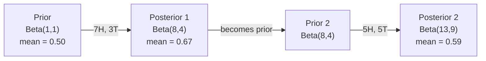

# 베이즈 정리

> 확률이 우리가 무엇을 기대하는지에 관한 것이라면, 베이즈 정리는 우리가 무엇을 배우는지에 관한 것입니다.

**유형:** Build (실습)
**Language:** Python
**선수 레슨:** Phase 1, Lesson 06 (Probability Fundamentals)
**소요 시간:** ~75분

## 학습 목표

- 베이즈 정리(Bayes' theorem)를 적용하여 사전 확률(prior), 우도(likelihood), 증거(evidence)로부터 사후 확률(posterior)을 계산합니다.
- 라플라스 스무딩(Laplace smoothing)과 로그 공간 연산을 적용한 나이브 베이즈(Naive Bayes) 텍스트 분류기를 밑바닥부터 구현합니다.
- MLE와 MAP 추정을 비교하고, MAP가 L2 규제(regularization)와 어떻게 대응하는지 설명합니다.
- A/B 테스팅을 위해 베타-이항 켤레 사전 분포(Beta-Binomial conjugate priors)를 사용한 순차적 베이지안 업데이트를 구현합니다.

## 문제 상황

어떤 의학 검사의 정확도가 99%입니다. 검사 결과 양성이 나왔습니다. 실제로 질병에 걸렸을 확률은 얼마일까요?

대부분의 사람들은 99%라고 답합니다. 하지만 실제 답은 질병이 얼마나 희귀한지에 달려 있습니다. 만약 10,000명 중 1명만 이 질병에 걸린다면, 양성 결과가 나왔을 때 실제로 질병에 걸렸을 확률은 약 1%에 불과합니다. 양성 결과의 나머지 99%는 건강한 사람에게서 나온 거짓 경보(위양성)입니다.

이것은 말장난이 아닙니다. 바로 베이즈 정리입니다. 모든 스팸 필터, 모든 의료 진단, 불확실성을 정량화하는 모든 머신러닝 모델이 정확히 이 추론 방식을 사용합니다. 어떤 믿음에서 시작하여, 증거를 관찰하고, 그 믿음을 업데이트합니다.

이 개념을 이해하지 못한 채 ML 시스템을 구축하면 모델 출력을 잘못 해석하고, 잘못된 임계값을 설정하며, 과신하는 예측을 배포하게 됩니다.

## 핵심 개념

### 결합 확률에서 베이즈 정리로

Lesson 06에서 배운 조건부 확률 공식은 다음과 같습니다.

```
P(A|B) = P(A and B) / P(B)
```

대칭적으로 다음도 성립합니다.

```
P(B|A) = P(A and B) / P(A)
```

두 식 모두 P(A and B)라는 동일한 분자를 공유합니다. 두 식을 같게 놓고 정리하면 다음과 같습니다.

```
P(A and B) = P(A|B) * P(B) = P(B|A) * P(A)

Therefore:

P(A|B) = P(B|A) * P(A) / P(B)
```

이것이 베이즈 정리입니다. 네 개의 값, 하나의 방정식입니다.

### 네 가지 구성 요소

| 부분 | 명칭 | 의미 |
|------|------|---------------|
| P(A\|B) | 사후 확률(Posterior) | 증거 B를 관찰한 후 A에 대해 업데이트된 믿음 |
| P(B\|A) | 우도(Likelihood) | A가 참일 때 증거 B가 관찰될 확률 |
| P(A) | 사전 확률(Prior) | 증거를 관찰하기 전 A에 대한 믿음 |
| P(B) | 증거(Evidence) | 가능한 모든 경우에서 B가 관찰될 전체 확률 |

증거 항 P(B)는 정규화 상수 역할을 합니다. 전체 확률의 법칙(law of total probability)을 사용하여 다음과 같이 전개할 수 있습니다.

```
P(B) = P(B|A) * P(A) + P(B|not A) * P(not A)
```

### 의학 검사 예시

어떤 질병이 10,000명 중 1명에게 발생합니다. 검사의 정확도는 99%입니다(환자의 99%를 잡아내고, 1%의 확률로 위양성을 냅니다).

```
P(sick)          = 0.0001     (prior: disease is rare)
P(positive|sick) = 0.99       (likelihood: test catches it)
P(positive|healthy) = 0.01    (false positive rate)

P(positive) = P(positive|sick) * P(sick) + P(positive|healthy) * P(healthy)
            = 0.99 * 0.0001 + 0.01 * 0.9999
            = 0.000099 + 0.009999
            = 0.010098

P(sick|positive) = P(positive|sick) * P(sick) / P(positive)
                 = 0.99 * 0.0001 / 0.010098
                 = 0.0098
                 = 0.98%
```

1% 미만입니다. 사전 확률의 영향이 지배적입니다. 질환이 희귀한 경우, 검사가 정확하더라도 대부분의 양성 결과는 거짓 경보입니다. 의사들이 재검사를 지시하는 이유가 바로 여기에 있습니다.

### 스팸 필터 예시

"lottery"라는 단어가 포함된 이메일을 받았습니다. 이 메일은 스팸일까요?

```
P(spam)                = 0.3      (30% of email is spam)
P("lottery"|spam)      = 0.05     (5% of spam emails contain "lottery")
P("lottery"|not spam)  = 0.001    (0.1% of legitimate emails contain "lottery")

P("lottery") = 0.05 * 0.3 + 0.001 * 0.7
             = 0.015 + 0.0007
             = 0.0157

P(spam|"lottery") = 0.05 * 0.3 / 0.0157
                  = 0.955
                  = 95.5%
```

단어 하나로 확률이 30%에서 95.5%로 바뀝니다. 실제 스팸 필터는 수백 개의 단어에 걸쳐 베이즈 정리를 동시에 적용합니다.

### 나이브 베이즈: 독립성 가정

나이브 베이즈는 클래스가 주어졌을 때 모든 특성이 조건부 독립이라고 가정하여 이를 여러 특성으로 확장합니다.

```
P(class | feature_1, feature_2, ..., feature_n)
  = P(class) * P(feature_1|class) * P(feature_2|class) * ... * P(feature_n|class)
    / P(feature_1, feature_2, ..., feature_n)
```

"나이브(naive)"라는 부분은 바로 이 독립성 가정에서 비롯됩니다. 텍스트에서 단어의 출현은 독립적이지 않습니다("New"와 "York"는 상관관계가 있습니다). 그러나 분류기는 보정된 확률을 생성할 필요 없이 클래스의 순위만 매기면 되기 때문에, 이 가정은 실전에서 놀라울 정도로 잘 작동합니다.

분모는 모든 클래스에 대해 동일하므로 분모를 생략하고 분자만 비교할 수 있습니다.

```
score(class) = P(class) * product of P(feature_i | class)
```

가장 높은 점수를 가진 클래스를 선택합니다.

### 최대 우도 추정(MLE)

학습 데이터로부터 P(feature|class)를 어떻게 얻을까요? 바로 개수를 세는 것입니다.

```
P("free"|spam) = (number of spam emails containing "free") / (total spam emails)
```

이것이 MLE(최대 우도 추정)입니다. 관찰된 데이터를 가장 잘 설명하는(가능성을 최대화하는) 파라미터 값을 선택합니다. 이산 빈도의 경우 우도 함수를 최대화하는 것은 상대 도수 계산으로 귀결됩니다.

문제점: 학습 중에 스팸에서 특정 단어가 한 번도 등장하지 않으면, MLE는 해당 단어의 확률을 0으로 만듭니다. 보지 못한 단어 하나가 전체 곱을 0으로 만들어 버립니다. 이는 라플라스 스무딩(Laplace smoothing)으로 해결합니다.

```
P(word|class) = (count(word, class) + 1) / (total_words_in_class + vocabulary_size)
```

모든 빈도에 1을 더함으로써 어떤 확률도 0이 되지 않도록 보장합니다.

### 최대 사후 확률 추정(MAP)

MLE의 질문: P(data|parameters)를 최대화하는 파라미터는 무엇인가?

MAP의 질문: P(parameters|data)를 최대화하는 파라미터는 무엇인가?

베이즈 정리에 따르면 다음과 같습니다.

```
P(parameters|data) proportional to P(data|parameters) * P(parameters)
```

MAP는 파라미터 자체에 대한 사전 확률을 추가합니다. 파라미터가 작아야 한다고 믿는다면, 큰 값에 페널티를 주는 사전 분포로 이를 인코딩합니다. 이는 ML의 L2 규제와 동일합니다. 릿지 회귀(ridge regression)의 "릿지" 페널티는 문자 그대로 가중치에 대한 가우시안 사전 분포입니다.

| 추정 방식 | 최적화 대상 | ML 대응 개념 |
|------------|-----------|---------------|
| MLE | P(data\|params) | 규제 없는 학습 |
| MAP | P(data\|params) * P(params) | L2 / L1 규제 |

### 베이지안 vs 빈도주의: 실질적인 차이

빈도주의자는 파라미터를 고정된 미지의 상수로 취급합니다. 그들은 "이 실험을 여러 번 반복하면 어떤 결과가 나올까?"라고 묻습니다.

베이지안은 파라미터를 분포로 취급합니다. 그들은 "관찰한 데이터가 주어졌을 때, 파라미터에 대해 무엇을 믿을 수 있는가?"라고 묻습니다.

ML 시스템 구축에 있어 실질적인 차이는 다음과 같습니다.

| 측면 | 빈도주의 | 베이지안 |
|--------|-------------|----------|
| 출력 | 점 추정치(Point estimate) | 값들의 분포 |
| 불확실성 | 신뢰 구간(Confidence interval, 절차에 대한 것) | 신용 구간(Credible interval, 파라미터에 대한 것) |
| 적은 데이터 | 과적합될 수 있음 | 사전 분포가 규제 역할을 함 |
| 계산량 | 일반적으로 빠름 | 종종 샘플링(MCMC)이 필요함 |

대부분의 프로덕션 ML은 빈도주의적입니다(SGD, 점 추정치). 베이지안 방법은 보정된 불확실성이 필요할 때(의료적 의사결정, 안전 필수 시스템)나 데이터가 부족할 때(퓨샷 러닝, 콜드 스타트) 진가를 발휘합니다.

### ML에서 베이지안 사고방식이 중요한 이유

이 연결 고리는 단순한 비유보다 훨씬 깊습니다.

**사전 분포는 규제입니다.** 가중치에 대한 가우시안 사전 분포는 L2 규제입니다. 라플라스 사전 분포는 L1 규제입니다. 규제 항을 추가할 때마다, 기대하는 파라미터 값에 대해 베이지안적 주장을 펼치고 있는 셈입니다.

**사후 분포는 불확실성입니다.** 단일 예측 확률은 모델이 그 추정치에 대해 얼마나 확신하는지 전혀 알려주지 않습니다. 베이지안 방법은 분포를 제공합니다: "P(spam)이 0.8에서 0.95 사이일 것으로 생각합니다."

**베이즈 업데이트는 온라인 학습입니다.** 오늘의 사후 분포가 내일의 사전 분포가 됩니다. 모델이 새로운 데이터를 관찰할 때, 처음부터 다시 학습하는 대신 점진적으로 믿음을 업데이트합니다.

**모델 비교는 베이지안입니다.** 베이지안 정보 기준(BIC), 한계 우도(marginal likelihood), 베이즈 팩터(Bayes factor)는 모두 과적합 없이 모델 간 비교를 수행하기 위해 베이지안 추론을 사용합니다.

```figure
bayes-update
```

## 직접 만들어보기

### 1단계: 베이즈 정리 함수

```python
def bayes(prior, likelihood, false_positive_rate):
    evidence = likelihood * prior + false_positive_rate * (1 - prior)
    posterior = likelihood * prior / evidence
    return posterior

result = bayes(prior=0.0001, likelihood=0.99, false_positive_rate=0.01)
print(f"P(sick|positive) = {result:.4f}")
```

### 2단계: 나이브 베이즈 분류기

```python
import math
from collections import defaultdict

class NaiveBayes:
    def __init__(self, smoothing=1.0):
        self.smoothing = smoothing
        self.class_counts = defaultdict(int)
        self.word_counts = defaultdict(lambda: defaultdict(int))
        self.class_word_totals = defaultdict(int)
        self.vocab = set()

    def train(self, documents, labels):
        for doc, label in zip(documents, labels):
            self.class_counts[label] += 1
            words = doc.lower().split()
            for word in words:
                self.word_counts[label][word] += 1
                self.class_word_totals[label] += 1
                self.vocab.add(word)

    def predict(self, document):
        words = document.lower().split()
        total_docs = sum(self.class_counts.values())
        vocab_size = len(self.vocab)
        best_class = None
        best_score = float("-inf")
        for cls in self.class_counts:
            score = math.log(self.class_counts[cls] / total_docs)
            for word in words:
                count = self.word_counts[cls].get(word, 0)
                total = self.class_word_totals[cls]
                score += math.log((count + self.smoothing) / (total + self.smoothing * vocab_size))
            if score > best_score:
                best_score = score
                best_class = cls
        return best_class
```

로그 확률은 언더플로(underflow)를 방지합니다. 여러 개의 작은 확률을 곱하면 부동소수점으로 표현하기에 너무 작은 수가 됩니다. 로그 확률을 더하는 것은 수치적으로 안정적이며 수학적으로도 동등합니다.

### 3단계: 스팸 데이터로 학습

```python
train_docs = [
    "win free money now",
    "free lottery ticket winner",
    "claim your prize today free",
    "urgent offer free cash",
    "congratulations you won free",
    "meeting tomorrow at noon",
    "project update attached",
    "can we schedule a call",
    "quarterly report review",
    "lunch on thursday sounds good",
    "team standup notes attached",
    "please review the pull request",
]

train_labels = [
    "spam", "spam", "spam", "spam", "spam",
    "ham", "ham", "ham", "ham", "ham", "ham", "ham",
]

classifier = NaiveBayes()
classifier.train(train_docs, train_labels)

test_messages = [
    "free money waiting for you",
    "meeting rescheduled to friday",
    "you won a free prize",
    "please review the attached report",
]

for msg in test_messages:
    print(f"  '{msg}' -> {classifier.predict(msg)}")
```

### 4단계: 학습된 확률 검사

```python
def show_top_words(classifier, cls, n=5):
    vocab_size = len(classifier.vocab)
    total = classifier.class_word_totals[cls]
    probs = {}
    for word in classifier.vocab:
        count = classifier.word_counts[cls].get(word, 0)
        probs[word] = (count + classifier.smoothing) / (total + classifier.smoothing * vocab_size)
    sorted_words = sorted(probs.items(), key=lambda x: x[1], reverse=True)
    for word, prob in sorted_words[:n]:
        print(f"    {word}: {prob:.4f}")

print("\nTop spam words:")
show_top_words(classifier, "spam")
print("\nTop ham words:")
show_top_words(classifier, "ham")
```
## 사용해보기

Scikit-learn은 프로덕션 환경에서 바로 사용할 수 있는 나이브 베이즈(naive Bayes) 구현체를 제공합니다:

```python
from sklearn.feature_extraction.text import CountVectorizer
from sklearn.naive_bayes import MultinomialNB
from sklearn.metrics import classification_report

vectorizer = CountVectorizer()
X_train = vectorizer.fit_transform(train_docs)
clf = MultinomialNB()
clf.fit(X_train, train_labels)

X_test = vectorizer.transform(test_messages)
predictions = clf.predict(X_test)
for msg, pred in zip(test_messages, predictions):
    print(f"  '{msg}' -> {pred}")
```

동일한 알고리즘입니다. CountVectorizer가 토큰화(tokenization)와 어휘 사전 구축을 처리합니다. MultinomialNB는 스무딩(smoothing)과 로그 확률 계산을 내부적으로 처리합니다. 직접 밑바닥부터 구현한 버전도 단 40줄로 동일한 작업을 수행합니다.

## 실전 적용

여기서 구현한 NaiveBayes 클래스는 전체 파이프라인(토큰화, 라플라스 스무딩을 적용한 확률 추정, 로그 공간에서의 예측)을 보여줍니다. `code/bayes.py`의 코드는 Python 표준 라이브러리 외에 어떠한 의존성 없이도 처음부터 끝까지 실행됩니다.

### 켤레 사전 분포(Conjugate Priors)

사전 분포(prior)와 사후 분포(posterior)가 동일한 분포군에 속할 때, 해당 사전 분포를 "켤레(conjugate)"라고 부릅니다. 이는 베이즈 업데이트(Bayesian updating)를 대수적으로 깔끔하게 만들어 주며, 수치 적분(numerical integration) 없이도 닫힌 형태(closed-form)의 사후 분포를 얻을 수 있게 합니다.

| 우도(Likelihood) | 켤레 사전 분포 | 사후 분포 | 예시 |
|-----------|----------------|-----------|---------|
| Bernoulli | Beta(a, b) | Beta(a + 성공 횟수, b + 실패 횟수) | 동전 던지기 편향 추정 |
| Normal (분산이 알려진 경우) | Normal(mu_0, sigma_0) | Normal(가중 평균, 더 작은 분산) | 센서 보정 |
| Poisson | Gamma(a, b) | Gamma(a + 관측값 합계, b + n) | 도착률 모델링 |
| Multinomial | Dirichlet(alpha) | Dirichlet(alpha + 관측 횟수) | 토픽 모델링, 언어 모델 |

이것이 중요한 이유: 켤레 사전 분포가 없다면 몬테카를로 샘플링(Monte Carlo sampling)이나 변분 추론(variational inference)을 사용하여 사후 분포를 근사해야 합니다. 반면 켤레 사전 분포를 사용하면 숫자 두 개만 업데이트하면 됩니다.

베타 분포(Beta distribution)는 실무에서 가장 흔하게 쓰이는 켤레 사전 분포입니다. Beta(a, b)는 확률 모수에 대한 사전 믿음(belief)을 나타냅니다. 평균은 a/(a+b)입니다. a+b가 클수록 분포가 더 밀집(확신)됩니다.

베타 사전 분포의 특수한 경우:
- Beta(1, 1) = 균등 분포(uniform). 모수에 대해 아무런 사전 정보가 없는 상태입니다.
- Beta(10, 10) = 0.5에서 정점을 이룸. 모수가 0.5에 가까울 것이라고 강하게 확신하는 상태입니다.
- Beta(1, 10) = 0 쪽으로 치우침. 모수가 작은 값일 것이라고 믿는 상태입니다.

업데이트 규칙은 매우 간단합니다:

```
Prior:     Beta(a, b)
Data:      s successes, f failures
Posterior: Beta(a + s, b + f)
```

적분도, 샘플링도 필요 없습니다. 덧셈만 하면 됩니다.

### 순차적 베이즈 업데이트(Sequential Bayesian Updating)

베이즈 추론(Bayesian inference)은 본질적으로 순차적입니다. 오늘의 사후 분포가 내일의 사전 분포가 됩니다. 실제 시스템은 이러한 방식으로 모든 과거 데이터를 재처리하지 않고도 점진적으로 학습합니다.

구체적인 예시: 동전이 공정한지 추정하기.

**1일 차: 데이터 없음.**
Beta(1, 1)로 시작합니다(균등 사전 분포). 아무런 사전 정보가 없습니다.
- 사전 분포 평균: 0.5
- 사전 분포가 [0, 1] 구간 전체에서 평평함

**2일 차: 앞면 7회, 뒷면 3회 관측.**
사후 분포 = Beta(1 + 7, 1 + 3) = Beta(8, 4)
- 사후 분포 평균: 8/12 = 0.667
- 동전이 앞면 쪽으로 치우쳐 있음을 증거가 시사함

**3일 차: 앞면 5회, 뒷면 5회 추가 관측.**
어제의 사후 분포를 오늘의 사전 분포로 사용합니다.
사후 분포 = Beta(8 + 5, 4 + 5) = Beta(13, 9)
- 사후 분포 평균: 13/22 = 0.591
- 균형 잡힌 새로운 데이터 덕분에 추정치가 다시 0.5 쪽으로 당겨짐



관측 순서는 상관없습니다. Beta(1, 1)에 앞면 12회와 뒷면 8회를 한 번에 반영하여 업데이트해도 Beta(13, 9)로 동일한 결과를 얻습니다. 순차적 업데이트와 배치(batch) 업데이트는 수학적으로 동일합니다. 하지만 순차적 업데이트를 사용하면 원시 데이터를 저장하지 않고도 각 단계마다 의사결정을 내릴 수 있습니다.

이것이 바로 프로덕션 ML 시스템에서 온라인 학습(online learning)의 기반이 되는 원리입니다. 밴딧(bandit) 문제를 위한 톰슨 샘플링(Thompson sampling), 점진적 추천 시스템, 스트리밍 이상 탐지기 모두 이 패턴을 사용합니다.

### A/B 테스트와의 연계

A/B 테스트는 다른 형태의 베이즈 추론입니다.

설정: 두 가지 버튼 색상을 테스트하고 있습니다. 변형 A(파란색)와 변형 B(초록색) 중 어느 쪽이 더 많은 클릭을 얻는지 알고 싶습니다.

베이지안 A/B 테스트 과정:

1. **사전 분포(Prior).** 두 변형 모두 Beta(1, 1)로 시작합니다. 사전 선호는 없습니다.
2. **데이터(Data).** 변형 A: 노출 1,000회 중 클릭 50회. 변형 B: 노출 1,000회 중 클릭 65회.
3. **사후 분포(Posteriors).**
   - A: Beta(1 + 50, 1 + 950) = Beta(51, 951). 평균 = 0.051
   - B: Beta(1 + 65, 1 + 935) = Beta(66, 936). 평균 = 0.066
4. **의사결정(Decision).** P(B > A)를 계산합니다. 즉, B의 실제 전환율이 A보다 높을 확률입니다.

P(B > A)를 해석적으로(analytically) 계산하기는 어렵습니다. 하지만 몬테카를로를 사용하면 매우 간단해집니다:

```
1. Draw 100,000 samples from Beta(51, 951)  -> samples_A
2. Draw 100,000 samples from Beta(66, 936)  -> samples_B
3. P(B > A) = fraction of samples where B > A
```

P(B > A) > 0.95이면 변형 B를 배포합니다. 0.05와 0.95 사이라면 데이터를 계속 수집합니다. P(B > A) < 0.05이면 변형 A를 배포합니다.

빈도주의(frequentist) A/B 테스트 대비 장점:
- "B가 더 우수할 확률이 97%이다"와 같이 직접적인 확률 진술을 얻을 수 있습니다.
- p-값(p-value)으로 인한 혼란이 없습니다. "귀무가설 기각 실패"와 같은 모호한 표현을 쓸 필요가 없습니다.
- 위양성률(false positive rate)을 증가시키지 않고 언제든지 결과를 확인할 수 있습니다("엿보기 문제(peeking problem)"가 없음).
- 사전 지식을 반영할 수 있습니다(예: 이전 테스트에 따르면 전환율이 대체로 3~8% 수준임).

| 측면 | 빈도주의 A/B | 베이지안 A/B |
|--------|----------------|--------------|
| 출력값 | p-값 | P(B > A) |
| 해석 | "A=B일 때 이 데이터가 얼마나 놀라운가?" | "B가 A보다 우수할 가능성이 얼마나 높은가?" |
| 조기 종료 | 위양성 증가 유발 | 언제든지 안전함 (사전 분포가 적절히 선택되고 모델이 올바르게 명시된 경우) |
| 사전 지식 | 사용하지 않음 | 베타 사전 분포로 인코딩 |
| 의사결정 규칙 | p < 0.05 | P(B > A) > 임계값 |

## 연습 문제

1. **다중 검사.** 한 환자가 독립적인 두 번의 검사에서 모두 양성 판정을 받았습니다(두 검사 모두 정확도 99%, 질병 유병률은 10,000명 중 1명). 두 검사를 모두 거친 후 P(질병)은 얼마입니까? 첫 번째 검사의 사후 확률을 두 번째 검사의 사전 확률로 사용하세요.

2. **스무딩의 영향.** 스무딩 값을 0.01, 0.1, 1.0, 10.0으로 설정하여 스팸 분류기를 실행해 보세요. 상위 단어 확률이 어떻게 변합니까? smoothing=0일 때 햄(ham)에만 등장하는 단어가 있으면 어떤 일이 발생합니까?

3. **특성 추가.** 단어 빈도수와 함께 메시지 길이(짧음/길음)도 특성(feature)으로 사용하도록 NaiveBayes 클래스를 확장해 보세요. 학습 데이터로부터 P(짧음|spam)과 P(짧음|ham)을 추정하고 이를 예측 점수에 반영하세요.

4. **직접 계산하는 MAP.** 관측 데이터(동전 던지기 10회 중 앞면 7회)가 주어졌을 때, Beta(2, 2) 사전 분포를 사용하여 편향의 MAP 추정치를 계산하세요. 이를 MLE 추정치(7/10)와 비교해 보세요.
## 핵심 용어

| 용어 | 흔히 하는 표현 | 실제 의미 |
|------|----------------|----------------------|
| 사전 확률(Prior) | "내 초기 추측" | 증거를 관찰하기 전의 P(가설). 머신러닝에서는 규제(regularization) 항에 해당합니다. |
| 우도(Likelihood) | "데이터가 얼마나 잘 들어맞는지" | P(증거\|가설). 특정 가설 아래에서 관측된 데이터가 나타날 확률입니다. |
| 사후 확률(Posterior) | "업데이트된 내 믿음" | P(가설\|증거). 사전 확률에 우도를 곱한 뒤 정규화한 값입니다. |
| 증거(Evidence) | "정규화 상수" | 모든 가설에 걸친 P(데이터). 사후 확률의 합이 1이 되도록 보장합니다. |
| 나이브 베이즈(Naive Bayes) | "그 단순한 텍스트 분류기" | 클래스가 주어졌을 때 특성(feature)들이 서로 독립이라고 가정하는 분류기입니다. 잘못된 가정임에도 불구하고 실제로 잘 작동합니다. |
| 라플라스 평활화(Laplace smoothing) | "1 더하기 평활화" | 처음 보는 데이터로 인해 확률이 0이 되는 것을 방지하기 위해 모든 특성에 작은 빈도를 더하는 기법입니다. |
| 최대 우도 추정(MLE) | "그냥 빈도수대로 계산하기" | P(데이터\|파라미터)를 최대화하는 파라미터를 선택합니다. 사전 확률이 없어 데이터가 적으면 과적합(overfitting)될 수 있습니다. |
| 최대 사후 확률 추정(MAP) | "사전 확률이 추가된 MLE" | P(데이터\|파라미터) * P(파라미터)를 최대화하는 파라미터를 선택합니다. 규제가 적용된 MLE와 동일합니다. |
| 로그 확률(Log-probability) | "로그 공간에서 계산하기" | 아주 작은 수를 여러 번 곱할 때 발생하는 부동소수점 언더플로(underflow)를 방지하기 위해 P 대신 log(P)를 사용하는 것입니다. |
| 거짓 양성(False positive) | "오경보" | 검사 결과는 양성이지만 실제 상태는 음성인 경우입니다. 기저율의 오류(base rate fallacy)를 유발합니다. |

## 더 읽을거리

- [3Blue1Brown: Bayes' theorem](https://www.youtube.com/watch?v=HZGCoVF3YvM) - 의학 검사 예시를 통한 시각적 설명
- [Stanford CS229: Generative Learning Algorithms](https://cs229.stanford.edu/main_notes.pdf) - 나이브 베이즈 및 판별 모델(discriminative model)과의 관계
- [Think Bayes](https://greenteapress.com/wp/think-bayes/) - Python 코드로 배우는 베이지안 통계학 무료 도서
- [scikit-learn Naive Bayes](https://scikit-learn.org/stable/modules/naive_bayes.html) - 프로덕션 구현체 및 각 변형 모델의 사용 시점
