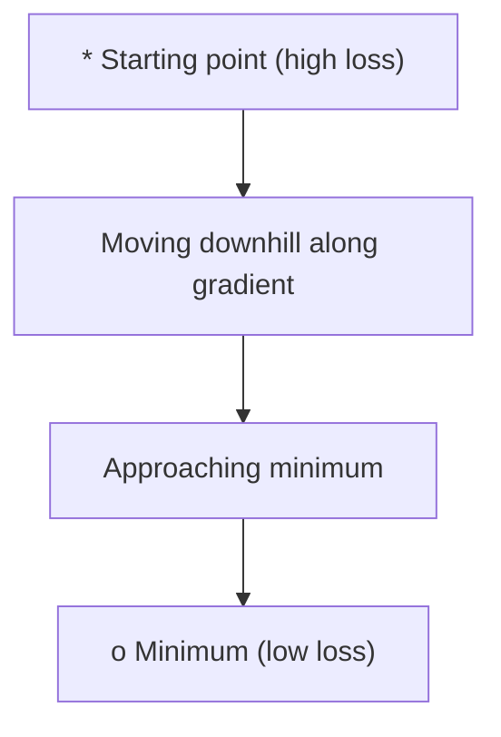
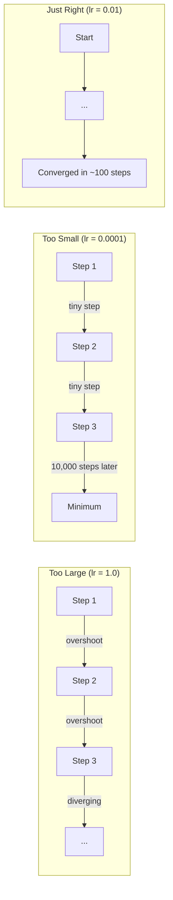
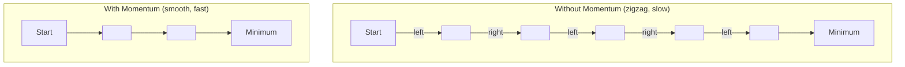
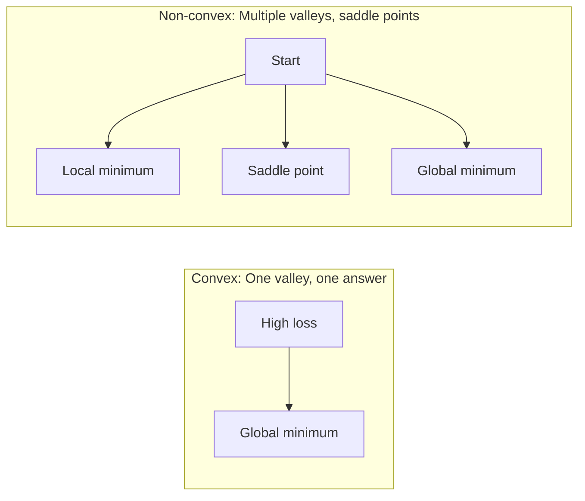
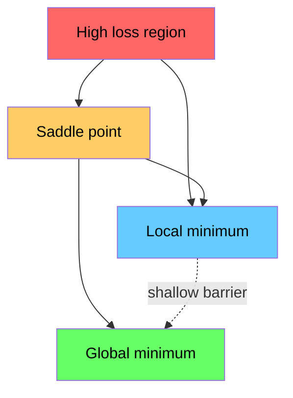

# 최적화

> 신경망을 학습시키는 것은 골짜기의 가장 낮은 곳을 찾는 일에 불과합니다.

**유형:** Build (실습)
**Language:** Python
**선수 레슨:** Phase 1, Lessons 04-05 (Derivatives, Gradients)
**소요 시간:** ~75분

## 학습 목표

- 기본 경사 하강법(vanilla gradient descent), 모멘텀(momentum)이 적용된 SGD, Adam을 바닥부터 구현하기
- 로젠브록 함수(Rosenbrock function)에서 옵티마이저 수렴을 비교하고, Adam이 가중치별 학습률을 적응적으로 조절하는 이유를 설명하기
- 볼록(convex) 손실 곡면과 비볼록(non-convex) 손실 곡면을 구별하고, 고차원에서 안장점(saddle point)이 미치는 영향을 설명하기
- 학습 안정성을 위한 학습률 스케줄(단계적 감쇠, 코사인 어닐링, 웜업)을 구성하기

## 문제 상황

손실 함수(loss function)가 주어졌습니다. 이 함수는 모델이 얼마나 잘못되었는지를 알려줍니다. 그래디언트(gradient)도 구했습니다. 그래디언트는 어느 방향으로 가야 손실이 더 커지는지를 알려줍니다. 이제 내리막길을 걸어 내려갈 전략이 필요합니다.

단순한 접근법은 직관적입니다. 그래디언트의 반대 방향으로 이동하는 것입니다. 이동 보폭은 학습률(learning rate)이라 부르는 특정 값으로 조정합니다. 이를 반복합니다. 이것이 바로 경사 하강법(gradient descent)이며, 실제로 잘 작동합니다. 하지만 "잘 작동한다"는 말에는 주의할 점이 따릅니다. 학습률이 너무 크면 골짜기 벽 사이를 튕겨 다니며 최적점을 완전히 지나쳐 버립니다. 너무 작으면 수천 번의 불필요한 스텝을 거치며 정답을 향해 기어가게 됩니다. 안장점에 도달하면 최솟값을 찾지 못했음에도 움직임을 멈추게 됩니다.

딥러닝의 모든 옵티마이저(optimizer)는 동일한 질문에 대한 답입니다. 어떻게 하면 골짜기 바닥에 더 빠르고 안정적으로 도달할 수 있을까요?

## 개념

### 최적화란 무엇인가

최적화(optimization)는 함수의 값을 최소화(또는 최대화)하는 입력값을 찾는 과정입니다. 머신러닝에서 이 함수는 손실 함수입니다. 입력값은 모델의 가중치(weight)입니다. 학습은 곧 최적화입니다.

```
minimize L(w) where:
  L = loss function
  w = model weights (could be millions of parameters)
```

### 기본 경사 하강법 (Vanilla gradient descent)

가장 단순한 옵티마이저입니다. 모든 가중치에 대해 손실의 그래디언트를 계산합니다. 각 가중치를 그래디언트의 반대 방향으로 이동시킵니다. 이동 보폭은 학습률로 조절합니다.

```
w = w - lr * gradient
```

이것이 알고리즘의 전부입니다. 단 한 줄입니다.



### 학습률: 가장 중요한 하이퍼파라미터

학습률(learning rate)은 스텝 크기(step size)를 제어합니다. 수렴에 관한 모든 것을 결정합니다.



올바른 학습률을 구하는 정형화된 공식은 없습니다. 실험을 통해 찾아내야 합니다. 일반적인 시작 지점은 다음과 같습니다. Adam은 0.001, 모멘텀이 적용된 SGD는 0.01입니다.

### SGD vs 배치 vs 미니배치

기본 경사 하강법은 전체 데이터셋에 대해 그래디언트를 계산한 후 한 걸음을 내딛습니다. 이를 배치 경사 하강법(batch gradient descent)이라고 합니다. 안정적이지만 느립니다.

확률적 경사 하강법(SGD, Stochastic Gradient Descent)은 무작위로 추출한 단일 샘플에서 그래디언트를 계산하고 즉시 스텝을 이동합니다. 노이즈가 많지만 빠릅니다.

미니배치(mini-batch) 경사 하강법은 둘 사이의 절충안입니다. 작은 배치(32, 64, 128, 256개 샘플)에 대해 그래디언트를 계산한 다음 스텝을 이동합니다. 이것이 실제로 모든 사람이 사용하는 방식입니다.

| 변형 | 배치 크기 | 그래디언트 품질 | 스텝당 속도 | 노이즈 |
|---------|-----------|-----------------|---------------|-------|
| 배치 GD | 전체 데이터셋 | 정확함 | 느림 | 없음 |
| SGD | 1개 샘플 | 노이즈 매우 심함 | 빠름 | 높음 |
| 미니배치 | 32-256 | 우수한 추정치 | 균형 잡힘 | 보통 |

SGD와 미니배치에서 발생하는 노이즈는 버그가 아닙니다. 얕은 지역 최솟값(local minima)과 안장점을 벗어나는 데 도움을 줍니다.

### 모멘텀: 내리막길을 구르는 공

기본 경사 하강법은 현재의 그래디언트만 바라봅니다. 그래디언트가 지그재그로 진동하면(좁은 골짜기에서 흔히 발생), 진행 속도가 느려집니다. 모멘텀(momentum)은 과거의 그래디언트를 속도(velocity) 텀에 누적하여 이 문제를 해결합니다.

```
v = beta * v + gradient
w = w - lr * v
```

비유하자면 내리막길을 구르는 공과 같습니다. 작은 요철마다 멈췄다 다시 출발하지 않습니다. 일관된 방향으로는 속도를 높이고, 진동은 완화합니다.



`beta`(일반적으로 0.9)는 이전 기록을 얼마나 유지할지 제어합니다. 베타 값이 클수록 모멘텀이 커져 경로가 부드러워지지만, 방향 전환에 대한 반응은 느려집니다.

### Adam: 적응형 학습률

서로 다른 가중치는 서로 다른 학습률을 필요로 합니다. 큰 그래디언트가 거의 발생하지 않는 가중치는 마침내 큰 그래디언트가 나타났을 때 더 큰 보폭으로 이동해야 합니다. 지속적으로 거대한 그래디언트가 발생하는 가중치는 더 작은 보폭으로 이동해야 합니다.

Adam(Adaptive Moment Estimation)은 가중치마다 두 가지 값을 추적합니다.

1. 1차 모멘트 (m): 그래디언트의 이동 평균 (모멘텀과 유사)
2. 2차 모멘트 (v): 그래디언트 제곱의 이동 평균 (그래디언트 크기)

```
m = beta1 * m + (1 - beta1) * gradient
v = beta2 * v + (1 - beta2) * gradient^2

m_hat = m / (1 - beta1^t)    bias correction
v_hat = v / (1 - beta2^t)    bias correction

w = w - lr * m_hat / (sqrt(v_hat) + epsilon)
```

`sqrt(v_hat)`로 나누는 과정이 핵심 통찰입니다. 그래디언트가 큰 가중치는 큰 수로 나누어지므로(실질적 스텝 크기가 작아짐), 그래디언트가 작은 가중치는 작은 수로 나누어집니다(실질적 스텝 크기가 커짐). 각 가중치는 고유한 적응형 학습률을 갖게 됩니다.

기본 하이퍼파라미터: `lr=0.001, beta1=0.9, beta2=0.999, epsilon=1e-8`. 이 기본값들은 대부분의 문제에서 잘 작동합니다.

### 학습률 스케줄

고정된 학습률은 일종의 타협안입니다. 학습 초기에는 빠른 진행을 위해 큰 보폭을 원합니다. 학습 후반에는 최솟값 근처에서 미세 조정을 하기 위해 작은 보폭을 원합니다.

일반적인 스케줄:

| 스케줄 | 공식 | 사용 사례 |
|----------|---------|----------|
| 단계적 감쇠 (Step decay) | 매 N 에포크마다 lr = lr * factor | 단순함, 수동 제어 |
| 지수 감쇠 (Exponential decay) | lr = lr_0 * decay^t | 매끄러운 감소 |
| 코사인 어닐링 (Cosine annealing) | lr = lr_min + 0.5 * (lr_max - lr_min) * (1 + cos(pi * t / T)) | Transformer, 현대적 학습 기법 |
| 웜업 + 감쇠 (Warmup + decay) | 선형 증가 후 감쇠 | 대규모 모델, 초기 불안정성 방지 |

### 볼록 vs 비볼록

볼록 함수(convex function)는 최솟값이 단 하나뿐입니다. 경사 하강법은 항상 그 최솟값을 찾아냅니다. `f(x) = x^2`과 같은 2차 함수는 볼록 함수입니다.

신경망의 손실 함수는 비볼록(non-convex) 함수입니다. 수많은 지역 최솟값, 안장점, 평탄한 영역(flat regions)을 가지고 있습니다.



실제로는 고차원 신경망에서 지역 최솟값이 문제가 되는 경우는 드뭅니다. 대부분의 지역 최솟값은 전역 최솟값(global minimum)에 가까운 손실 값을 갖습니다. 진짜 장애물은 안장점(일부 방향으로는 평탄하고 다른 방향으로는 굽어 있는 지점)입니다. 모멘텀과 미니배치에서 발생하는 노이즈가 이 안장점을 벗어나는 데 도움을 줍니다.

### 손실 곡면 시각화

손실은 모든 가중치에 대한 함수입니다. 100만 개의 가중치를 가진 모델의 손실 곡면(loss landscape)은 1,000,001차원 공간에 존재합니다. 우리는 가중치 공간에서 무작위로 두 방향을 선택하고 해당 방향을 따라 손실을 표시함으로써 이를 시각화하여 2D 곡면을 만듭니다.



날카로운 최솟값(sharp minima)은 일반화 성능이 떨어집니다. 평탄한 최솟값(flat minima)은 일반화 성능이 좋습니다. 이것이 모멘텀을 적용한 SGD가 최종 테스트 정확도에서 Adam보다 종종 우수한 성과를 내는 이유 중 하나입니다. SGD의 노이즈가 날카로운 최솟값에 안착하는 것을 방지하기 때문입니다.

```figure
gradient-descent
```

## 직접 구현하기

### 1단계: 테스트 함수 정의하기

로젠브록 함수(Rosenbrock function)는 최적화 분야의 고전적인 벤치마크입니다. 이 함수의 최솟값은 (1, 1)에 위치하며, 찾기는 쉽지만 따라가기는 어려운 좁고 굽은 골짜기 안에 있습니다.

```
f(x, y) = (1 - x)^2 + 100 * (y - x^2)^2
```

```python
def rosenbrock(params):
    x, y = params
    return (1 - x) ** 2 + 100 * (y - x ** 2) ** 2

def rosenbrock_gradient(params):
    x, y = params
    df_dx = -2 * (1 - x) + 200 * (y - x ** 2) * (-2 * x)
    df_dy = 200 * (y - x ** 2)
    return [df_dx, df_dy]
```

### 2단계: 기본 경사 하강법

```python
class GradientDescent:
    def __init__(self, lr=0.001):
        self.lr = lr

    def step(self, params, grads):
        return [p - self.lr * g for p, g in zip(params, grads)]
```

### 3단계: 모멘텀이 적용된 SGD

```python
class SGDMomentum:
    def __init__(self, lr=0.001, momentum=0.9):
        self.lr = lr
        self.momentum = momentum
        self.velocity = None

    def step(self, params, grads):
        if self.velocity is None:
            self.velocity = [0.0] * len(params)
        self.velocity = [
            self.momentum * v + g
            for v, g in zip(self.velocity, grads)
        ]
        return [p - self.lr * v for p, v in zip(params, self.velocity)]
```

### 4단계: Adam

```python
class Adam:
    def __init__(self, lr=0.001, beta1=0.9, beta2=0.999, epsilon=1e-8):
        self.lr = lr
        self.beta1 = beta1
        self.beta2 = beta2
        self.epsilon = epsilon
        self.m = None
        self.v = None
        self.t = 0

    def step(self, params, grads):
        if self.m is None:
            self.m = [0.0] * len(params)
            self.v = [0.0] * len(params)

        self.t += 1

        self.m = [
            self.beta1 * m + (1 - self.beta1) * g
            for m, g in zip(self.m, grads)
        ]
        self.v = [
            self.beta2 * v + (1 - self.beta2) * g ** 2
            for v, g in zip(self.v, grads)
        ]

        m_hat = [m / (1 - self.beta1 ** self.t) for m in self.m]
        v_hat = [v / (1 - self.beta2 ** self.t) for v in self.v]

        return [
            p - self.lr * mh / (vh ** 0.5 + self.epsilon)
            for p, mh, vh in zip(params, m_hat, v_hat)
        ]
```

### 5단계: 실행 및 비교

```python
def optimize(optimizer, func, grad_func, start, steps=5000):
    params = list(start)
    history = [params[:]]
    for _ in range(steps):
        grads = grad_func(params)
        params = optimizer.step(params, grads)
        history.append(params[:])
    return history

start = [-1.0, 1.0]

gd_history = optimize(GradientDescent(lr=0.0005), rosenbrock, rosenbrock_gradient, start)
sgd_history = optimize(SGDMomentum(lr=0.0001, momentum=0.9), rosenbrock, rosenbrock_gradient, start)
adam_history = optimize(Adam(lr=0.01), rosenbrock, rosenbrock_gradient, start)

for name, history in [("GD", gd_history), ("SGD+M", sgd_history), ("Adam", adam_history)]:
    final = history[-1]
    loss = rosenbrock(final)
    print(f"{name:6s} -> x={final[0]:.6f}, y={final[1]:.6f}, loss={loss:.8f}")
```

예상 출력 결과: Adam이 가장 빠르게 수렴합니다. 모멘텀이 적용된 SGD는 더 매끄러운 경로를 따릅니다. 기본 GD는 좁은 골짜기를 따라 천천히 나아갑니다.
## 활용하기

실무에서는 PyTorch나 JAX의 옵티마이저(optimizer)를 사용합니다. 이들 라이브러리는 매개변수 그룹(parameter group), 가중치 감쇠(weight decay), 그래디언트 클리핑(gradient clipping), GPU 가속을 자체적으로 처리합니다.

```python
import torch

model = torch.nn.Linear(784, 10)

sgd = torch.optim.SGD(model.parameters(), lr=0.01, momentum=0.9)
adam = torch.optim.Adam(model.parameters(), lr=0.001)
adamw = torch.optim.AdamW(model.parameters(), lr=0.001, weight_decay=0.01)

scheduler = torch.optim.lr_scheduler.CosineAnnealingLR(adam, T_max=100)
```

경험 법칙(Rules of thumb):

- Adam(lr=0.001)으로 시작하십시오. 튜닝 없이도 대부분의 문제에서 잘 작동합니다.
- 최종 정확도를 최대한 끌어올려야 하고 추가적인 튜닝을 감당할 여유가 있다면 모멘텀(momentum)이 적용된 SGD(lr=0.01, momentum=0.9)로 전환하십시오.
- Transformer 모델에는 AdamW(분리된 가중치 감쇠가 적용된 Adam)를 사용하십시오.
- 에포크(epoch) 수가 몇 번 이상인 긴 학습 과정에서는 항상 학습률 스케줄(learning rate schedule)을 사용하십시오.
- 학습이 불안정하다면 학습률을 낮추십시오. 학습이 너무 느리다면 학습률을 높이십시오.

## 적용하기

이번 레슨에서는 적절한 옵티마이저를 선택하기 위한 프롬프트를 만듭니다. `outputs/prompt-optimizer-guide.md`을 참조하십시오.

여기서 구현한 옵티마이저 클래스는 Phase 3에서 신경망을 밑바닥부터 직접 학습시킬 때 다시 등장합니다.

## 실습 과제

1. **학습률 탐색(Learning rate sweep).** 로젠브록 함수(Rosenbrock function)에서 학습률 [0.0001, 0.0005, 0.001, 0.005, 0.01]로 기본 경사 하강법(vanilla gradient descent)을 실행하십시오. 각 학습률에 대해 5,000 스텝 후의 최종 손실(loss)을 그래프로 그리거나 출력하십시오. 수렴하는 가장 큰 학습률을 찾아보십시오.

2. **모멘텀 비교.** 로젠브록 함수에서 모멘텀 값 [0.0, 0.5, 0.9, 0.99]로 SGD를 실행하십시오. 매 스텝마다 손실을 추적하십시오. 어떤 모멘텀 값이 가장 빠르게 수렴합니까? 어떤 값이 오버슈트(overshoot)를 발생시킵니까?

3. **안장점(Saddle point) 탈출.** 함수 `f(x, y) = x^2 - y^2`를 정의하십시오(원점에서 안장점을 가짐). (0.01, 0.01)에서 시작하십시오. 기본 GD, 모멘텀 SGD, Adam이 어떻게 동작하는지 비교하십시오. 어느 옵티마이저가 안장점을 탈출합니까?

4. **학습률 감쇠(Learning rate decay) 구현.** GradientDescent 클래스에 지수 감쇠 스케줄을 추가하십시오: `lr = lr_0 * 0.999^step`. 로젠브록 함수에서 감쇠가 있을 때와 없을 때의 수렴 과정을 비교하십시오.

## 핵심 용어

| 용어 | 일상적인 표현 | 실제 의미 |
|------|----------------|----------------------|
| 경사 하강법(Gradient descent) | "내리막길 내려가기" | 학습률로 스케일링된 그래디언트를 빼서 가중치를 업데이트하는 가장 기본적인 옵티마이저입니다. |
| 학습률(Learning rate) | "보폭(Step size)" | 각 업데이트마다 가중치를 얼마나 이동시킬지 제어하는 스칼라 값입니다. 너무 크면 발산하고, 너무 작으면 연산 자원을 낭비합니다. |
| 모멘텀(Momentum) | "관성 유지하기" | 이전 그래디언트들을 속도(velocity) 벡터로 누적합니다. 진동을 완화하고 일관된 방향으로의 이동을 가속합니다. |
| SGD | "무작위 샘플링" | 확률적 경사 하강법(Stochastic gradient descent). 전체 데이터셋 대신 무작위로 선택된 일부 서브셋에서 그래디언트를 계산합니다. 실무에서는 거의 항상 미니배치 SGD를 의미합니다. |
| 미니배치(Mini-batch) | "데이터 한 묶음" | 그래디언트를 추정하는 데 사용되는 학습 데이터의 작은 서브셋(32~256개 샘플)입니다. 속도와 그래디언트 정확도 사이의 균형을 맞춥니다. |
| Adam | "기본 옵티마이저" | Adaptive Moment Estimation. 가중치별 그래디언트 및 그래디언트 제곱의 이동 평균을 추적하여 가중치마다 개별 학습률을 부여합니다. |
| 편향 보정(Bias correction) | "콜드 스타트 해결" | Adam의 1차 및 2차 모멘트는 0으로 초기화됩니다. 편향 보정은 초기 스텝 동안 이를 보상하기 위해 (1 - beta^t)로 나눕니다. |
| 학습률 스케줄(Learning rate schedule) | "시간에 따른 lr 조정" | 학습 진행 중에 학습률을 조정하는 함수입니다. 초반에는 크게 이동하고 후반에는 미세하게 이동합니다. |
| 볼록 함수(Convex function) | "골짜기 하나" | 모든 극소점(local minimum)이 곧 최솟값(global minimum)인 함수입니다. 경사 하강법으로 항상 최솟값을 찾을 수 있습니다. 신경망의 손실 함수는 볼록 함수가 아닙니다. |
| 안장점(Saddle point) | "평평하지만 최솟값은 아님" | 그래디언트가 0이지만 어떤 방향으로는 극솟값이고 다른 방향으로는 극댓값인 지점입니다. 고차원에서 흔하게 나타납니다. |
| 손실 지형(Loss landscape) | "지형도" | 가중치 공간 위에 손실 함수를 시각화한 것입니다. 두 개의 무작위 방향으로 단면을 잘라 시각화합니다. |
| 수렴(Convergence) | "목표 도달" | 추가적인 스텝을 진행해도 손실이 더 이상 유의미하게 감소하지 않는 지점에 옵티마이저가 도달한 상태입니다. |

## 추가 자료

- [Sebastian Ruder: An overview of gradient descent optimization algorithms](https://ruder.io/optimizing-gradient-descent/) - 주요 옵티마이저 전반을 종합적으로 다룬 서베이
- [Why Momentum Really Works (Distill)](https://distill.pub/2017/momentum/) - 모멘텀의 역학을 보여주는 인터랙티브 시각화
- [Adam: A Method for Stochastic Optimization (Kingma & Ba, 2014)](https://arxiv.org/abs/1412.6980) - 쉽고 간결하게 작성된 원저작 Adam 논문
- [Visualizing the Loss Landscape of Neural Nets (Li et al., 2018)](https://arxiv.org/abs/1712.09913) - 뾰족한 최솟값(sharp minima)과 평평한 최솟값(flat minima)을 비교해 보여준 논문
