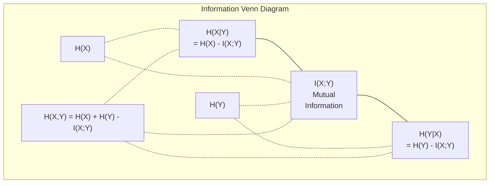

# Information Theory

> 정보 이론은 놀라움(surprise)을 측정합니다. 손실 함수는 이 위에 구축됩니다.

**유형:** Learn (이론)
**Language:** Python
**선수 레슨:** Phase 1, Lesson 06 (Probability)
**소요 시간:** ~60분

## Learning Objectives

- 엔트로피, 크로스 엔트로피, KL 발산을 밑바닥부터 계산하고 이들의 관계를 설명합니다.
- 크로스 엔트로피 손실 최소화가 로그 가능도(log-likelihood) 최대화와 동등한 이유를 유도합니다.
- 특성(feature)과 타깃 간의 상호 정보량을 계산하여 특성 중요도의 순위를 매깁니다.
- 퍼플렉서티(perplexity)를 언어 모델이 선택하는 유효 어휘 크기로 설명합니다.

## The Problem

여러분은 분류 모델을 학습시킬 때마다 `CrossEntropyLoss()`을 호출합니다. 언어 모델 관련 논문마다 "퍼플렉서티"를 보게 됩니다. VAE, 지식 증류(distillation), RLHF에서는 KL 발산에 대해 읽게 됩니다. 이들은 서로 동떨어진 개념이 아닙니다. 모두 같은 개념이 다른 형태를 취하고 있을 뿐입니다.

정보 이론은 불확실성, 압축, 예측에 대해 추론할 수 있는 언어를 제공합니다. 클로드 섀넌(Claude Shannon)은 통신 문제를 해결하기 위해 1948년에 이를 창안했습니다. 알고 보면 신경망을 학습시키는 것도 통신 문제입니다. 모델은 학습된 가중치라는 노이즈 낀 채널을 통해 올바른 레이블을 전송하려고 시도하는 것입니다.

이번 레슨에서는 모든 공식이 어디에서 왔고 왜 작동하는지 이해할 수 있도록 밑바닥부터 유도합니다.

## The Concept

### Information Content (Surprise)

일어날 가능성이 낮은 사건이 발생할 때, 더 많은 정보가 전달됩니다. 동전을 던져 앞면이 나오는 것? 놀랍지 않습니다. 복권에 당첨되는 것? 매우 놀랍습니다.

확률이 p인 사건의 정보량(information content)은 다음과 같습니다.

```
I(x) = -log(p(x))
```

밑이 2인 로그를 사용하면 비트(bit) 단위가 됩니다. 자연로그를 사용하면 나트(nat) 단위가 됩니다. 같은 개념이지만 단위만 다릅니다.

```
Event              Probability    Surprise (bits)
Fair coin heads    0.5            1.0
Rolling a 6        0.167          2.58
1-in-1000 event    0.001          9.97
Certain event      1.0            0.0
```

확실한 사건은 정보량이 0입니다. 이미 일어날 것임을 알고 있었기 때문입니다.

### Entropy (Average Surprise)

엔트로피(entropy)는 어떤 분포의 모든 가능한 결과에 걸친 기대 놀라움(expected surprise)입니다.

```
H(P) = -sum( p(x) * log(p(x)) )  for all x
```

공정한 동전은 이진 변수에 대해 최대 엔트로피인 1비트를 갖습니다. 편향된 동전(앞면 99%)은 0.08비트라는 낮은 엔트로피를 갖습니다. 무엇이 일어날지 이미 알고 있으므로, 동전을 던질 때마다 얻는 정보가 거의 없습니다.

```
Fair coin:    H = -(0.5 * log2(0.5) + 0.5 * log2(0.5)) = 1.0 bit
Biased coin:  H = -(0.99 * log2(0.99) + 0.01 * log2(0.01)) = 0.08 bits
```

엔트로피는 분포에 내재된 줄일 수 없는 불확실성을 측정합니다. 엔트로피 이하로는 압축할 수 없습니다.

### Cross-Entropy (The Loss Function You Use Every Day)

크로스 엔트로피(cross-entropy)는 실제로 분포 P에서 나오는 사건을 인코딩하기 위해 분포 Q를 사용할 때 발생하는 평균 놀라움을 측정합니다.

```
H(P, Q) = -sum( p(x) * log(q(x)) )  for all x
```

P는 실제 분포(레이블)입니다. Q는 모델의 예측입니다. Q가 P와 완벽하게 일치하면 크로스 엔트로피는 엔트로피와 같아집니다. 조금이라도 불일치하면 값이 더 커집니다.

분류 문제에서 P는 원-핫 벡터(실제 클래스의 확률은 1, 나머지는 모두 0)입니다. 이에 따라 크로스 엔트로피는 다음과 같이 단순화됩니다.

```
H(P, Q) = -log(q(true_class))
```

이것이 분류를 위한 크로스 엔트로피 손실 공식의 전부입니다. 올바른 클래스의 예측 확률을 최대화하는 것입니다.

### KL Divergence (Distance Between Distributions)

KL 발산(KL divergence)은 P 대신 Q를 사용함으로써 얻게 되는 추가적인 놀라움의 양을 측정합니다.

```
D_KL(P || Q) = sum( p(x) * log(p(x) / q(x)) )  for all x
             = H(P, Q) - H(P)
```

크로스 엔트로피는 엔트로피에 KL 발산을 더한 값입니다. 학습 중에 실제 분포의 엔트로피는 일정하므로, 크로스 엔트로피를 최소화하는 것은 KL 발산을 최소화하는 것과 같습니다. 모델의 분포를 실제 분포에 가깝게 밀어붙이는 것입니다.

KL 발산은 대칭적이지 않습니다: D_KL(P || Q) != D_KL(Q || P). 따라서 진정한 거리 측도(distance metric)는 아닙니다.

### Mutual Information

상호 정보량(mutual information)은 한 변수를 아는 것이 다른 변수에 대해 얼마나 많은 것을 알려주는지를 측정합니다.

```
I(X; Y) = H(X) - H(X|Y)
        = H(X) + H(Y) - H(X, Y)
```

X와 Y가 독립이면 상호 정보량은 0입니다. 하나를 알아도 다른 하나에 대해 아무것도 알 수 없습니다. 두 변수가 완벽하게 상관되어 있다면 상호 정보량은 둘 중 어느 한 변수의 엔트로피와 같습니다.

특성 선택(feature selection)에서 특성과 타깃 간의 상호 정보량이 높다는 것은 해당 특성이 유용함을 의미합니다. 상호 정보량이 낮다는 것은 그것이 노이즈임을 의미합니다.

### Conditional Entropy

H(Y|X)는 X를 관측한 후 Y에 대해 남아 있는 불확실성의 양을 측정합니다.

```
H(Y|X) = H(X,Y) - H(X)
```

두 가지 극단적인 경우:
- X가 Y를 완전히 결정한다면 H(Y|X) = 0입니다. X를 알면 Y에 대한 모든 불확실성이 제거됩니다. 예: X = 섭씨온도, Y = 화씨온도.
- X가 Y에 대해 아무것도 알려주지 않는다면 H(Y|X) = H(Y)입니다. X를 알아도 불확실성이 전혀 줄어들지 않습니다. 예: X = 동전 던지기 결과, Y = 내일의 날씨.

조건부 엔트로피는 항상 음이 아니며 결코 H(Y)를 초과하지 않습니다.

```
0 <= H(Y|X) <= H(Y)
```

머신러닝에서 조건부 엔트로피는 결정 트리(decision tree)에 등장합니다. 분기(split)마다 알고리즘은 H(Y|X)를 최소화하는 특성 X, 즉 레이블 Y에 대한 불확실성을 가장 많이 제거하는 특성을 선택합니다.

### Joint Entropy

H(X,Y)는 X와 Y의 결합 분포에 대한 엔트로피입니다.

```
H(X,Y) = -sum sum p(x,y) * log(p(x,y))   for all x, y
```

주요 성질:

```
H(X,Y) <= H(X) + H(Y)
```

등호는 X와 Y가 독립일 때 성립합니다. 두 변수가 정보를 공유하면 결합 엔트로피는 개별 엔트로피의 합보다 작아집니다. 이때 "누락된" 엔트로피가 바로 상호 정보량입니다.



관계식:
- H(X,Y) = H(X) + H(Y|X) = H(Y) + H(X|Y)
- I(X;Y) = H(X) - H(X|Y) = H(Y) - H(Y|X)
- H(X,Y) = H(X) + H(Y) - I(X;Y)

### Mutual Information (Deep Dive)

상호 정보량 I(X;Y)는 한 변수를 아는 것이 다른 변수에 대한 불확실성을 얼마나 줄여주는지를 정량화합니다.

```
I(X;Y) = H(X) - H(X|Y)
       = H(Y) - H(Y|X)
       = H(X) + H(Y) - H(X,Y)
       = sum sum p(x,y) * log(p(x,y) / (p(x) * p(y)))
```

성질:
- 항상 I(X;Y) >= 0입니다. 무언가를 관측함으로써 정보를 잃는 일은 결코 없습니다.
- X와 Y가 독립일 때에만 I(X;Y) = 0입니다.
- I(X;Y) = I(Y;X)입니다. KL 발산과 달리 대칭적입니다.
- I(X;X) = H(X)입니다. 변수는 자기 자신과 모든 정보를 공유합니다.

**특성 선택을 위한 상호 정보량.** ML에서는 타깃에 대한 정보를 많이 담고 있는 특성을 원합니다. 상호 정보량은 특성의 순위를 매기는 원칙적인 방법을 제공합니다.

1. 각 특성 X_i에 대해 Y가 타깃 변수일 때 I(X_i; Y)를 계산합니다.
2. MI 점수를 기준으로 특성의 순위를 매깁니다.
3. 상위 k개의 특성을 유지합니다.

이 방식은 선형, 비선형, 단조 또는 비단조 여부와 관계없이 특성과 타깃 간의 모든 관계에 대해 작동합니다. 상관관계(correlation)는 선형 관계만 포착합니다. MI는 모든 관계를 포착합니다.

| Method | Detects | Computational cost | Handles categorical? |
|--------|---------|-------------------|---------------------|
| Pearson correlation | Linear relationships | O(n) | No |
| Spearman correlation | Monotonic relationships | O(n log n) | No |
| Mutual information | Any statistical dependency | O(n log n) with binning | Yes |
### 라벨 스무딩과 크로스 엔트로피

표준적인 분류(classification)에서는 하드 타깃(hard target)인 [0, 0, 1, 0]을 사용합니다. 실제 클래스는 확률 1을 얻고, 나머지 모든 클래스는 0을 얻습니다. 라벨 스무딩(label smoothing)은 이를 소프트 타깃(soft target)으로 대체합니다.

```
soft_target = (1 - epsilon) * hard_target + epsilon / num_classes
```

입실론(epsilon) = 0.1이고 클래스가 4개인 경우:
- 하드 타깃:  [0, 0, 1, 0]
- 소프트 타깃:  [0.025, 0.025, 0.925, 0.025]

정보 이론 관점에서 보면, 라벨 스무딩은 타깃 분포의 엔트로피(entropy)를 증가시킵니다. 원-핫(one-hot) 형태의 하드 타깃은 불확실성이 전혀 없으므로 엔트로피가 0입니다. 반면 소프트 타깃은 양(+)의 엔트로피를 가집니다.

이것이 도움이 되는 이유:
- 모델이 로짓(logit)을 극단적인 값으로 몰아가는 것을 방지합니다(크로스 엔트로피 하에서 원-핫 타깃에 완벽히 맞추려면 무한대의 로짓이 필요함).
- 정규화(regularization) 역할을 합니다: 모델이 100% 확신하지 못하도록 만듭니다.
- 보정(calibration) 성능을 개선합니다: 예측 확률이 실제 불확실성을 더 잘 반영하게 됩니다.
- 훈련과 추론(inference) 동작 간의 격차를 줄입니다.

라벨 스무딩이 적용된 크로스 엔트로피 손실은 다음과 같습니다.

```
L = (1 - epsilon) * CE(hard_target, prediction) + epsilon * H_uniform(prediction)
```

두 번째 항은 균등 분포(uniform distribution)에서 멀어지는 예측에 페널티를 부여하며, 이는 확신도(confidence)에 대한 직접적인 정규화로 작용합니다.

### 크로스 엔트로피가 대표적인 분류 손실 함수인 이유

세 가지 관점이지만, 결론은 같습니다.

**정보 이론 관점.** 크로스 엔트로피는 실제 분포 대신 모델의 분포를 사용함으로써 낭비되는 비트 수를 측정합니다. 이를 최소화하면 모델이 현실을 가장 효율적으로 인코딩하게 됩니다.

**최대 우도(Maximum likelihood) 관점.** 실제 클래스가 y_i인 N개의 훈련 샘플에 대해:

```
Likelihood     = product( q(y_i) )
Log-likelihood = sum( log(q(y_i)) )
Negative log-likelihood = -sum( log(q(y_i)) )
```

마지막 줄이 바로 크로스 엔트로피 손실입니다. 크로스 엔트로피 최소화 = 모델 하에서 훈련 데이터의 우도(likelihood) 최대화입니다.

**그래디언트 관점.** 로짓에 대한 크로스 엔트로피의 그래디언트(gradient)는 단순히 (예측값 - 실제값)입니다. 깔끔하고 안정적이며 계산 속도가 빠릅니다. 이것이 크로스 엔트로피가 softmax와 완벽하게 어우러지는 이유입니다.

### 비트(Bits) vs 내트(Nats)

유일한 차이점은 로그의 밑(base)입니다.

```
log base 2   -> bits      (information theory tradition)
log base e   -> nats      (machine learning convention)
log base 10  -> hartleys  (rarely used)
```

1 nat = 1/ln(2) bits = 1.4427 bits입니다. PyTorch와 TensorFlow는 기본적으로 자연로그(nats)를 사용합니다.

### 퍼플렉서티(Perplexity)

퍼플렉서티는 크로스 엔트로피의 지수(exponential) 값입니다. 모델이 동일한 확률을 가진 몇 개의 선택지 사이에서 헷갈려하고 있는지를 유효한 선택지 수로 나타냅니다.

```
Perplexity = 2^H(P,Q)   (if using bits)
Perplexity = e^H(P,Q)   (if using nats)
```

퍼플렉서티가 50인 언어 모델은 평균적으로 가능한 다음 토큰 50개 중에서 균등하게 하나를 골라야 할 때만큼 혼란스러워한다는 의미입니다. 값이 낮을수록 좋습니다.

GPT-2는 일반적인 벤치마크에서 약 30의 퍼플렉서티를 기록했습니다. 최신 모델들은 데이터가 충분한 도메인에서 한 자릿수 퍼플렉서티를 보입니다.

```figure
entropy-kl
```

## 직접 구현하기

### 1단계: 정보량과 엔트로피

```python
import math

def information_content(p, base=2):
    if p <= 0 or p > 1:
        return float('inf') if p <= 0 else 0.0
    return -math.log(p) / math.log(base)

def entropy(probs, base=2):
    return sum(
        p * information_content(p, base)
        for p in probs if p > 0
    )

fair_coin = [0.5, 0.5]
biased_coin = [0.99, 0.01]
fair_die = [1/6] * 6

print(f"Fair coin entropy:   {entropy(fair_coin):.4f} bits")
print(f"Biased coin entropy: {entropy(biased_coin):.4f} bits")
print(f"Fair die entropy:    {entropy(fair_die):.4f} bits")
```

### 2단계: 크로스 엔트로피와 KL 발산

```python
def cross_entropy(p, q, base=2):
    total = 0.0
    for pi, qi in zip(p, q):
        if pi > 0:
            if qi <= 0:
                return float('inf')
            total += pi * (-math.log(qi) / math.log(base))
    return total

def kl_divergence(p, q, base=2):
    return cross_entropy(p, q, base) - entropy(p, base)

true_dist = [0.7, 0.2, 0.1]
good_model = [0.6, 0.25, 0.15]
bad_model = [0.1, 0.1, 0.8]

print(f"Entropy of true dist:     {entropy(true_dist):.4f} bits")
print(f"CE (good model):          {cross_entropy(true_dist, good_model):.4f} bits")
print(f"CE (bad model):           {cross_entropy(true_dist, bad_model):.4f} bits")
print(f"KL divergence (good):     {kl_divergence(true_dist, good_model):.4f} bits")
print(f"KL divergence (bad):      {kl_divergence(true_dist, bad_model):.4f} bits")
```

### 3단계: 분류 손실 함수로서의 크로스 엔트로피

```python
def softmax(logits):
    max_logit = max(logits)
    exps = [math.exp(z - max_logit) for z in logits]
    total = sum(exps)
    return [e / total for e in exps]

def cross_entropy_loss(true_class, logits):
    probs = softmax(logits)
    return -math.log(probs[true_class])

logits = [2.0, 1.0, 0.1]
true_class = 0

probs = softmax(logits)
loss = cross_entropy_loss(true_class, logits)

print(f"Logits:      {logits}")
print(f"Softmax:     {[f'{p:.4f}' for p in probs]}")
print(f"True class:  {true_class}")
print(f"Loss:        {loss:.4f} nats")
print(f"Perplexity:  {math.exp(loss):.2f}")
```

### 4단계: 음의 로그 우도와 동일한 크로스 엔트로피

```python
import random

random.seed(42)

n_samples = 1000
n_classes = 3
true_labels = [random.randint(0, n_classes - 1) for _ in range(n_samples)]
model_logits = [[random.gauss(0, 1) for _ in range(n_classes)] for _ in range(n_samples)]

ce_loss = sum(
    cross_entropy_loss(label, logits)
    for label, logits in zip(true_labels, model_logits)
) / n_samples

nll = -sum(
    math.log(softmax(logits)[label])
    for label, logits in zip(true_labels, model_logits)
) / n_samples

print(f"Cross-entropy loss:      {ce_loss:.6f}")
print(f"Negative log-likelihood: {nll:.6f}")
print(f"Difference:              {abs(ce_loss - nll):.2e}")
```

### 5단계: 상호정보량

```python
def mutual_information(joint_probs, base=2):
    rows = len(joint_probs)
    cols = len(joint_probs[0])

    margin_x = [sum(joint_probs[i][j] for j in range(cols)) for i in range(rows)]
    margin_y = [sum(joint_probs[i][j] for i in range(rows)) for j in range(cols)]

    mi = 0.0
    for i in range(rows):
        for j in range(cols):
            pxy = joint_probs[i][j]
            if pxy > 0:
                mi += pxy * math.log(pxy / (margin_x[i] * margin_y[j])) / math.log(base)
    return mi

independent = [[0.25, 0.25], [0.25, 0.25]]
dependent = [[0.45, 0.05], [0.05, 0.45]]

print(f"MI (independent): {mutual_information(independent):.4f} bits")
print(f"MI (dependent):   {mutual_information(dependent):.4f} bits")
```

## 활용하기

실무에서 사용하는 방식 그대로, NumPy를 활용해 동일한 개념들을 구현해 보겠습니다.

```python
import numpy as np

def np_entropy(p):
    p = np.asarray(p, dtype=float)
    mask = p > 0
    result = np.zeros_like(p)
    result[mask] = p[mask] * np.log(p[mask])
    return -result.sum()

def np_cross_entropy(p, q):
    p, q = np.asarray(p, dtype=float), np.asarray(q, dtype=float)
    mask = p > 0
    return -(p[mask] * np.log(q[mask])).sum()

def np_kl_divergence(p, q):
    return np_cross_entropy(p, q) - np_entropy(p)

true = np.array([0.7, 0.2, 0.1])
pred = np.array([0.6, 0.25, 0.15])
print(f"Entropy:    {np_entropy(true):.4f} nats")
print(f"Cross-ent:  {np_cross_entropy(true, pred):.4f} nats")
print(f"KL div:     {np_kl_divergence(true, pred):.4f} nats")
```

`torch.nn.CrossEntropyLoss()`이 내부적으로 수행하는 작업을 밑바닥부터 직접 구현해 보았습니다. 이제 훈련 중에 손실이 감소하는 이유를 이해할 수 있습니다. 바로 모델의 예측 분포가 낭비되는 정보의 내트(nats) 단위 기준으로 실제 분포에 점점 더 가까워지기 때문입니다.

## 연습 문제

1. 균등 분포를 가정하여 영어 알파벳(26자)의 엔트로피를 계산하세요. 그런 다음 실제 알파벳 빈도수를 사용하여 엔트로피를 추정해 보세요. 둘 중 어느 쪽이 더 높으며, 그 이유는 무엇인가요?

2. 실제 클래스가 1인 샘플에 대해 모델이 로짓 [5.0, 2.0, 0.5]를 출력했습니다. 손으로 직접 크로스 엔트로피 손실을 계산한 다음, 작성한 `cross_entropy_loss` 함수로 검증해 보세요. 손실이 0이 되려면 로짓이 어떤 값이어야 할까요?

3. KL 발산(KL divergence)이 대칭적이지 않음을 증명하세요. 두 분포 P와 Q를 선택하고 D_KL(P || Q)와 D_KL(Q || P)를 계산해 보세요. 두 값이 서로 다른 이유를 설명하세요.

4. 토큰 예측 시퀀스에 대한 퍼플렉서티를 계산하는 함수를 작성하세요. (true_token_index, predicted_logits) 쌍으로 이루어진 리스트가 주어졌을 때, 해당 시퀀스의 퍼플렉서티를 반환해야 합니다.

## 핵심 용어

| 용어 | 흔히 하는 말 | 실제 의미 |
|------|----------------|----------------------|
| 정보량(Information content) | "놀람 정도" | 사건을 인코딩하는 데 필요한 비트(또는 내트) 수: -log(p) |
| 엔트로피(Entropy) | "무작위성" | 분포의 모든 결과에 걸친 평균 놀람 정도. 줄일 수 없는 불확실성을 측정함. |
| 크로스 엔트로피(Cross-entropy) | "손실 함수" | 모델 분포 Q를 사용하여 실제 분포 P의 사건을 인코딩할 때의 평균 놀람 정도. |
| KL 발산(KL divergence) | "분포 간의 거리" | P 대신 Q를 사용함으로써 낭비되는 추가 비트. 크로스 엔트로피에서 엔트로피를 뺀 값과 같음. 비대칭적임. |
| 상호정보량(Mutual information) | "X와 Y가 얼마나 관련되어 있는가" | Y를 앎으로써 줄어드는 X에 대한 불확실성. 0이면 서로 독립임을 의미함. |
| Softmax | "로짓을 확률로 변환하기" | 지수화(exponentiate) 후 정규화. 임의의 실수 벡터를 유효한 확률 분포로 매핑함. |
| 퍼플렉서티(Perplexity) | "모델이 얼마나 헷갈려하는가" | 크로스 엔트로피의 지수 값. 각 스텝에서 모델이 선택 대상으로 삼는 유효 어휘 크기. |
| 비트(Bits) | "섀넌의 단위" | 밑이 2인 로그로 측정한 정보량. 1비트는 공정한 동전 던지기 하나를 해결함. |
| 내트(Nats) | "머신러닝의 단위" | 자연로그로 측정한 정보량. PyTorch와 TensorFlow에서 기본값으로 사용됨. |
| 음의 로그 우도(Negative log-likelihood) | "NLL 손실" | 원-핫 라벨의 경우 크로스 엔트로피 손실과 동일함. 이를 최소화하면 정답 예측 확률이 최대화됨. |

## 참고 자료

- [Shannon 1948: A Mathematical Theory of Communication](https://people.math.harvard.edu/~ctm/home/text/others/shannon/entropy/entropy.pdf) - 최초의 논문이며, 지금 읽어도 훌륭합니다.
- [Visual Information Theory (Chris Olah)](https://colah.github.io/posts/2015-09-Visual-Information/) - 엔트로피와 KL 발산에 관한 최고의 시각적 설명
- [PyTorch CrossEntropyLoss 공식 문서](https://pytorch.org/docs/stable/generated/torch.nn.CrossEntropyLoss.html) - 방금 구현한 내용을 프레임워크가 실제로 구현한 방식
