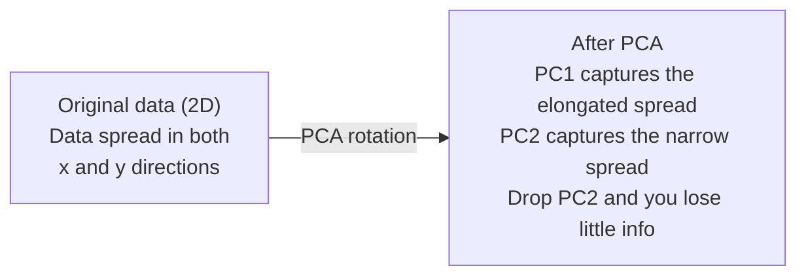

# 차원 축소

> 고차원 데이터에는 구조가 존재합니다. 올바른 각도에서 바라볼 때 그 구조를 찾을 수 있습니다.

**유형:** Build (실습)
**Language:** Python
**선수 레슨:** Phase 1, Lessons 01 (Linear Algebra Intuition), 02 (Vectors, Matrices & Operations), 03 (Eigenvalues & Eigenvectors), 06 (Probability & Distributions)
**소요 시간:** ~90분

## 학습 목표

- 밑바닥부터 PCA 구현하기: 데이터 중심화, 공분산 행렬(covariance matrix) 계산, 고윳값 분해(eigendecomposition), 데이터 투영
- 설명된 분산 비율(explained variance ratio)과 엘보우 방법(elbow method)을 활용해 주성분(principal component)의 개수 결정하기
- PCA, t-SNE, UMAP을 비교하여 MNIST 숫자를 2차원으로 시각화하고 각각의 트레이드오프 설명하기
- RBF 커널을 사용하는 커널 PCA(kernel PCA)를 적용하여 일반 PCA로는 다룰 수 없는 비선형 데이터 구조 분리하기

## 문제 상황

샘플당 784개의 특성(feature)을 가진 데이터셋이 있습니다. 손글씨 숫자의 픽셀값일 수도 있고, 유전자 발현 수준이거나 사용자 행동 신호일 수도 있습니다. 784차원은 시각화할 수 없습니다. 그래프로 그릴 수도 없고, 머릿속으로 떠올릴 수도 없습니다.

하지만 이 784개의 특성 중 대부분은 중복입니다. 실제 정보는 훨씬 더 작은 표면 위에 존재합니다. 손글씨 숫자 "7"을 표현하는 데 784개의 독립적인 숫자가 모두 필요하지는 않습니다. 획의 각도, 가로획의 길이, 기울어진 정도와 같은 몇 가지 정보만 있으면 충분합니다. 나머지는 노이즈에 불과합니다.

차원 축소(dimensionality reduction)는 바로 이 더 작은 표면을 찾아냅니다. 784차원 데이터를 가져와 중요한 구조는 그대로 유지하면서 2차원, 10차원, 또는 50차원으로 압축합니다.

## 핵심 개념

### 차원의 저주

고차원 공간은 직관적이지 않습니다. 차원이 커질수록 세 가지 문제가 발생합니다.

**거리가 무의미해집니다.** 고차원에서는 임의의 두 점 사이의 거리가 모두 동일한 값으로 수렴합니다. 모든 점이 다른 모든 점과 거의 같은 거리에 있게 되면, 최근접 이웃 탐색(nearest-neighbor search)이 제대로 작동하지 않습니다.

```
Dimension    Avg distance ratio (max/min between random points)
2            ~5.0
10           ~1.8
100          ~1.2
1000         ~1.02
```

**부피가 모서리에 집중됩니다.** d차원의 단위 초입방체(hypercube)는 2^d개의 모서리를 가집니다. 100차원에서는 거의 모든 부피가 중심에서 멀리 떨어진 모서리에 몰려 있습니다. 데이터 포인트들이 가장자리로 흩어지면서 모델은 내부 공간의 데이터 부족 현상을 겪게 됩니다.

**기하급수적으로 더 많은 데이터가 필요합니다.** 공간 내에서 동일한 샘플 밀도를 유지하려면, 2차원에서 20차원으로 늘어날 때 10^18배 더 많은 데이터가 필요합니다. 현실에서는 데이터가 항상 부족합니다. 차원을 축소하면 데이터 밀도를 다룰 수 있는 수준으로 되돌릴 수 있습니다.

### PCA: 중요한 방향 찾기

주성분 분석(PCA, Principal Component Analysis)은 데이터의 분산(variance)이 가장 큰 축을 찾습니다. 첫 번째 축이 가장 큰 분산을 포착하고, 두 번째 축이 그다음으로 큰 분산을 포착하도록 좌표계를 회전시킵니다.

알고리즘 절차는 다음과 같습니다.

```
1. Center the data        (subtract the mean from each feature)
2. Compute covariance     (how features move together)
3. Eigendecomposition     (find the principal directions)
4. Sort by eigenvalue     (biggest variance first)
5. Project               (keep top k eigenvectors, drop the rest)
```

왜 고윳값 분해를 사용할까요? 공분산 행렬은 대칭 행렬(symmetric matrix)이자 준양부호 행렬(positive semi-definite matrix)입니다. 이 행렬의 고유벡터(eigenvector)는 특성 공간에서 서로 직교하는 방향을 나타냅니다. 고윳값(eigenvalue)은 각 방향이 얼마만큼의 분산을 포착하는지 알려줍니다. 가장 큰 고윳값을 갖는 고유벡터가 바로 최대 분산의 방향을 가리킵니다.



- **PCA 적용 전:** 데이터 구름이 x축과 y축 모두에 걸쳐 대각선 방향으로 퍼져 있습니다.
- **PCA 적용 후:** PC1이 최대 분산 방향(길게 늘어난 방향)과 일치하고 PC2가 최소 분산 방향(좁게 퍼진 방향)과 일치하도록 좌표계가 회전합니다.
- **차원 축소:** PC2를 버리고 데이터를 PC1에 투영해도 정보 손실이 거의 발생하지 않습니다.

### 설명된 분산 비율

각 주성분은 전체 분산의 일부분을 포착합니다. 설명된 분산 비율은 각 성분이 전체 분산 중 얼마만큼을 차지하는지 알려줍니다.

```
Component    Eigenvalue    Explained ratio    Cumulative
PC1          4.73          0.473              0.473
PC2          2.51          0.251              0.724
PC3          1.12          0.112              0.836
PC4          0.89          0.089              0.925
...
```

누적 설명 분산이 0.95에 도달하면, 해당 개수의 성분만으로 정보의 95%를 포착할 수 있다는 뜻입니다. 그 이후의 성분들은 대부분 노이즈에 가깝습니다.

### 주성분 개수 선택하기

세 가지 전략이 있습니다.

1. **임계값 기준(Threshold).** 분산의 90~95%를 설명할 수 있을 만큼의 성분을 유지합니다.
2. **엘보우 방법(Elbow method).** 성분별 설명된 분산을 그래프로 그리고 급격히 꺾이는 지점을 찾습니다.
3. **다운스트림 성능(Downstream performance).** PCA를 전처리 단계로 사용합니다. k 값을 바꿔가며 모델의 정확도를 측정하고, 정확도가 정체되는(plateau) 지점의 k를 선택합니다.

### t-SNE: 이웃 관계 보존

t-분포 확률적 임베딩(t-SNE, t-Distributed Stochastic Neighbor Embedding)은 시각화를 위해 고안되었습니다. 고차원 데이터를 2차원(또는 3차원)으로 매핑하면서 어떤 점들이 서로 가까이 있는지를 보존합니다.

기본 직관은 다음과 같습니다. 원본 공간에서 점들 사이의 거리를 바탕으로 점 쌍(pair)에 대한 확률 분포를 계산합니다. 가까운 점들에는 높은 확률을, 먼 점들에는 낮은 확률을 부여합니다. 그런 다음 2차원 공간에서 동일한 확률 분포를 만족하는 배치를 찾습니다. 784차원에서 이웃이었던 점들은 2차원에서도 이웃으로 남게 됩니다.

t-SNE의 주요 특성:
- 비선형적입니다. PCA가 펼치지 못하는 복잡한 매니폴드(manifold)를 펼칠 수 있습니다.
- 확률적(stochastic)입니다. 실행할 때마다 다른 배치가 생성됩니다.
- 퍼플렉서티(perplexity) 매개변수로 고려할 이웃의 수를 제어합니다(일반적인 범위: 5~50).
- 결과물에서 군집 간의 거리는 의미가 없습니다. 군집 그 자체만이 유의미합니다.
- 대규모 데이터셋에서는 느립니다. 기본적으로 O(n^2)의 복잡도를 갖습니다.

### UMAP: 더 빠르고 우수한 전역 구조 보존

UMAP(Uniform Manifold Approximation and Projection)은 t-SNE와 유사하게 작동하지만 두 가지 장점이 있습니다.
- 더 빠릅니다. 모든 쌍의 거리를 계산하는 대신 근사 최근접 이웃 그래프(approximate nearest-neighbor graph)를 사용합니다.
- 전역 구조(global structure)를 더 잘 보존합니다. 결과물에서 군집 간의 상대적 위치가 t-SNE보다 더 유의미한 경향이 있습니다.

UMAP은 고차원 공간에서 가중치 그래프("퍼지 위상 표현(fuzzy topological representation)")를 구성한 다음, 이 그래프를 최대한 보존하는 저차원 배치를 찾습니다.

주요 매개변수:
- `n_neighbors`: 국소 구조를 정의하는 이웃의 수입니다(perplexity와 유사). 값이 클수록 전역 구조를 더 많이 보존합니다.
- `min_dist`: 결과물에서 점들이 얼마나 조밀하게 뭉치는지를 결정합니다. 값이 작을수록 더 조밀한 군집이 형성됩니다.

### 어떤 방법을 언제 사용해야 하는가

| 방법 | 사용 사례 | 보존 대상 | 속도 |
|------|-----------|-----------|------|
| PCA | 학습 전 전처리 | 전역 분산 | 빠름(정확한 계산), 수백만 개 샘플 처리 가능 |
| PCA | 빠른 탐색적 시각화 | 선형 구조 | 빠름 |
| t-SNE | 논문/보고서용 고품질 2D 플롯 | 국소 이웃 관계 | 느림(1만 개 미만 샘플에 이상적) |
| UMAP | 대규모 2D 시각화 | 국소 구조 + 일부 전역 구조 | 보통(수백만 개 처리 가능) |
| PCA | 모델용 특성 축소 | 분산 순위 기반 특성 | 빠름 |
| t-SNE / UMAP | 군집 구조 파악 | 군집 분리도 | 보통~느림 |

실무 지침: 전처리와 데이터 압축에는 PCA를 사용하세요. 2차원에서 데이터 구조를 시각화해야 할 때는 t-SNE나 UMAP을 사용하세요.
### 커널 PCA

표준 PCA는 선형 부분 공간(linear subspace)을 찾습니다. 좌표계를 회전시키고 축을 제거합니다. 하지만 데이터가 비선형 다양체(nonlinear manifold)에 놓여 있다면 어떻게 될까요? 2차원 공간의 원은 어떤 직선으로도 분리할 수 없습니다. 표준 PCA는 도움이 되지 않습니다.

커널 PCA(Kernel PCA)는 해당 공간의 좌표를 명시적으로 계산하지 않고도, 커널 함수로 유도된 고차원 특성 공간(feature space)에서 PCA를 적용합니다. 이것이 바로 서포트 벡터 머신(SVM)의 기반이 되는 아이디어인 커널 트릭(kernel trick)입니다.

알고리즘:
1. K_ij = k(x_i, x_j)인 커널 행렬 K를 계산합니다.
2. 특성 공간에서 커널 행렬을 중심화(centering)합니다.
3. 중심화된 커널 행렬을 고유값 분해(eigendecomposition)합니다.
4. 상위 고유벡터(1/sqrt(고유값)으로 스케일링됨)가 투영 결과가 됩니다.

일반적인 커널 함수:

| 커널 | 수식 | 적합한 대상 |
|--------|---------|----------|
| RBF (가우시안) | exp(-gamma * \|\|x - y\|\|^2) | 대부분의 비선형 데이터, 매끄러운 다양체 |
| 다항식(Polynomial) | (x . y + c)^d | 다항식 관계 |
| 시그모이드(Sigmoid) | tanh(alpha * x . y + c) | 신경망과 유사한 매핑 |

커널 PCA와 표준 PCA의 사용 기준:

| 기준 | 표준 PCA | 커널 PCA |
|-----------|-------------|------------|
| 데이터 구조 | 선형 부분 공간 | 비선형 다양체 |
| 속도 | O(min(n^2 d, d^2 n)) | O(n^2 d + n^3) |
| 해석 가능성 | 주성분이 특성들의 선형 결합임 | 주성분의 직접적인 특성 해석이 어려움 |
| 확장성 | 수백만 개의 샘플에도 동작 | 커널 행렬이 n x n이므로 메모리 제약 발생 |
| 재구성 | 직접적인 역변환 가능 | 프리이미지(pre-image) 근사 필요 |

대표적인 예는 2차원 동심원입니다. 점들로 이루어진 두 개의 링이 하나는 다른 하나의 안쪽에 있습니다. 표준 PCA는 둘 모두를 동일한 직선에 투영하므로 분류에 전혀 도움이 되지 않습니다. 반면 RBF 커널을 적용한 커널 PCA는 안쪽 원과 바깥쪽 원을 서로 다른 영역으로 매핑하여 선형 분리가 가능하도록 만듭니다.

### 재구성 오차

차원 축소 결과가 얼마나 우수할까요? 784차원을 50차원으로 압축했을 때 무엇을 잃었을까요?

재구성 오차(reconstruction error) 측정:
1. 데이터를 k차원으로 투영: X_reduced = X @ W_k
2. 재구성: X_hat = X_reduced @ W_k^T
3. MSE 계산: mean((X - X_hat)^2)

PCA에서 재구성 오차는 설명된 분산(explained variance)과 명확한 관계를 가집니다:

```
Reconstruction error = sum of eigenvalues NOT included
Total variance = sum of ALL eigenvalues
Fraction lost = (sum of dropped eigenvalues) / (sum of all eigenvalues)
```

각 주성분의 설명된 분산 비율(explained variance ratio)은 다음과 같습니다:

```
explained_ratio_k = eigenvalue_k / sum(all eigenvalues)
```

주성분 개수에 따른 누적 설명 분산을 시각화하면 "엘보(elbow)" 곡선을 얻을 수 있습니다. 적절한 주성분 개수는 다음 조건에 해당하는 지점입니다:
- 곡선이 평탄해지는 지점(수확 체감)
- 누적 분산이 임계값(일반적으로 0.90 또는 0.95)을 넘어서는 지점
- 다운스트림(downstream) 작업의 성능이 정체(plateau)되는 지점

재구성 오차는 k를 선택하는 것 이상으로 유용합니다. 이상치 탐지(anomaly detection)에도 활용할 수 있습니다. 재구성 오차가 큰 샘플은 학습된 부분 공간에 부합하지 않는 이상치입니다. 이것이 프로덕션 시스템에서 사용되는 PCA 기반 이상치 탐지의 기초입니다.

```figure
pca-axes
```

## 직접 구현하기

### 1단계: 밑바닥부터 구현하는 PCA

```python
import numpy as np

class PCA:
    def __init__(self, n_components):
        self.n_components = n_components
        self.components = None
        self.mean = None
        self.eigenvalues = None
        self.explained_variance_ratio_ = None

    def fit(self, X):
        self.mean = np.mean(X, axis=0)
        X_centered = X - self.mean

        cov_matrix = np.cov(X_centered, rowvar=False)

        eigenvalues, eigenvectors = np.linalg.eigh(cov_matrix)

        sorted_idx = np.argsort(eigenvalues)[::-1]
        eigenvalues = eigenvalues[sorted_idx]
        eigenvectors = eigenvectors[:, sorted_idx]

        self.components = eigenvectors[:, :self.n_components].T
        self.eigenvalues = eigenvalues[:self.n_components]
        total_var = np.sum(eigenvalues)
        self.explained_variance_ratio_ = self.eigenvalues / total_var

        return self

    def transform(self, X):
        X_centered = X - self.mean
        return X_centered @ self.components.T

    def fit_transform(self, X):
        self.fit(X)
        return self.transform(X)
```

### 2단계: 합성 데이터에서 테스트

```python
np.random.seed(42)
n_samples = 500

t = np.random.uniform(0, 2 * np.pi, n_samples)
x1 = 3 * np.cos(t) + np.random.normal(0, 0.2, n_samples)
x2 = 3 * np.sin(t) + np.random.normal(0, 0.2, n_samples)
x3 = 0.5 * x1 + 0.3 * x2 + np.random.normal(0, 0.1, n_samples)

X_synthetic = np.column_stack([x1, x2, x3])

pca = PCA(n_components=2)
X_reduced = pca.fit_transform(X_synthetic)

print(f"Original shape: {X_synthetic.shape}")
print(f"Reduced shape:  {X_reduced.shape}")
print(f"Explained variance ratios: {pca.explained_variance_ratio_}")
print(f"Total variance captured: {sum(pca.explained_variance_ratio_):.4f}")
```

### 3단계: MNIST 숫자 2차원 시각화

```python
from sklearn.datasets import fetch_openml

mnist = fetch_openml("mnist_784", version=1, as_frame=False, parser="auto")
X_mnist = mnist.data[:5000].astype(float)
y_mnist = mnist.target[:5000].astype(int)

pca_mnist = PCA(n_components=50)
X_pca50 = pca_mnist.fit_transform(X_mnist)
print(f"50 components capture {sum(pca_mnist.explained_variance_ratio_):.2%} of variance")

pca_2d = PCA(n_components=2)
X_pca2d = pca_2d.fit_transform(X_mnist)
print(f"2 components capture {sum(pca_2d.explained_variance_ratio_):.2%} of variance")
```

### 4단계: sklearn과 비교

```python
from sklearn.decomposition import PCA as SklearnPCA
from sklearn.manifold import TSNE

sklearn_pca = SklearnPCA(n_components=2)
X_sklearn_pca = sklearn_pca.fit_transform(X_mnist)

print(f"\nOur PCA explained variance:     {pca_2d.explained_variance_ratio_}")
print(f"Sklearn PCA explained variance: {sklearn_pca.explained_variance_ratio_}")

diff = np.abs(np.abs(X_pca2d) - np.abs(X_sklearn_pca))
print(f"Max absolute difference: {diff.max():.10f}")

tsne = TSNE(n_components=2, perplexity=30, random_state=42)
X_tsne = tsne.fit_transform(X_mnist)
print(f"\nt-SNE output shape: {X_tsne.shape}")
```

### 5단계: UMAP과 비교

```python
try:
    from umap import UMAP

    reducer = UMAP(n_components=2, n_neighbors=15, min_dist=0.1, random_state=42)
    X_umap = reducer.fit_transform(X_mnist)
    print(f"UMAP output shape: {X_umap.shape}")
except ImportError:
    print("Install umap-learn: pip install umap-learn")
```

## 활용하기

분류기 이전의 전처리 단계로서의 PCA:

```python
from sklearn.decomposition import PCA as SklearnPCA
from sklearn.linear_model import LogisticRegression
from sklearn.model_selection import train_test_split
from sklearn.metrics import accuracy_score

X_train, X_test, y_train, y_test = train_test_split(
    X_mnist, y_mnist, test_size=0.2, random_state=42
)

results = {}
for k in [10, 30, 50, 100, 200]:
    pca_k = SklearnPCA(n_components=k)
    X_tr = pca_k.fit_transform(X_train)
    X_te = pca_k.transform(X_test)

    clf = LogisticRegression(max_iter=1000, random_state=42)
    clf.fit(X_tr, y_train)
    acc = accuracy_score(y_test, clf.predict(X_te))
    var_captured = sum(pca_k.explained_variance_ratio_)
    results[k] = (acc, var_captured)
    print(f"k={k:>3d}  accuracy={acc:.4f}  variance={var_captured:.4f}")
```

성능은 784차원에 도달하기 훨씬 전에 정체 구간에 진입합니다. 그 정체 지점이 바로 운영 기준점(operating point)입니다.

## 배포하기

이 레슨에서 생성되는 산출물:
- `outputs/skill-dimensionality-reduction.md` - 주어진 작업에 적합한 차원 축소 기법을 선택하는 스킬

## 연습 문제

1. `inverse_transform`을 지원하도록 PCA 클래스를 수정하세요. 10개, 50개, 200개의 주성분으로 MNIST 숫자를 재구성합니다. 각각에 대해 재구성 오차(원본과의 평균 제곱 오차)를 출력하세요.

2. 동일한 MNIST 서브셋에 perplexity 값을 5, 30, 100으로 설정하여 t-SNE를 실행하세요. 출력 결과가 어떻게 달라지는지 서술하세요. perplexity가 클러스터의 밀집도에 영향을 미치는 이유는 무엇인가요?

3. 50개의 특성 중 5개만 유의미한 데이터셋을 준비하세요(`sklearn.datasets.make_classification`로 생성). PCA를 적용하고 설명된 분산 곡선이 데이터가 실질적으로 5차원임을 올바르게 식별하는지 확인하세요.

## 핵심 용어

| 용어 | 흔히 하는 말 | 실제 의미 |
|------|----------------|----------------------|
| 차원의 저주(Curse of dimensionality) | "특성이 너무 많다" | 차원이 증가함에 따라 거리, 부피, 데이터 밀도가 모두 직관과 다르게 동작합니다. 모델은 이를 보완하기 위해 기하급수적으로 더 많은 데이터를 필요로 합니다. |
| PCA | "차원을 축소한다" | 분산이 최대가 되는 방향에 축이 정렬되도록 좌표계를 회전한 뒤, 분산이 작은 축을 제거합니다. |
| 주성분(Principal component) | "중요한 방향" | 공분산 행렬의 고유벡터입니다. 특성 공간에서 데이터의 분산이 가장 큰 방향을 의미합니다. |
| 설명된 분산 비율(Explained variance ratio) | "이 주성분이 얼마나 많은 정보를 가지고 있는가" | 하나의 주성분이 포착하는 전체 분산의 비율입니다. 상위 k개 비율의 합을 통해 k개 주성분이 정보를 얼마나 보존하는지 확인할 수 있습니다. |
| 공분산 행렬(Covariance matrix) | "특성들이 어떻게 상관관계를 갖는가" | (i, j) 원소가 특성 i와 특성 j가 함께 변화하는 방식을 측정하는 대칭 행렬입니다. 대각선 원소는 각 특성의 개별 분산입니다. |
| t-SNE | "그 클러스터 플롯" | 쌍별 이웃 확률(pairwise neighborhood probability)을 보존하여 고차원 데이터를 2차원으로 매핑하는 비선형 기법입니다. 시각화에는 유용하지만 전처리용으로는 적합하지 않습니다. |
| UMAP | "더 빠른 t-SNE" | 위상수학적 데이터 분석(topological data analysis)에 기반한 비선형 기법입니다. 국소적 구조와 일부 대역적 구조를 모두 보존합니다. t-SNE보다 확장성이 뛰어납니다. |
| 혼잡도(Perplexity) | "t-SNE 조절 다이얼" | 각 데이터 포인트가 고려하는 실질적인 이웃 수를 제어합니다. 낮은 perplexity는 매우 국소적인 구조에 집중합니다. 높은 perplexity는 더 넓은 패턴을 포착합니다. |
| 다양체(Manifold) | "데이터가 놓여 있는 곡면" | 고차원 공간에 임베딩된 저차원 곡면입니다. 3차원 공간에서 구겨진 종이 한 장은 2차원 다양체입니다. |

## 참고 자료

- [A Tutorial on Principal Component Analysis](https://arxiv.org/abs/1404.1100) (Shlens) - 기초부터 명확하게 설명하는 PCA 유도 과정
- [How to Use t-SNE Effectively](https://distill.pub/2016/misread-tsne/) (Wattenberg et al.) - t-SNE의 함정과 파라미터 선택에 대한 대화형 가이드
- [UMAP documentation](https://umap-learn.readthedocs.io/) - UMAP 저자들이 제공하는 이론 및 실무 가이드
