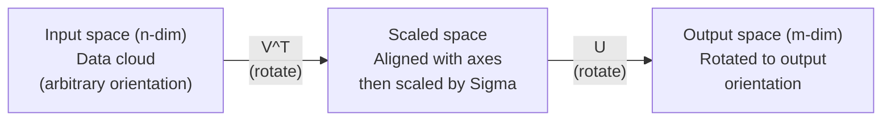
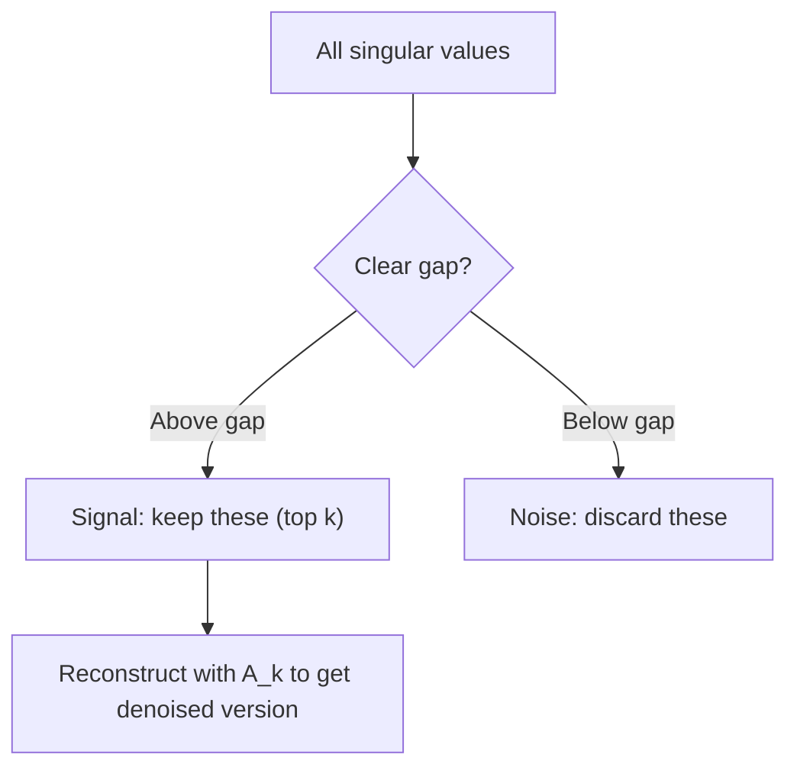

# 특잇값 분해(Singular Value Decomposition)

> SVD는 선형대수의 맥가이버 칼(Swiss Army knife)입니다. 모든 행렬은 SVD를 가지며, 모든 데이터 과학자에게 SVD가 필요합니다.

**유형:** Build (실습)
**사용 언어:** Python, Julia
**선수 레슨:** Phase 1, Lessons 01 (Linear Algebra Intuition), 02 (Vectors & Matrices Operations), 03 (Matrix Transformations)
**소요 시간:** ~120분

## 학습 목표

- 거듭제곱 반복법(power iteration)을 통해 SVD를 구현하고 U, Sigma, V^T의 기하학적 의미를 설명합니다.
- 절단 SVD(truncated SVD)를 이미지 압축에 적용하고 압축률 대비 복원 오차를 측정합니다.
- 과결정 최소제곱(overdetermined least-squares) 시스템을 풀기 위해 SVD를 통한 무어-펜로즈 유사역행렬(Moore-Penrose pseudoinverse)을 계산합니다.
- SVD를 PCA, 추천 시스템(잠재 요인), NLP의 잠재 의미 분석(Latent Semantic Analysis)과 연결합니다.

## 문제 상황

1000x2000 행렬이 주어졌다고 가정해 봅시다. 사용자-영화 평점 행렬일 수도 있고, 문서-단어 빈도 테이블일 수도 있으며, 이미지의 픽셀 값일 수도 있습니다. 이를 압축하거나, 노이즈를 제거하거나, 숨겨진 구조를 찾거나, 최소제곱 시스템을 풀어야 합니다. 고윳값 분해(eigendecomposition)는 정사각행렬에만 동작합니다. 게다가 행렬이 선형 독립인 고유벡터의 완전한 집합을 가져야만 작동합니다.

SVD는 모든 행렬에서 작동합니다. 어떤 모양이든, 어떤 계수(rank)이든 상관없으며, 아무런 조건도 없습니다. 행렬이 공간에 행하는 변환의 기하학적 구조를 드러내는 세 가지 인수로 분해합니다. 이는 선형대수학 전체에서 가장 일반적이며 가장 유용한 인수분해입니다.

## 핵심 개념

### SVD의 기하학적 의미

모든 행렬은 형태에 관계없이 회전, 스케일링, 회전이라는 세 가지 연산을 차례대로 수행합니다. SVD는 이 분해를 명시적으로 드러냅니다.

```
A = U * Sigma * V^T

      m x n     m x m    m x n    n x n
     (any)    (rotate)  (scale)  (rotate)
```

임의의 행렬 A가 주어졌을 때, SVD는 이를 다음과 같이 분해합니다:
- V^T는 입력 공간(n차원)의 벡터들을 회전시킵니다.
- Sigma는 각 축을 따라 스케일링합니다(늘이거나 줄입니다).
- U는 그 결과를 출력 공간(m차원)으로 회전시킵니다.



이렇게 생각해 보십시오. SVD에 행렬 하나를 넘겨주면, SVD는 이렇게 알려줍니다. "이 행렬은 입력 구(sphere)를 받아서 먼저 V^T로 회전시키고, Sigma로 타원체(ellipsoid) 모양으로 늘인 다음, U로 그 타원체를 회전시킨다." 특잇값들은 바로 이 타원체 축들의 길이입니다.

### 전체 분해 형태

m x n 형태의 행렬 A에 대해:

```
A = U * Sigma * V^T

where:
  U     is m x m, orthogonal (U^T U = I)
  Sigma is m x n, diagonal (singular values on the diagonal)
  V     is n x n, orthogonal (V^T V = I)

The singular values sigma_1 >= sigma_2 >= ... >= sigma_r > 0
where r = rank(A)
```

U의 열들을 좌특이벡터(left singular vectors)라고 부릅니다. V의 열들을 우특이벡터(right singular vectors)라고 부릅니다. Sigma의 대각 성분들은 특잇값(singular values)이라고 부릅니다. 이 값들은 항상 음이 아니며, 관례적으로 내림차순 정렬됩니다.

### 좌특이벡터, 특잇값, 우특이벡터

SVD의 각 구성 요소는 뚜렷한 기하학적 의미를 지닙니다.

**우특이벡터(V의 열들):** 입력 공간(R^n)의 정규직교 기저(orthonormal basis)를 형성합니다. 행렬이 출력 공간의 직교하는 방향들로 매핑하는 입력 공간 상의 방향들입니다. 정의역에 대한 자연스러운 좌표계로 볼 수 있습니다.

**특잇값(Sigma의 대각 성분):** 스케일링 인자들입니다. i번째 특잇값은 행렬이 i번째 우특이벡터를 따라 벡터들을 얼마나 늘이는지 나타냅니다. 특잇값이 0이면 행렬이 해당 방향을 완전히 납작하게 만든다는 의미입니다.

**좌특이벡터(U의 열들):** 출력 공간(R^m)의 정규직교 기저를 형성합니다. i번째 좌특이벡터는 i번째 우특이벡터가 (스케일링된 후) 출력 공간에서 도달하는 방향입니다.

이들 간의 관계는 다음과 같습니다:

```
A * v_i = sigma_i * u_i

The matrix A takes the i-th right singular vector v_i,
scales it by sigma_i, and maps it to the i-th left singular vector u_i.
```

이를 통해 임의의 행렬이 수행하는 변환을 좌표별로 명확하게 파악할 수 있습니다.

### 외적 형식

SVD는 랭크 1 행렬들의 합으로 작성할 수 있습니다:

```
A = sigma_1 * u_1 * v_1^T + sigma_2 * u_2 * v_2^T + ... + sigma_r * u_r * v_r^T

Each term sigma_i * u_i * v_i^T is a rank-1 matrix (an outer product).
The full matrix is the sum of r such matrices, where r is the rank.
```

이 형식은 저계수 근사(low-rank approximation)의 기초가 됩니다. 각 항은 하나의 구조 층을 추가합니다. 첫 번째 항은 가장 중요한 단일 패턴을 포착합니다. 두 번째 항은 그다음으로 중요한 패턴을 포착하며, 이후로도 마찬가지입니다. 이 합을 특정 지점에서 절단(truncation)하면 주어진 랭크에서 가능한 최선의 근사를 얻을 수 있습니다.

```
Rank-1 approx:    A_1 = sigma_1 * u_1 * v_1^T
                  (captures the dominant pattern)

Rank-2 approx:    A_2 = sigma_1 * u_1 * v_1^T + sigma_2 * u_2 * v_2^T
                  (captures the two most important patterns)

Rank-k approx:    A_k = sum of top k terms
                  (optimal by the Eckart-Young theorem)
```

### 고윳값 분해와의 관계

SVD와 고윳값 분해는 깊이 연결되어 있습니다. A의 특잇값과 특이벡터는 A^T A 및 A A^T의 고윳값과 고유벡터에서 직접 도출됩니다.

```
A^T A = V * Sigma^T * U^T * U * Sigma * V^T
      = V * Sigma^T * Sigma * V^T
      = V * D * V^T

where D = Sigma^T * Sigma is a diagonal matrix with sigma_i^2 on the diagonal.

So:
- The right singular vectors (V) are eigenvectors of A^T A
- The singular values squared (sigma_i^2) are eigenvalues of A^T A

Similarly:
A A^T = U * Sigma * V^T * V * Sigma^T * U^T
      = U * Sigma * Sigma^T * U^T

So:
- The left singular vectors (U) are eigenvectors of A A^T
- The eigenvalues of A A^T are also sigma_i^2
```

이 연결성은 세 가지 사실을 알려줍니다:
1. 특잇값은 항상 실수이며 음이 아닙니다(준양의 부호 행렬(positive semi-definite matrix)의 고윳값의 제곱근이기 때문입니다).
2. A^T A의 고윳값 분해를 통해 SVD를 계산할 수도 있지만, 이 방식은 조건수(condition number)를 제곱하여 수치적 정밀도를 떨어뜨립니다. 전용 SVD 알고리즘은 이를 회피합니다.
3. A가 대칭 준양의 부호 정사각행렬일 때, SVD와 고윳값 분해는 동일합니다.

### 절단 SVD: 저계수 근사

에카르트-영-미르스키(Eckart-Young-Mirsky) 정리에 따르면, A에 대한 최적의 랭크 k 근사(프로베니우스 노름 및 스펙트럼 노름 모두에서)는 상위 k개의 특잇값과 이에 해당하는 벡터들만 남겨둠으로써 얻을 수 있습니다:

```
A_k = U_k * Sigma_k * V_k^T

where:
  U_k     is m x k  (first k columns of U)
  Sigma_k is k x k  (top-left k x k block of Sigma)
  V_k     is n x k  (first k columns of V)

Approximation error = sigma_{k+1}  (in spectral norm)
                    = sqrt(sigma_{k+1}^2 + ... + sigma_r^2)  (in Frobenius norm)
```

이것은 단순히 "적당히 좋은" 근사가 아닙니다. 증명 가능한 랭크 k의 최적 근사입니다. 어떤 다른 랭크 k 행렬도 A에 이보다 더 가까울 수 없습니다.

| 구성 요소 | 상대적 크기 | 랭크 3 근사에 포함 여부 |
|-----------|-------------------|------------------------|
| sigma_1 | 가장 큼 | 예 |
| sigma_2 | 큼 | 예 |
| sigma_3 | 중간-큼 | 예 |
| sigma_4 | 중간 | 아니오 (오차) |
| sigma_5 | 중간-작음 | 아니오 (오차) |
| sigma_6 | 작음 | 아니오 (오차) |
| sigma_7 | 매우 작음 | 아니오 (오차) |
| sigma_8 | 극소 | 아니오 (오차) |

상위 3개 유지: A_3는 가장 큰 3개의 특잇값을 포착합니다. 오차 = 나머지 값들(sigma_4부터 sigma_8까지).

특잇값이 빠르게 감소하면 작은 k로도 행렬의 대부분을 포착할 수 있습니다. 느리게 감소한다면 행렬에 저계수 구조가 거의 없다는 뜻입니다.

### SVD를 활용한 이미지 압축

그레이스케일 이미지는 픽셀 강도들의 행렬입니다. 800x600 이미지는 480,000개의 값을 가집니다. SVD를 사용하면 훨씬 적은 값으로 이를 근사할 수 있습니다.

```
Original image: 800 x 600 = 480,000 values

SVD with rank k:
  U_k:      800 x k values
  Sigma_k:  k values
  V_k:      600 x k values
  Total:    k * (800 + 600 + 1) = k * 1401 values

  k=10:   14,010 values   (2.9% of original)
  k=50:   70,050 values  (14.6% of original)
  k=100: 140,100 values  (29.2% of original)

  The compression ratio improves as k gets smaller,
  but visual quality degrades.
```

핵심 통찰: 자연 이미지는 특잇값이 빠르게 감소합니다. 처음 몇 개의 특잇값이 대략적인 구조(형태, 그레이디언트)를 포착합니다. 뒤따르는 특잇값들은 세부 디테일과 노이즈를 포착합니다. 랭크 50에서 절단하면 저장 공간을 85% 적게 사용하면서도 원본과 거의 동일해 보이는 이미지를 만들어내는 경우가 많습니다.

### 추천 시스템을 위한 SVD

넷플릭스 프라이즈(Netflix Prize)가 이를 유명하게 만들었습니다. 대부분의 성분이 비어 있는 사용자-영화 평점 행렬이 있다고 가정해 봅시다.

```
             Movie1  Movie2  Movie3  Movie4  Movie5
  User1      [  5      ?       3       ?       1  ]
  User2      [  ?      4       ?       2       ?  ]
  User3      [  3      ?       5       ?       ?  ]
  User4      [  ?      ?       ?       4       3  ]

  ? = unknown rating
```

핵심 아이디어: 이 평점 행렬은 낮은 랭크를 갖습니다. 사용자들의 취향은 완전히 독립적이지 않습니다. 대부분의 선호도를 설명하는 소수의 잠재 요인(액션 대 드라마, 고전 대 신작, 지적 취향 대 직관적 취향)이 존재합니다.

(채워진) 평점 행렬에 SVD를 적용하면 다음과 같이 분해됩니다:
- U: 잠재 요인 공간에서의 사용자 프로필
- Sigma: 각 잠재 요인의 중요도
- V^T: 잠재 요인 공간에서의 영화 프로필

어떤 영화에 대한 사용자의 예측 평점은 해당 사용자 프로필과 영화 프로필의 내적(특잇값으로 가중치 부여)입니다. 저계수 근사가 누락된 항목들을 채워 넣습니다.

실제로는 결측 데이터를 직접 다루는 사이먼 펑크(Simon Funk)의 점진적 SVD나 ALS(교대최소제곱, alternating least squares)와 같은 변형 기법을 사용합니다. 하지만 핵심 아이디어는 동일합니다. 바로 SVD를 통한 잠재 요인 분해입니다.
### 자연어 처리(NLP)에서의 SVD: 잠재 의미 분석(Latent Semantic Analysis)

잠재 의미 분석(Latent Semantic Analysis, LSA)은 잠재 의미 색인(Latent Semantic Indexing, LSI)으로도 불리며, 단어-문서 행렬(term-document matrix)에 SVD를 적용합니다.

```
             Doc1   Doc2   Doc3   Doc4
  "cat"      [  3      0      1      0  ]
  "dog"      [  2      0      0      1  ]
  "fish"     [  0      4      1      0  ]
  "pet"      [  1      1      1      1  ]
  "ocean"    [  0      3      0      0  ]

After SVD with rank k=2:

  Each document becomes a point in 2D "concept space."
  Each term becomes a point in the same 2D space.
  Documents about similar topics cluster together.
  Terms with similar meanings cluster together.

  "cat" and "dog" end up near each other (land pets).
  "fish" and "ocean" end up near each other (water concepts).
  Doc1 and Doc3 cluster if they share similar topics.
```

LSA는 원시 텍스트에서 의미적 유사성을 포착하는 데 성공한 초기 방법 중 하나였습니다. 유의어 관계에 있는 단어들은 비슷한 문서에 나타나는 경향이 있으므로, SVD가 이들을 동일한 잠재 차원으로 묶어주기 때문에 효과적으로 작동합니다. 현대의 단어 임베딩(Word2Vec, GloVe)은 이 아이디어의 후손으로 볼 수 있습니다.

### 노이즈 감소를 위한 SVD

노이즈가 포함된 데이터는 상위 특잇값에 신호가 집중되어 있고, 모든 특잇값에 걸쳐 노이즈가 퍼져 있습니다. 절단을 수행하면 잡음 기저(noise floor)가 제거됩니다.

**깨끗한 신호의 특잇값:**

| 컴포넌트 | 크기 | 유형 |
|-----------|-----------|------|
| sigma_1 | 매우 큼 | 신호 |
| sigma_2 | 큼 | 신호 |
| sigma_3 | 중간 | 신호 |
| sigma_4 | 0에 가까움 | 무시 가능 |
| sigma_5 | 0에 가까움 | 무시 가능 |

**노이즈가 포함된 신호의 특잇값 (노이즈가 전체에 더해짐):**

| 컴포넌트 | 크기 | 유형 |
|-----------|-----------|------|
| sigma_1 | 매우 큼 | 신호 |
| sigma_2 | 큼 | 신호 |
| sigma_3 | 중간 | 신호 |
| sigma_4 | 작음 | 노이즈 |
| sigma_5 | 작음 | 노이즈 |
| sigma_6 | 작음 | 노이즈 |
| sigma_7 | 작음 | 노이즈 |



이 기법은 신호 처리, 과학적 측정, 데이터 정제 등에 사용됩니다. 가산 노이즈(additive noise)로 인해 행렬이 훼손되었을 때마다, 절단 SVD는 신호와 노이즈를 분리하는 원리적인 방법이 됩니다.

### SVD를 통한 의사역행렬(Pseudoinverse)

무어-펜로즈 의사역행렬(Moore-Penrose pseudoinverse) A+는 정방행렬이 아니거나 특이행렬(singular matrix)인 경우까지 행렬의 역행렬 개념을 일반화합니다. SVD를 사용하면 이를 매우 간단하게 계산할 수 있습니다.

```
If A = U * Sigma * V^T, then:

A+ = V * Sigma+ * U^T

where Sigma+ is formed by:
  1. Transpose Sigma (swap rows and columns)
  2. Replace each non-zero diagonal entry sigma_i with 1/sigma_i
  3. Leave zeros as zeros

For A (m x n):      A+ is (n x m)
For Sigma (m x n):  Sigma+ is (n x m)
```

의사역행렬은 최소제곱 문제를 풉니다. Ax = b에 정확한 해가 존재하지 않는 경우(초과결정계, overdetermined system), x = A+ b가 최소제곱 해(least-squares solution, ||Ax - b||를 최소화함)가 됩니다.

```
Overdetermined system (more equations than unknowns):

  [1  1]         [3]
  [2  1] x   =   [5]       No exact solution exists.
  [3  1]         [6]

  x_ls = A+ b = V * Sigma+ * U^T * b

  This gives the x that minimizes the sum of squared residuals.
  Same result as the normal equations (A^T A)^(-1) A^T b,
  but numerically more stable.
```

### 수치적 안정성 측면의 이점

A^T A의 고유값 분해(eigendecomposition)를 계산하면 특잇값이 제곱됩니다(A^T A의 고유값은 sigma_i^2). 이로 인해 조건수(condition number)가 제곱되어 수치적 오차가 증폭됩니다.

```
Example:
  A has singular values [1000, 1, 0.001]
  Condition number of A: 1000 / 0.001 = 10^6

  A^T A has eigenvalues [10^6, 1, 10^{-6}]
  Condition number of A^T A: 10^6 / 10^{-6} = 10^{12}

  Computing SVD directly: works with condition number 10^6
  Computing via A^T A:     works with condition number 10^{12}
                           (6 extra digits of precision lost)
```

현대의 SVD 알고리즘(골럽-카한 이중대각화, Golub-Kahan bidiagonalization)은 A^T A를 직접 만들지 않고 A에 대해 직접 연산합니다. 이것이 항상 `np.linalg.eig(A.T @ A)`보다 `np.linalg.svd(A)`를 선호해야 하는 이유입니다.

### PCA와의 연관성

PCA는 중심화(centered)된 데이터에 대한 SVD 그 자체입니다. 이는 비유가 아닙니다. 문자 그대로 동일한 계산입니다.

```
Given data matrix X (n_samples x n_features), centered (mean subtracted):

Covariance matrix: C = (1/(n-1)) * X^T X

PCA finds eigenvectors of C. But:

  X = U * Sigma * V^T    (SVD of X)

  X^T X = V * Sigma^2 * V^T

  C = (1/(n-1)) * V * Sigma^2 * V^T

So the principal components are exactly the right singular vectors V.
The explained variance for each component is sigma_i^2 / (n-1).

In sklearn, PCA is implemented using SVD, not eigendecomposition.
It is faster and more numerically stable.
```

즉, 10강에서 차원 축소(dimensionality reduction)에 대해 배운 모든 내용은 내부적으로 SVD를 기반으로 동작합니다. PCA는 머신러닝에서 SVD가 가장 널리 활용되는 사례입니다.

```figure
svd-rank-reconstruction
```

## 직접 만들어보기

### 1단계: 멱반복법(power iteration)을 사용해 밑바닥부터 SVD 구현하기

기본 개념: 가장 큰 특잇값과 해당 벡터를 찾기 위해 A^T A(또는 A A^T)에 멱반복법을 사용합니다. 그런 다음 행렬을 축약(deflation)하고 다음 특잇값에 대해 이를 반복합니다.

```python
import numpy as np

def power_iteration(M, num_iters=100):
    n = M.shape[1]
    v = np.random.randn(n)
    v = v / np.linalg.norm(v)

    for _ in range(num_iters):
        Mv = M @ v
        v = Mv / np.linalg.norm(Mv)

    eigenvalue = v @ M @ v
    return eigenvalue, v

def svd_from_scratch(A, k=None):
    m, n = A.shape
    if k is None:
        k = min(m, n)

    sigmas = []
    us = []
    vs = []

    A_residual = A.copy().astype(float)

    for _ in range(k):
        AtA = A_residual.T @ A_residual
        eigenvalue, v = power_iteration(AtA, num_iters=200)

        if eigenvalue < 1e-10:
            break

        sigma = np.sqrt(eigenvalue)
        u = A_residual @ v / sigma

        sigmas.append(sigma)
        us.append(u)
        vs.append(v)

        A_residual = A_residual - sigma * np.outer(u, v)

    U = np.column_stack(us) if us else np.empty((m, 0))
    S = np.array(sigmas)
    V = np.column_stack(vs) if vs else np.empty((n, 0))

    return U, S, V
```

### 2단계: 테스트 및 NumPy와 비교

```python
np.random.seed(42)
A = np.random.randn(5, 4)

U_ours, S_ours, V_ours = svd_from_scratch(A)
U_np, S_np, Vt_np = np.linalg.svd(A, full_matrices=False)

print("Our singular values:", np.round(S_ours, 4))
print("NumPy singular values:", np.round(S_np, 4))

A_reconstructed = U_ours @ np.diag(S_ours) @ V_ours.T
print(f"Reconstruction error: {np.linalg.norm(A - A_reconstructed):.8f}")
```

### 3단계: 이미지 압축 데모

```python
def compress_image_svd(image_matrix, k):
    U, S, Vt = np.linalg.svd(image_matrix, full_matrices=False)
    compressed = U[:, :k] @ np.diag(S[:k]) @ Vt[:k, :]
    return compressed

image = np.random.seed(42)
rows, cols = 200, 300
image = np.random.randn(rows, cols)

for k in [1, 5, 10, 20, 50]:
    compressed = compress_image_svd(image, k)
    error = np.linalg.norm(image - compressed) / np.linalg.norm(image)
    original_size = rows * cols
    compressed_size = k * (rows + cols + 1)
    ratio = compressed_size / original_size
    print(f"k={k:>3d}  error={error:.4f}  storage={ratio:.1%}")
```

### 4단계: 노이즈 감소

```python
np.random.seed(42)
clean = np.outer(np.sin(np.linspace(0, 4*np.pi, 100)),
                 np.cos(np.linspace(0, 2*np.pi, 80)))
noise = 0.3 * np.random.randn(100, 80)
noisy = clean + noise

U, S, Vt = np.linalg.svd(noisy, full_matrices=False)
denoised = U[:, :5] @ np.diag(S[:5]) @ Vt[:5, :]

print(f"Noisy error:    {np.linalg.norm(noisy - clean):.4f}")
print(f"Denoised error: {np.linalg.norm(denoised - clean):.4f}")
print(f"Improvement:    {(1 - np.linalg.norm(denoised - clean) / np.linalg.norm(noisy - clean)):.1%}")
```

### 5단계: 의사역행렬

```python
A = np.array([[1, 1], [2, 1], [3, 1]], dtype=float)
b = np.array([3, 5, 6], dtype=float)

U, S, Vt = np.linalg.svd(A, full_matrices=False)
S_inv = np.diag(1.0 / S)
A_pinv = Vt.T @ S_inv @ U.T

x_svd = A_pinv @ b
x_lstsq = np.linalg.lstsq(A, b, rcond=None)[0]
x_pinv = np.linalg.pinv(A) @ b

print(f"SVD pseudoinverse solution:  {x_svd}")
print(f"np.linalg.lstsq solution:   {x_lstsq}")
print(f"np.linalg.pinv solution:    {x_pinv}")
```

## 사용해보기

완전하게 작동하는 데모는 `code/svd.py`에 있습니다. 이를 실행하여 이미지 압축, 추천 시스템, 잠재 의미 분석, 노이즈 감소에 SVD가 적용되는 모습을 확인해 보세요.

```bash
python svd.py
```

`code/svd.jl`의 Julia 버전은 Julia의 내장 함수인 `svd()`와 `LinearAlgebra` 패키지를 사용하여 동일한 개념을 보여줍니다.

```bash
julia svd.jl
```

## 배포하기

이 강의를 통해 다음을 얻을 수 있습니다:
- `outputs/skill-svd.md` - 실제 프로젝트에서 SVD를 언제, 어떻게 적용해야 하는지 판단하는 역량

## 연습문제

1. 멱반복법을 사용하지 않고 밑바닥부터 전체 SVD를 구현해 보세요. 대신 A^T A의 고유값 분해를 계산하여 V와 특잇값을 얻은 다음, U = A V Sigma^{-1}을 계산합니다. 수치적 정확도를 멱반복법 버전 및 NumPy와 비교해 보세요.

2. 실제 그레이스케일 이미지를 로드합니다(또는 이미지를 그레이스케일로 변환합니다). 랭크 1, 5, 10, 25, 50, 100으로 압축해 보세요. 각 랭크별로 압축률과 상대 오차를 계산합니다. 이미지가 시각적으로 수용 가능한 수준이 되는 랭크를 찾아보세요.

3. 간단한 추천 시스템을 구축해 보세요. 일부 항목이 채워진 10x8 크기의 사용자-영화 평점 행렬을 만듭니다. 결측값은 행 평균으로 채웁니다. SVD를 계산하고 랭크 3 근사로 재구성합니다. 재구성된 행렬을 사용하여 누락된 평점을 예측해 보세요. 예측값이 타당한지 확인합니다.

4. 3개의 합성 토픽을 가진 100x50 크기의 문서-단어 행렬을 만듭니다. 각 토픽에는 연관된 단어가 5개씩 있습니다. 노이즈를 추가합니다. SVD를 적용하고 상위 3개의 특잇값이 나머지보다 훨씬 큰지 확인합니다. 문서를 3차원 잠재 공간에 투영하고 같은 토픽의 문서들이 함께 클러스터링되는지 확인해 보세요.

5. 깨끗한 저랭크 행렬(랭크 3, 크기 50x40)을 생성하고 다양한 수준(sigma = 0.1, 0.5, 1.0, 2.0)의 가우시안 노이즈를 추가합니다. 각 노이즈 수준에 대해 k를 1부터 40까지 변화시키며 원본 행렬에 대한 재구성 오차를 측정하여 최적의 절단 랭크를 찾아보세요. 노이즈 수준에 따라 최적의 k가 어떻게 변하는지 그래프로 그려보세요.
## 핵심 용어

| 용어 | 흔히 하는 말 | 실제 의미 |
|------|----------------|----------------------|
| SVD | "어떤 행렬이든 분해하기" | U와 V가 직교 행렬이고 Sigma가 음이 아닌 원소를 갖는 대각 행렬인 U Sigma V^T로 A를 분해합니다. 어떤 형태의 어떤 행렬에든 적용할 수 있습니다. |
| 특이값(Singular value) | "이 성분이 얼마나 중요한지" | Sigma의 i번째 대각 원소입니다. 행렬이 i번째 주방향을 따라 얼마나 늘어나는지 측정합니다. 항상 음이 아니며, 내림차순으로 정렬됩니다. |
| 좌특이벡터(Left singular vector) | "출력 방향" | U의 한 열(column)입니다. i번째 우특이벡터가 (sigma_i로 스케일링된 후) 매핑되는 출력 공간에서의 방향입니다. |
| 우특이벡터(Right singular vector) | "입력 방향" | V의 한 열(column)입니다. 행렬에 의해 (sigma_i로 스케일링된 후) i번째 좌특이벡터로 매핑되는 입력 공간에서의 방향입니다. |
| 절단된 SVD(Truncated SVD) | "저계수 근사" | 상위 k개의 특이값과 해당 벡터들만 유지합니다. 원본 행렬에 대한 증명 가능한 최적의 계수 k(rank-k) 근사를 생성합니다(에카르트-영 정리). |
| 계수(Rank) | "진짜 차원" | 0이 아닌 특이값의 개수입니다. 행렬이 실제로 사용하는 독립적인 방향이 몇 개인지 알려줍니다. |
| 의사역행렬(Pseudoinverse) | "일반화된 역행렬" | V Sigma+ U^T입니다. 0이 아닌 특이값의 역수를 취하고, 0은 그대로 둡니다. 정방행렬이 아니거나 특이(singular) 행렬인 경우의 최소제곱 문제를 해결합니다. |
| 조건수(Condition number) | "오차에 얼마나 민감한지" | sigma_max / sigma_min입니다. 조건수가 크다는 것은 작은 입력 변화가 큰 출력 변화를 일으킨다는 것을 의미합니다. SVD는 이를 직접적으로 보여줍니다. |
| 잠재 요인(Latent factor) | "숨겨진 변수" | SVD로 발견한 저계수 공간의 한 차원입니다. 추천 시스템에서는 장르 선호도에 해당할 수 있고, NLP에서는 주제(토픽)에 해당할 수 있습니다. |
| 프로베니우스 놈(Frobenius norm) | "전체 행렬 크기" | 모든 원소의 제곱합에 대한 제곱근입니다. 특이값 제곱합의 제곱근과 같습니다. 근사 오차를 측정하는 데 사용됩니다. |
| 에카르트-영 정리(Eckart-Young theorem) | "SVD가 최적의 압축을 제공함" | 어떤 목표 계수 k에 대해서도, 절단된 SVD는 가능한 모든 계수 k 행렬 중에서 근사 오차를 최소화합니다. |
| 거듭제곱 반복법(Power iteration) | "가장 큰 고유벡터 찾기" | 무작위 벡터에 행렬을 반복적으로 곱하고 정규화합니다. 가장 큰 고윳값을 갖는 고유벡터로 수렴합니다. 많은 SVD 알고리즘의 기초를 이룹니다. |

## 추천 자료

- [Gilbert Strang: Linear Algebra and Its Applications, Chapter 7](https://math.mit.edu/~gs/linearalgebra/) - 응용을 포함한 SVD에 대한 심도 있는 설명
- [3Blue1Brown: But what is the SVD?](https://www.youtube.com/watch?v=vSczTbgc8Rc) - SVD에 대한 기하학적 직관
- [We Recommend a Singular Value Decomposition](https://www.ams.org/publicoutreach/feature-column/fcarc-svd) - 미국수학회(AMS)의 알기 쉬운 개요
- [Netflix Prize and Matrix Factorization](https://sifter.org/~simon/journal/20061211.html) - 추천 시스템을 위한 SVD에 관한 Simon Funk의 원작 블로그 글
- [Latent Semantic Analysis](https://en.wikipedia.org/wiki/Latent_semantic_analysis) - SVD를 적용한 최초의 자연어 처리(NLP) 기법
- [Numerical Linear Algebra by Trefethen and Bau](https://people.maths.ox.ac.uk/trefethen/text.html) - SVD 알고리즘과 수치적 특성을 이해하기 위한 표준적인 명저
