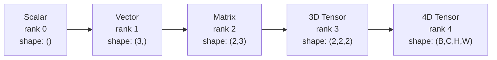
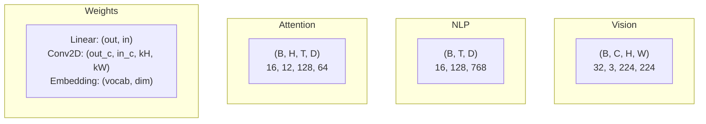
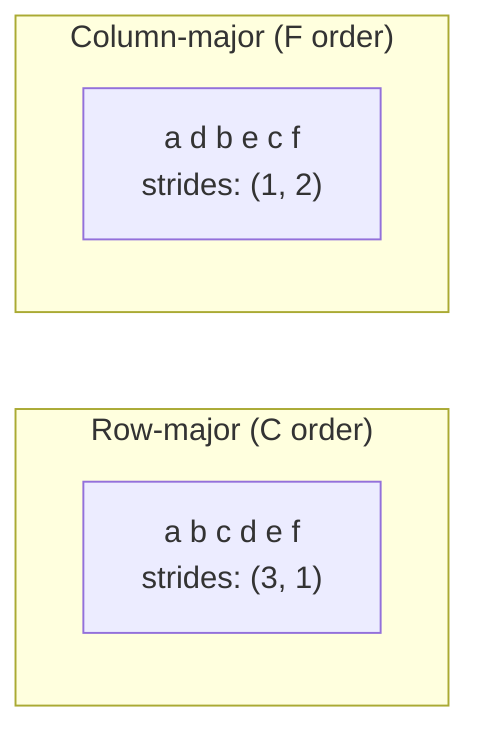
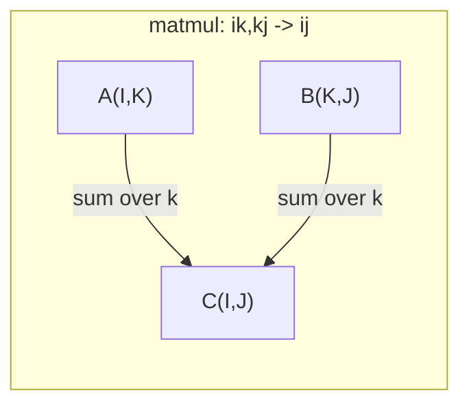

# 텐서 연산

> 텐서는 데이터와 딥러닝 사이의 공통 언어입니다. 모든 이미지, 모든 문장, 모든 그래디언트가 텐서를 통해 흐릅니다.

**유형:** Build (실습)
**Language:** Python
**선수 레슨:** Phase 1, Lessons 01 (Linear Algebra Intuition), 02 (Vectors, Matrices & Operations)
**소요 시간:** ~90분

## 학습 목표

- shape, strides, reshape, transpose 및 원소별(element-wise) 연산을 지원하는 텐서 클래스를 밑바닥부터 구현합니다.
- 브로드캐스팅(broadcasting) 규칙을 적용하여 데이터 복사 없이 서로 다른 shape의 텐서를 연산합니다.
- 내적, 행렬 곱셈, 외적, 배치 연산을 위한 einsum 표현식을 작성합니다.
- 멀티헤드 어텐션(multi-head attention)의 모든 단계에서 정확한 텐서 shape의 변화를 추적합니다.

## 문제 상황

트랜스포머(Transformer)를 구축합니다. 순전파(forward pass) 코드는 깔끔해 보입니다. 실행하자 다음과 같은 에러가 발생합니다: `RuntimeError: mat1 and mat2 shapes cannot be multiplied (32x768 and 512x768)`. shape을 유심히 살펴봅니다. transpose를 시도해 봅니다. 이제 `Expected 4D input (got 3D input)` 에러가 발생합니다. unsqueeze를 추가합니다. 그러자 다른 곳에서 문제가 터집니다.

shape 에러는 딥러닝 코드에서 가장 흔히 발생하는 버그입니다. 개념적으로 어렵지는 않습니다. 각 연산에는 정해진 shape 규약이 있으니까요. 하지만 연산이 겹치면서 에러는 빠르게 불어납니다. 트랜스포머는 수십 개의 reshape, transpose, 브로드캐스팅이 서로 연결되어 있습니다. 축 하나만 잘못 지정해도 에러가 연쇄적으로 발생합니다. 더 심각한 것은 일부 shape 실수는 아예 에러를 발생시키지도 않는다는 점입니다. 잘못된 차원을 따라 브로드캐스팅되거나 엉뚱한 축에 대해 합을 구하면서 조용히 엉터리 결과를 만들어냅니다.

행렬은 두 대상 집합 간의 쌍별(pairwise) 관계를 다룹니다. 하지만 실제 데이터는 2차원에 들어맞지 않습니다. 224x224 크기의 RGB 이미지 32장으로 구성된 배치는 4D 텐서입니다: `(32, 3, 224, 224)`. 12개 헤드를 갖는 셀프 어텐션(self-attention) 역시 4D입니다: `(batch, heads, seq_len, head_dim)`. 따라서 임의의 차원 수로 일반화할 수 있고 모든 차원에 걸쳐 깔끔하게 합성되는 연산을 갖춘 자료구조가 필요합니다. 그 자료구조가 바로 텐서(tensor)입니다. 텐서 연산을 마스터하면 shape 에러를 손쉽게 디버깅할 수 있습니다.

## 핵심 개념

### 텐서란 무엇인가

텐서는 단일 데이터 타입을 갖는 다차원 숫자 배열입니다. 차원의 수를 **랭크(rank)**(또는 **차수(order)**)라고 합니다. 각 차원은 **축(axis)**입니다. **shape**은 각 축을 따른 크기를 나열한 튜플입니다.



총 원소 수 = 모든 축 크기의 곱. shape이 `(2, 3, 4)`인 텐서는 `2 * 3 * 4 = 24`개의 원소를 갖습니다.

### 딥러닝에서의 텐서 shape

데이터 타입마다 관례적으로 매핑되는 특정 텐서 shape이 있습니다.



PyTorch는 NCHW(channels-first) 형식을 사용합니다. TensorFlow는 기본적으로 NHWC(channels-last)를 사용합니다. 데이터 배치가 일치하지 않으면 눈에 띄지 않는 성능 저하가 발생하거나 에러가 납니다.

### 메모리 레이아웃의 동작 원리

메모리 상에서 2D 배열은 1D 바이트 시퀀스로 저장됩니다. **스트라이드(strides)**는 각 축을 따라 한 걸음 이동할 때 건너뛰어야 하는 원소의 개수를 알려줍니다.



transpose는 데이터를 직접 이동시키지 않습니다. 스트라이드 값을 맞바꾸어 텐서를 **비연속적(non-contiguous)** 상태로 만들 뿐입니다. 즉, 특정 행의 원소들이 메모리 상에서 더 이상 인접하지 않게 됩니다.

### 브로드캐스팅 규칙

브로드캐스팅을 사용하면 데이터를 복사하지 않고도 서로 다른 shape의 텐서 간 연산을 수행할 수 있습니다. shape을 오른쪽부터 맞춥니다. 두 차원이 호환되려면 서로 크기가 같거나 둘 중 하나가 1이어야 합니다. 차원 수가 부족한 쪽은 왼쪽에 1이 채워집니다.

```
Tensor A:     (8, 1, 6, 1)
Tensor B:        (7, 1, 5)
Padded B:     (1, 7, 1, 5)
Result:       (8, 7, 6, 5)
```

### Einsum: 범용 텐서 연산

아인슈타인 표기법(Einstein summation)은 각 축에 문자를 부여합니다. 입력에는 있지만 출력에 없는 축은 합산(축약)됩니다. 양쪽 모두에 존재하는 축은 유지됩니다.



주요 패턴: `i,i->` (내적), `i,j->ij` (외적), `ii->` (대각합(trace)), `ij->ji` (전치(transpose)), `bij,bjk->bik` (배치 행렬 곱셈), `bhtd,bhsd->bhts` (어텐션 점수).

```figure
tensor-broadcast
```

## 직접 구현하기

전체 코드는 `code/tensors.py`에 있습니다. 각 단계는 해당 파일의 구현을 참조합니다.

### 1단계: 텐서 스토리지와 스트라이드

텐서는 1차원 평탄화된 숫자 리스트와 shape 메타데이터를 저장합니다. 스트라이드는 다차원 인덱스를 1차원 평탄화 인덱스로 매핑하는 인덱싱 로직에 사용됩니다.

```python
class Tensor:
    def __init__(self, data, shape=None):
        if isinstance(data, (list, tuple)):
            self._data, self._shape = self._flatten_nested(data)
        elif isinstance(data, np.ndarray):
            self._data = data.flatten().tolist()
            self._shape = tuple(data.shape)
        else:
            self._data = [data]
            self._shape = ()

        if shape is not None:
            total = reduce(lambda a, b: a * b, shape, 1)
            if total != len(self._data):
                raise ValueError(
                    f"Cannot reshape {len(self._data)} elements into shape {shape}"
                )
            self._shape = tuple(shape)

        self._strides = self._compute_strides(self._shape)

    @staticmethod
    def _compute_strides(shape):
        if len(shape) == 0:
            return ()
        strides = [1] * len(shape)
        for i in range(len(shape) - 2, -1, -1):
            strides[i] = strides[i + 1] * shape[i + 1]
        return tuple(strides)
```

shape이 `(3, 4)`인 경우, 스트라이드는 `(4, 1)`입니다. 행을 하나 넘어가려면 원소 4개를 건너뛰고, 열을 하나 넘어가려면 원소 1개를 건너뜁니다.

### 2단계: Reshape, squeeze, unsqueeze

Reshape은 원소의 순서를 바꾸지 않고 shape만 변경합니다. 전체 원소 수는 반드시 동일하게 유지되어야 합니다. 한 차원의 크기를 자동으로 추론하려면 `-1`을 사용합니다.

```python
t = Tensor(list(range(12)), shape=(2, 6))
r = t.reshape((3, 4))
r = t.reshape((-1, 3))
```

Squeeze는 크기가 1인 축을 제거합니다. Unsqueeze는 크기가 1인 축을 삽입합니다. Unsqueeze는 브로드캐스팅에서 매우 중요합니다. 편향(bias) 벡터 `(D,)`를 배치 `(B, T, D)`에 더하려면 `(1, 1, D)` 형태로 unsqueeze해야 합니다.

```python
t = Tensor(list(range(6)), shape=(1, 3, 1, 2))
s = t.squeeze()
v = Tensor([1, 2, 3])
u = v.unsqueeze(0)
```

### 3단계: Transpose와 permute

Transpose는 두 개의 축을 맞바꿉니다. Permute는 모든 축의 순서를 재배치합니다. NCHW와 NHWC 형식을 상호 변환할 때 이 방식을 사용합니다.

```python
mat = Tensor(list(range(6)), shape=(2, 3))
tr = mat.transpose(0, 1)

t4d = Tensor(list(range(24)), shape=(1, 2, 3, 4))
perm = t4d.permute((0, 2, 3, 1))
```

transpose나 permute를 수행한 후 텐서는 메모리 상에서 비연속적(non-contiguous) 상태가 됩니다. PyTorch에서 `view`는 비연속 텐서에 대해 실패하므로, `reshape`를 사용하거나 먼저 `.contiguous()`를 호출해야 합니다.

### 4단계: 원소별 연산 및 리덕션

원소별(element-wise) 연산(덧셈, 곱셈, 뺄셈)은 각 원소에 독립적으로 적용되며 shape을 유지합니다. 리덕션(reduction) 연산(합, 평균, 최댓값)은 하나 이상의 축을 축소합니다.

```python
a = Tensor([[1, 2], [3, 4]])
b = Tensor([[10, 20], [30, 40]])
c = a + b
d = a * 2
s = a.sum(axis=0)
```

CNN에서의 글로벌 평균 풀링(global average pooling): `(B, C, H, W).mean(axis=[2, 3])`은 `(B, C)`을 만듭니다. NLP에서의 시퀀스 평균 풀링(sequence mean pooling): `(B, T, D).mean(axis=1)`는 `(B, D)`을 만듭니다.

### 5단계: NumPy를 활용한 브로드캐스팅

`tensors.py`의 `demo_broadcasting_numpy()` 함수는 핵심 패턴을 보여줍니다.

```python
activations = np.random.randn(4, 3)
bias = np.array([0.1, 0.2, 0.3])
result = activations + bias

images = np.random.randn(2, 3, 4, 4)
scale = np.array([0.5, 1.0, 1.5]).reshape(1, 3, 1, 1)
result = images * scale

a = np.array([1, 2, 3]).reshape(-1, 1)
b = np.array([10, 20, 30, 40]).reshape(1, -1)
outer = a * b
```

브로드캐스팅을 활용한 쌍별 거리 계산: `(M, 2)`를 `(M, 1, 2)`로, `(N, 2)`를 `(1, N, 2)`로 reshape한 다음 뺄셈, 제곱, 마지막 축을 따른 합산, 제곱근 계산을 차례로 수행합니다. 결과: `(M, N)`.

### 6단계: Einsum 연산

`demo_einsum()` 및 `demo_einsum_gallery()` 함수는 자주 쓰이는 모든 패턴을 단계별로 살펴봅니다.

```python
a = np.array([1.0, 2.0, 3.0])
b = np.array([4.0, 5.0, 6.0])
dot = np.einsum("i,i->", a, b)

A = np.array([[1, 2], [3, 4], [5, 6]], dtype=float)
B = np.array([[7, 8, 9], [10, 11, 12]], dtype=float)
matmul = np.einsum("ik,kj->ij", A, B)

batch_A = np.random.randn(4, 3, 5)
batch_B = np.random.randn(4, 5, 2)
batch_mm = np.einsum("bij,bjk->bik", batch_A, batch_B)
```

축약(contraction)의 연산 비용은 유지되거나 합산되는 모든 인덱스 크기의 곱입니다. B=32, I=128, J=64, K=128인 `bij,bjk->bik`의 경우, `32 * 128 * 64 * 128 = 33,554,432`회의 곱셈-누적(multiply-add) 연산이 필요합니다.

### 7단계: Einsum을 이용한 어텐션 메커니즘

`demo_attention_einsum()` 함수는 멀티헤드 어텐션을 처음부터 끝까지 구현합니다.

```python
B, H, T, D = 2, 4, 8, 16
E = H * D

X = np.random.randn(B, T, E)
W_q = np.random.randn(E, E) * 0.02

Q = np.einsum("bte,ek->btk", X, W_q)
Q = Q.reshape(B, T, H, D).transpose(0, 2, 1, 3)

scores = np.einsum("bhtd,bhsd->bhts", Q, K) / np.sqrt(D)
weights = softmax(scores, axis=-1)
attn_output = np.einsum("bhts,bhsd->bhtd", weights, V)

concat = attn_output.transpose(0, 2, 1, 3).reshape(B, T, E)
output = np.einsum("bte,ek->btk", concat, W_o)
```

모든 단계가 텐서 연산으로 이루어집니다: 프로젝션(einsum을 이용한 행렬 곱셈), 헤드 분할(reshape + transpose), 어텐션 점수(einsum을 이용한 배치 행렬 곱셈), 가중합(einsum을 이용한 배치 행렬 곱셈), 헤드 결합(transpose + reshape), 출력 프로젝션(einsum을 이용한 행렬 곱셈).

## 활용하기

### 직접 구현 vs NumPy

| 연산 | 직접 구현 (Tensor 클래스) | NumPy |
|---|---|---|
| 생성 | `Tensor([[1,2],[3,4]])` | `np.array([[1,2],[3,4]])` |
| Reshape | `t.reshape((3,4))` | `a.reshape(3,4)` |
| Transpose | `t.transpose(0,1)` | `a.T` 또는 `a.transpose(0,1)` |
| Squeeze | `t.squeeze(0)` | `np.squeeze(a, 0)` |
| 합 | `t.sum(axis=0)` | `a.sum(axis=0)` |
| Einsum | 해당 없음 | `np.einsum("ij,jk->ik", a, b)` |

### 직접 구현 vs PyTorch

```python
import torch

t = torch.tensor([[1, 2, 3], [4, 5, 6]], dtype=torch.float32)
t.shape
t.stride()
t.is_contiguous()

t.reshape(3, 2)
t.unsqueeze(0)
t.transpose(0, 1)
t.transpose(0, 1).contiguous()

torch.einsum("ik,kj->ij", A, B)
```

PyTorch는 자동 미분(autograd), GPU 지원, 최적화된 BLAS 커널을 추가로 제공합니다. shape의 동작 방식은 완전히 동일합니다. 직접 구현한 버전을 이해하고 있다면, PyTorch에서 발생하는 shape 에러를 한눈에 파악할 수 있습니다.

### 모든 신경망 레이어의 텐서 연산 표현

| 연산 | 텐서 형태 | Einsum |
|---|---|---|
| 선형 레이어(Linear layer) | `Y = X @ W.T + b` | `"bd,od->bo"` + 편향 |
| 어텐션 QKV | `Q = X @ W_q` | `"btd,dh->bth"` |
| 어텐션 점수 | `Q @ K.T / sqrt(d)` | `"bhtd,bhsd->bhts"` |
| 어텐션 출력 | `softmax(scores) @ V` | `"bhts,bhsd->bhtd"` |
| 배치 정규화(Batch norm) | `(X - mu) / sigma * gamma` | 원소별 연산 + 브로드캐스팅 |
| 소프트맥스(Softmax) | `exp(x) / sum(exp(x))` | 원소별 연산 + 리덕션 |
## 배포하기 (Ship It)

이 레슨에서는 재사용 가능한 두 가지 프롬프트를 생성합니다:

1. **`outputs/prompt-tensor-shapes.md`** -- 텐서 shape 불일치를 디버깅하기 위한 체계적인 프롬프트입니다. 모든 일반적인 연산(matmul, broadcast, cat, Linear, Conv2d, BatchNorm, softmax)에 대한 결정 테이블과 해결책 조회 테이블을 포함합니다.

2. **`outputs/prompt-tensor-debugger.md`** -- shape 오류로 인해 막혔을 때 모든 AI 어시스턴트에 붙여넣을 수 있는 단계별 디버깅 프롬프트입니다. 오류 메시지와 텐서 shape을 입력하면 정확한 해결책을 반환합니다.

## 연습 문제

1. **초급 -- Reshape 왕복 변환.** shape이 `(2, 3, 4)`인 텐서를 가져옵니다. 이를 `(6, 4)`로 reshape한 다음, `(24,)`로, 다시 `(2, 3, 4)`으로 변환합니다. 평탄화된(flat) 데이터를 출력하여 각 단계에서 요소 순서가 보존되는지 확인합니다.

2. **중급 -- 브로드캐스팅(broadcasting) 구현.** 크기가 1인 차원을 대상 shape에 맞게 확장하는 `broadcast_to(shape)` 메서드로 `Tensor` 클래스를 확장합니다. 그런 다음 연산 전에 자동으로 브로드캐스팅하도록 `_elementwise_op`을 수정합니다. `(3, 1)`와 `(1, 4)` shape으로 테스트하여 `(3, 4)`이 생성되는지 확인합니다.

3. **고급 -- einsum 밑바닥부터 구현하기.** 최소한 내적(`i,i->`), 행렬 곱(`ij,jk->ik`), 외적(`i,j->ij`), 전치(`ij->ji`)를 처리하는 기본 `einsum(subscripts, *tensors)` 함수를 구현합니다. 서브스크립트 문자열을 파싱하고, 축약(contracted) 인덱스를 식별한 뒤, 모든 인덱스 조합을 순회합니다. 구현 결과를 `np.einsum`와 비교합니다.

4. **고급 -- 어텐션(attention) shape 추적기.** `batch_size`, `seq_len`, `embed_dim`, `num_heads`을 입력으로 받아 멀티 헤드 어텐션의 모든 단계(입력, Q/K/V 투영, 헤드 분할, 어텐션 스코어, softmax 가중치, 가중합, 헤드 병합, 출력 투영)에서 정확한 shape을 출력하는 함수를 작성합니다. `demo_attention_einsum()` 출력과 비교하여 검증합니다.

## 핵심 용어

| 용어 | 흔히 하는 말 | 실제 의미 |
|---|---|---|
| Tensor | "차원이 더 많은 행렬" | 균일한 타입과 정의된 shape, stride, 연산을 갖춘 다차원 배열 |
| Rank | "차원의 수" | 축(axis)의 수. 행렬의 랭크는 2이며, 선형대수의 행렬 랭크(matrix rank)와 다름 |
| Shape | "텐서의 크기" | 각 축을 따른 크기를 나열한 튜플. `(2, 3)`는 2개의 행, 3개의 열을 의미함 |
| Stride | "메모리가 배치된 방식" | 각 축을 따라 한 위치 전진하기 위해 건너뛰어야 하는 요소의 수 |
| Broadcasting | "shape이 달라도 알아서 잘 동작함" | 엄격한 규칙 집합: 오른쪽부터 정렬하며, 차원이 동일하거나 둘 중 하나가 1이어야 함 |
| Contiguous | "텐서가 정상적인 상태임" | 논리적 배치와 비교해 빈틈이나 순서 변경 없이 메모리에 순차적으로 저장된 요소들 |
| Einsum | "matmul을 멋지게 쓰는 방법" | 모든 텐서 축약(contraction), 외적, 대각합(trace), 전치를 한 줄로 표현하는 일반 표기법 |
| View | "reshape과 같음" | 동일한 메모리 버퍼를 공유하지만 shape/stride 메타데이터가 다른 텐서. 비연속적인(non-contiguous) 데이터에서는 실패함 |
| Contraction | "인덱스에 대해 합산하는 것" | 텐서 간에 공유된 인덱스를 곱하고 합산하여 더 낮은 랭크의 결과를 생성하는 일반적인 연산 |
| NCHW / NHWC | "PyTorch 대 TensorFlow 포맷" | 이미지 텐서의 메모리 레이아웃 규칙. NCHW는 채널을 공간 차원 앞에 두고, NHWC는 뒤에 둠 |

## 추가 자료

- [NumPy Broadcasting](https://numpy.org/doc/stable/user/basics.broadcasting.html) -- 시각적 예제와 함께 설명하는 표준 규칙
- [PyTorch Tensor Views](https://pytorch.org/docs/stable/tensor_view.html) -- 뷰가 동작하는 경우와 복사가 일어나는 경우
- [einops](https://github.com/arogozhnikov/einops) -- 텐서 reshaping을 가독성 높고 안전하게 만들어 주는 라이브러리
- [The Illustrated Transformer](https://jalammar.github.io/illustrated-transformer/) -- 어텐션을 통해 흐르는 텐서 shape 시각화
- [Einstein Summation in NumPy](https://numpy.org/doc/stable/reference/generated/numpy.einsum.html) -- 예제와 함께 제공되는 전체 einsum 문서
